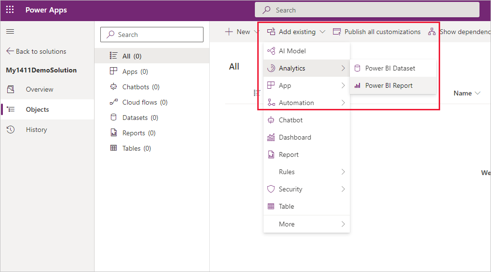
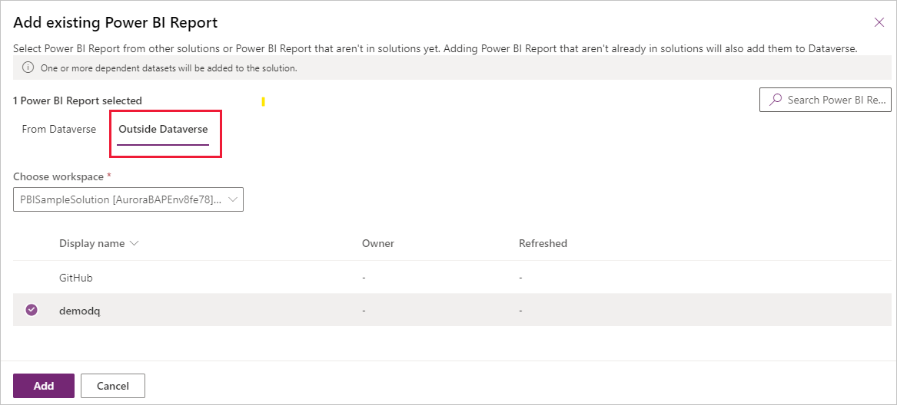
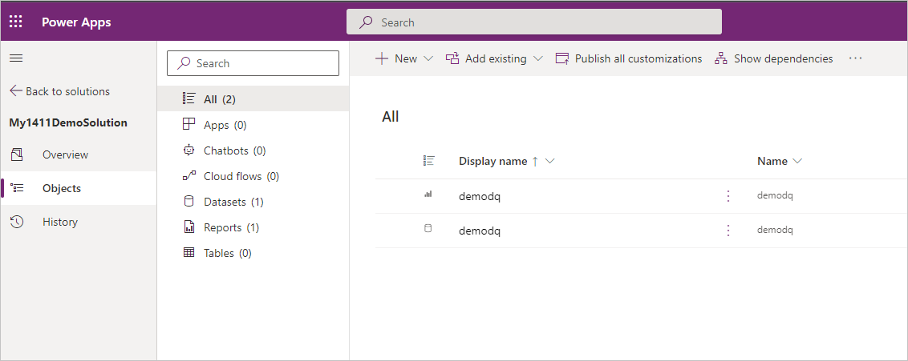
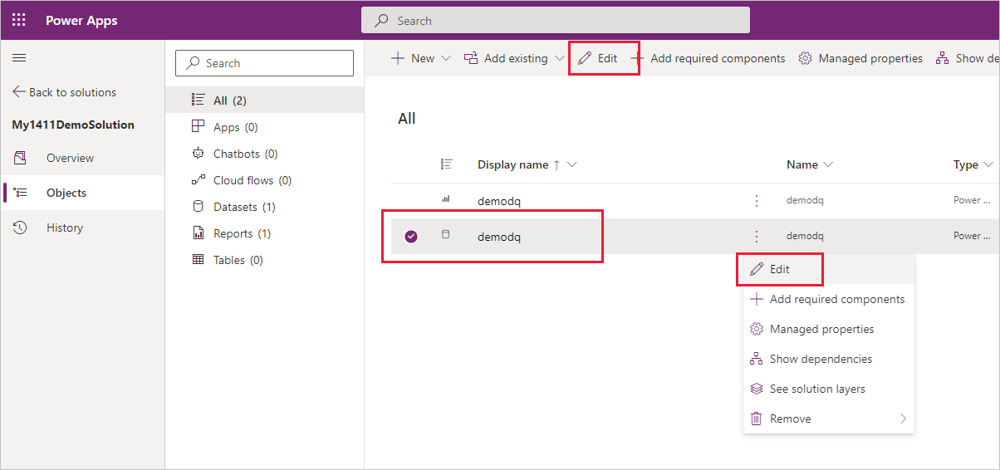
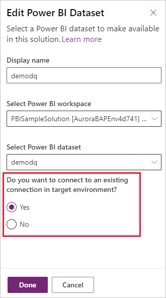
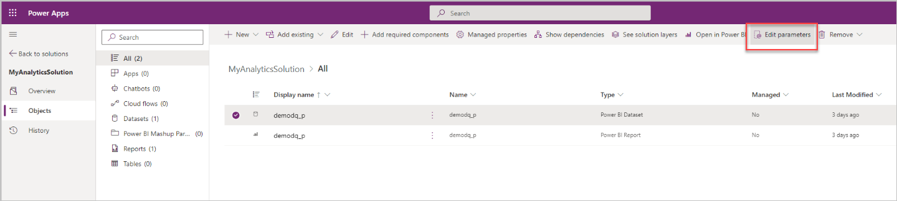
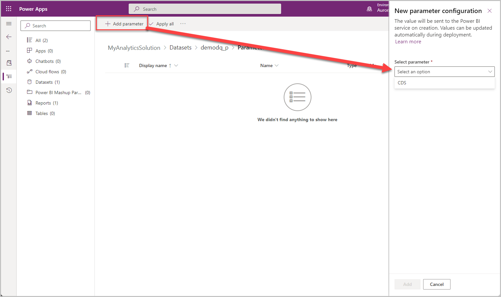
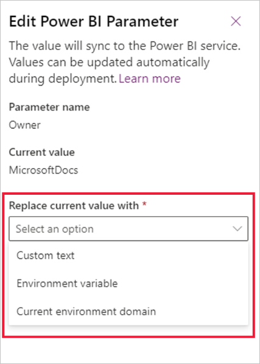
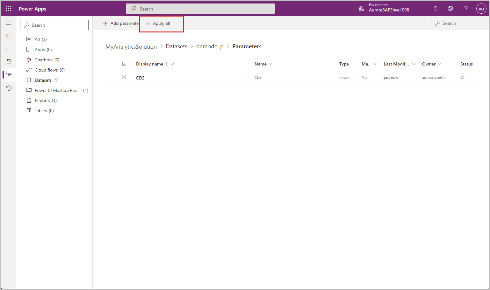
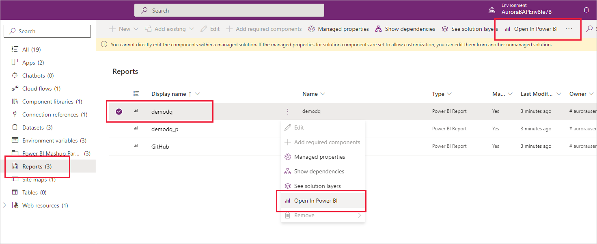

# Create Power BI report and dataset components (preview)

> [!IMPORTANT]
>
> - This feature reached retirement on July 31, 2024 and is no longer available. We recommend removing all Power BI report and dataset components from existing solutions and use [Power BI embedded system dashboard](./create-edit-powerbi-embedded-page.md) instead.
> - Using the Power BI embedded system dashboard doesn't deploy Power BI reports and datasets in a Power BI workspace. Power Apps will no longer create a dedicated environment aware workspace in Power BI. Additionally, embedding the Power BI embedded system dashboard in forms, similar to the feature described in this article, isn't possible.

[!INCLUDE [cc-beta-prerelease-disclaimer](../../includes/cc-beta-prerelease-disclaimer.md)]

As data culture spreads across more and more organizations, and analytics becomes a vital part of decision making and the daily actions taken by employees, it has become critical to have reliable, up-to-date analytics readily available in your Power Apps.  

As a step towards achieving this goal, it's possible to add Power BI reports and datasets as components in Power Apps solutions. Once you add a Power BI report to a solution, it can be seamlessly managed as part of your ALM process across environments and tenants.

> [!IMPORTANT]
> - This is a preview feature.
> - [!INCLUDE[cc_preview_features_definition](../../includes/cc-preview-features-definition.md)]

In this article, you learn how to do the following tasks:

* Add Power BI reports and dataset components to a solution.
* Configure the behavior of Power BI mashup parameters upon import and export as part of the Power Apps solution.
* Configure the dataset component so that the dataset automatically connects to a Microsoft Dataverse data source when the solution is deployed to a new environment.

## Prerequisites

* A Power BI Pro license.
* A Power BI report and/or dataset that you want to create Power Apps solution components for.

## General limitations and restrictions

* The **Power BI Extensions (Preview)** system solution must be installed. In new environments, it's installed by default. Existing environments must install it manually from PPAC before importing solutions and creating Power BI components. To install the extension, go to the [Power Platform admin center](https://aka.ms/powerbi_extension).
* Only Power BI reports and datasets can be added to a solution. Only datasets created with the enhanced dataset model are supported. Any other artifact type isn't supported (such as dashboard, dataflow, and paginated report).
* Connection references to Power BI data sources aren't supported (for example, in composite models).
* The Power BI dataset parameter types "Any" and "Binary" aren't supported in the Power BI integration with Power Apps solutions.
* Sharing Power BI reports and datasets can only be done from Power BI (sharing the model driven app doesn't share the embedded report).
* Recovery from workspace deletion isn't supported. Once the dedicated environment workspace has been deleted, you won't be able to add/import any Power BI component to the Power Apps environment.
* Power Apps Application IDs aren't supported during public preview.
* Information sharing between Power Platform environments and Power BI workspaces located in different geographies is supported if the relevant settings are **ON**. More information: [Cross-geo operations](/power-bi/collaborate-share/service-power-bi-powerapps-integration-considerations#cross-geo-operations).
* Environment life cycle operations aren't supported during preview. More information: [Considerations working with the Power Apps/Power BI integration](/power-bi/collaborate-share/service-power-bi-powerapps-integration-considerations#environment-life-cycle-operations).
* Dataverse for Teams environments aren't supported.
* National clouds aren't currently supported.  

## Create Power BI report and dataset components

1. Open your Power Apps solution development environment.

1. Create a new solution.

1. In the new solution, choose **Add existing > Analytics > Power BI Report**.

    

1. Select **Outside Dataverse**, find and select the Power BI report you want to add to the solution, and then choose **Add**. 

    

    When you add a Power BI report component to a solution, a component for the report's dataset is added to the solution as well.  

    In addition, when you add a report from outside of Dataverse, copies of the report and its dataset are created in the workspace that is dedicated to the environment. **Afterwards, all updates should start from this dedicated environment workspace**.

    

    > [!NOTE]
    > The Add operation can last a few minutes while the actual reports and datasets are being exported to Dataverse.

1. If your dataset connects to a Dataverse data source, you can configure it to automatically connect to the Dataverse data source in deployment environments. 

    Select the dataset and choose **Edit**.

    

1. In the edit pane that appears, select **Yes** to configure the dataset so that it automatically connects to an existing connection when the solution is imported into another environment.

    

    > [!NOTE]
    > Steps 5 and 6 are only relevant for Dataverse data sources.

1. Now, you can [create a Power BI embedded system dashboard](./create-edit-powerbi-embedded-page.md) based on the report component or [embed it (the report component) in a form using the form designer](./add-move-configure-or-delete-components-on-form.md#add-components-for-a-column-on-the-form).

1. When done, export the solution. You can export the solution as either a managed or unmanaged solution.

## Configure Power BI parameters

Power BI components allow you to configure Power BI mashup parameters. However, you can't create Power BI mashup parameters in the solution environment – they must already be present in the Power BI dataset you add to the solution. 

> [!NOTE]
> The Power BI dataset parameter types *Any* and *Binary* are not supported in the Power BI integration with Power Apps solutions. 

In this section the options you have for configuring how a Power BI dataset parameter is going to get its value when the solution is deployed in a different environment are displayed.

1. Go to your Power Apps environment > **Solutions**.

1. Create a solution.

1. Select the dataset that has the parameters you want to configure, and then choose **Edit parameters**:

    

1. Choose **Add a parameter**. You can only add parameters that are already part of the Power BI dataset:

    

1. Select a Power BI mashup parameter and choose **Edit** to open the parameters edit pane. Select the **Replace current value with \*** drop-down to view the parameter configuration options.

    

    You have three options for determining how the parameter is going to get its value when the solution is installed in a different environment:  

    * **Custom text**: This is the most straightforward way to set a value. When you select the custom text option, you specify a text string, and then, when the solution is deployed in another environment, that text string will be the value of the parameter. 

    * **Current environment domain**: When you choose current environment domain, the value of the parameter will be domain of the current environment. This means that wherever the solution is deployed, the value of the parameter will be the domain of the deployment environment. 

    * **Environment variable**: With this option you associate the parameter value with an environment variable. When you select this option, you'll notice all the environment variables in the current environment, and you can select one. If the environment variable you need doesn't exist, you can create one in the solution. 

        The environment variable option is significant because it makes it possible to require the installer to provide a value for a parameter during deployment. This is done by associating the parameter with an environment variable that has a blank value. 

        When you configure a parameter with an environment variable in order to require the installer to provide a value upon deployment, make sure that the default value is blank. If there's a current value, remove it by right-clicking and choosing **Remove from solution**. 

        For more information about environment variables, go to [Environment variables overview](../data-platform/environmentvariables.md). 

1. Once you're done configuring the parameters, select **Apply all to apply all parameter values**. 
 
    

1. Once you’re applied the parameters, you can export the solution and deploy it in your deployment environments.

## Updating a solution that includes Power BI components

Updates to Power BI components must be made in Power BI on the artifacts in the dedicated Power BI environment workspace that are connected to the components. You can access these artifacts either by opening the workspace directly in the Power BI service, or by using the **Open in Power BI** option in the Power Apps environment.

> [!NOTE]
> Updating a solution with Power BI components automatically updates the relevant artifacts of the dedicated environment workspace in Power BI for both managed and unmanaged solutions. 

After you update the component, you can export the solution as a managed or unmanaged solution, and then import it into a different environment (for unmanaged solutions you can also import into the same environment). 

### See also

* [Customize and manage Power BI components](./customize-manage-powerbi-components.md)
* [Create a Power BI embedded system dashboard](./create-edit-powerbi-embedded-page.md)
* [Add components for a column on the form](./add-move-configure-or-delete-components-on-form.md#add-components-for-a-column-on-the-form).
* [Power BI content management in Power Apps solutions](./power-bi-content-management-power-apps-solutions.md)

[!INCLUDE[footer-include](../../includes/footer-banner.md)]
