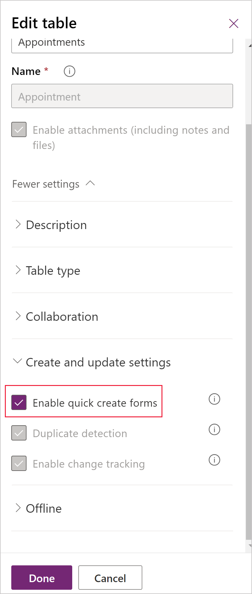

# Create or edit model-driven app quick create forms

With quick create forms, an app can have a streamlined data entry experience with full support for logic defined by form scripts and business rules. In a Power Apps model-driven app, quick create forms appear when the **Create** button is selected in the navigation bar or when **+ New** is chosen when creating a new row from a **lookup** or **subgrid**.
  
Model-driven apps and Dynamics 365 mobile apps use quick create forms for creating new rows. If a table already has a quick create form configured for it, the mobile apps use that form. If a table doesn't have a configured quick create form, Power Apps generates a quick create form for creating rows in the mobile apps based on the main form definition.  

Here's the quick create form for the standard Microsoft Dataverse account table.
  
:::image type="content" source="media/quick-create-form-account.png" alt-text="Quick create form for account table in form designer":::
  
## Tables with quick create forms

By default only these system tables have quick create forms: account, 1campaign response, 1case, 1competitor, contact, 1lead, 1opportunity.  
 
1Requires a customer engagement app.

Although it's possible to create quick create forms for system activity tables (except for the appointment table), system activity tables don't support quick create forms. Currently, the option to disable the quick create form for the appointment table isn't supported. Any of the other [updated tables](create-design-forms.md) and any custom tables can be enabled to support these forms by selecting **Enable quick create forms** in the table definition and creating a quick create form for the table.

Custom activity tables that support quick create forms can be enabled, and it's possible to create quick create forms for those tables. However, the quick create form for custom activity tables aren't used when app users select **Create** on the navigation bar. These quick create forms can be used only when users add a new row for a subgrid that displays that specific custom activity table.

## Create a quick create form

Although you can define multiple quick create forms, only one quick create form can be used by everyone. The form everyone uses is set using the [form order](assign-form-order.md). Quick create forms can't be assigned to security roles and they don't provide the capability for the user to switch forms.  
  
> [!NOTE]
>
> - The table must have the **Enable quick create forms** option enabled for the quick create form to be available as an option for the table.
> - The table must be added to your app.
> - Some columns, such as the `CREATEDON` column, aren't available to add to a quick create form.  
  
### How to create a quick create form
  
1. Sign in to [Power Apps](https://make.powerapps.com/?utm_source=padocs&utm_medium=linkinadoc&utm_campaign=referralsfromdoc).
1. Select **Solutions** on the left navigation pane, and then open the solution you want. [!INCLUDE [left-navigation-pane](../../includes/left-navigation-pane.md)]
1. Select **Tables**, select the table, and then select the **Forms** area.  
1. On the toolbar, select **Add form** > **Quick create form**.  
1. In the form designer, drag any columns from the **Table columns** left pane into the sections on the form.  
1. When you're finished, select **Save and publish** to display the new form in the application.  
  
## Edit a quick create form

While quick create forms support form scripts and business rules, their purpose is different from main forms and they don't support all the capabilities of main forms. Quick create forms always have one section with three columns. You can't add more sections or columns.
  
The following controls can't be added to quick create forms:  
  
- Subgrids  
- Quick view forms  
- Web resources  
- iFrames  
- Notes  
- Bing Maps  
  
If you add a composite column to a quick create form, it's displayed as separate columns.
  
### To edit a quick create form  
  
1. Sign in to [Power Apps](https://make.powerapps.com/?utm_source=padocs&utm_medium=linkinadoc&utm_campaign=referralsfromdoc).  
1. Select **Solutions** on the left navigation pane, and then open the solution you want. [!INCLUDE [left-navigation-pane](../../includes/left-navigation-pane.md)]
1. Open the table, and then select the **Forms** area.
1. In the form list, select a form where the form **Type** is **Quick create**.  
1. Drag any columns from the **Table columns** left pane into the sections in the form.  
  
   See [Configure event handlers](configure-event-handlers-legacy.md) for information about editing event handlers for form scripts.  

   :::image type="content" source="media/create-and-edit-a-model-driven-form/create-quick-create-form.gif" alt-text="Default model-driven app site map":::

1. When you're finished, select **Save and publish** to display the modified form in the application.  

## Enable quick create form property behavior for activities

The **Enable quick create forms** property can be enabled or disabled for all standard activities except recurring appointments. This property allows the form that is displayed by default for most activities to display. By default, the **Enable quick create forms** property is enabled and the quick create form is the form displayed in the app areas and activity tables that support it.

>  

### Unified Interface client form display behavior

The following table indicates what form is displayed by default when the **Enable quick create forms** property is *enabled* in the Unified Interface client.

|Location where form is accessed  |Form displayed  |
|---------|---------|
|Specific activity associated grid  | Quick create      |
|Specific activity sub grid   |  Quick create     |
|Activities (`activitypointer`) grid     | Quick create     |
|Activities (`activitypointer`) associated grid   | Quick create    |
|Activities (`activitypointer`) sub grid  | Quick create    |
|Global command bar + button 1    | Quick create    |
|Timeline wall   | Quick create    |
|Activities (`activitypointer`) grid   | Main   |
|Specific activity grid    | Main   |

1Activities appear in the global **Create** or **+ New** buttons when the **Enable quick create forms** property is enabled. In this case, the quick create form is used if it exists or the main form if it doesn't. If **Enable quick create forms** is disabled, the entry for the table won't appear.

### Classic web client form display behavior

The following table indicates what form is displayed by default when the **Enable quick create forms** property is *enabled* in the classic web client.

|Location where form is accessed  |Form displayed  |
|---------|---------|
|Specific activity associated grid  | Quick create      |
|Specific activity sub grid   |  Quick create     |
|Activities (`activitypointer`) grid     | Main     |
|Activities (`activitypointer`) associated grid   | Main    |
|Activities (`activitypointer`) sub grid  | Main    |
|Global command bar + button    | Main    |
|Specific activity grid   | Main    |

#### Classic web client social pane behavior

The social pane is a special case because it doesn't use the **Enable quick create forms** property but uses different forms for different activity tables as indicated here.

|Activity  |Form displayed  |
|---------|---------|
|Task     | Quick create    |
|Phone Call   | Quick create     |
|Email   | Main     |
|Appointment  | Main     |
|Custom activity     | Main      |

### Solution import Allow Quick Create value behavior

When a solution from version 8.2 is imported, regardless of the value of the **Enable quick create forms** property in the solution, the following tables are reset to the default form display value. Also, the main form displays: task, phone call, email, and appointment. In this situation, you'll need to reset the **Enable quick create forms** option back to *enabled* for those activity tables after the import.

If there's a customization made in a version 9.0 solution to tables where **Enable quick create forms** is enabled, the value won't change after import. However, if the **Enable quick create forms** option is set to *disabled* for the task, phone call, email, and appointment tables, the value is overwritten to enabled. In this situation, the **Enable quick create forms** option needs to be reset back to disabled for those activity tables after the import.

> [!IMPORTANT]
>
> - If a quick create form exists for a table but isn't included in the app, the Unified Interface runtime will still open the quick create form. This behavior occurs with lookup controls and subgrids. If you don’t want a quick create form to appear in your app you must delete it.
> - Be aware of the behavior that occurs when a parent relationship is created with the same table. For example, if Account has a relationship to Account and lookup is created that is used by a quick create form that creates a parent row, the first row won't be saved with the lookup that has the parent row value. This is because of the circular reference introduced by using the same table. If you experience this issue, you can resolve it by removing the parent row ID on the quick create form before saving the row.

## Next steps

[Create quick view form](create-edit-quick-view-forms.md)

[Form types overview](types-forms.md)

[!INCLUDE[footer-include](../../includes/footer-banner.md)]
