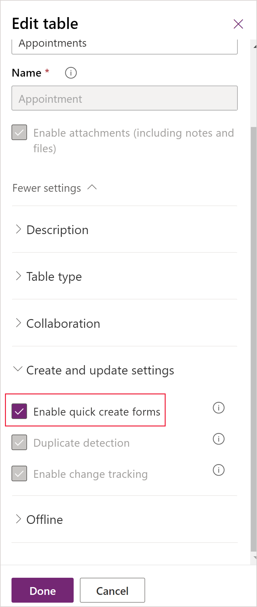

# Create or edit model-driven app quick create forms for a streamlined data entry experience

In this article, you create and edit a quick create form.

 With quick create forms, your app can have a streamlined data entry experience with full support for logic defined by form scripts and business rules. In a Power Apps model-driven app, quick create forms appear when you select the **Create** button in the navigation bar or when you choose **+ New** when creating a new row from a lookup or subgrid.
  
 Dynamics 365 mobile apps use quick create forms for creating new rows. If a table already has a quick create form configured for it, the mobile apps use that form. If a table doesn't have a configured quick create form, Power Apps generates a quick create form  for creating rows in the mobile apps based on the main form definition.  
  
   
## Tables with quick create forms  
 By default only these system tables have quick create forms: account, 1campaign response, 1case, 1competitor, contact, 1lead, 1opportunity.  
 
1Requires a customer engagement app.
 
Although you can create quick create forms for system activity tables, except for the appointment table, they do not support quick create forms. Currently, the option to disable the quick create form for the appointment table is not supported. Any of the other [updated tables](create-design-forms.md) and any custom tables can be enabled to support these forms by selecting **Enable quick create forms** in the table definition and creating a quick create form for the table. 

You can enable custom activity tables to support quick create forms, and you can create quick create forms for those tables. However, the quick create form for custom activity tables will not be used when people select **Create** on the navigation bar. These quick create forms can be used only when people add a new row for a subgrid that displays that specific custom activity table.  
  
   
## Create a quick create form  
 Although you can define multiple quick create forms, only one quick create form can be used by everyone. The form everyone will use is set using the form order. Quick create forms cannot be assigned to security roles and they do not provide the capability for the user to switch forms.  
  
> [!NOTE]
>  - The table must have the **Enable quick create forms** option enabled for the quick create form to be displayed. 
>  - You must also add the table and the quick create form to your app.
>  - Some columns, such as the CREATEDON column, aren't available to add to a quick create form.  
  
### How to create a quick create form  
  
1.  Sign in to [Power Apps](https://make.powerapps.com/?utm_source=padocs&utm_medium=linkinadoc&utm_campaign=referralsfromdoc).

2.  Expand **Data**, select **Tables**, select the table that you want, and then select the **Forms** tab.  

3.  On the toolbar, select **Add form** > **Quick Create Form**.  
  
4.  In the form designer drag any columns from the **Column Explorer** into the sections on the form.  
  
5.  When you are finished, select **Save**.  
  
6.  Select **Publish** to see the new form in the application.  
  
   
## Edit a quick create form  
 While quick create forms support form scripts and business rules, their purpose is different from main forms and they don't support all the capabilities of main forms. Quick create forms always have one section with three columns. You can't add more sections or columns.  
  
 The following controls cannot be added to quick create forms:  
  
-   Subgrids  
  
-   Quick View Forms  
  
-   Web resources  
  
-   iFrames  
  
-   Notes  
  
-   Bing Maps  
  
If you add a composite column to a quick create form, it will be displayed as separate columns.  
  
### To edit a quick create form  
  
1.  Sign in to [Power Apps](https://make.powerapps.com/?utm_source=padocs&utm_medium=linkinadoc&utm_campaign=referralsfromdoc).  

2. Expand **Data**, select **Tables**, select the table that you want, and then select the **Forms** tab.    

3. In the form list, select a form where the form **Type** is **Quick Create**.  
  
3.  Drag any columns from the **Column Explorer** into the sections in the form.  
  
     See [Configure event handlers](configure-event-handlers-legacy.md) for information about editing event handlers for form scripts.  
  
4.  When you are finished, select **Save**.  
  
5.  Select **Publish** to see the modified form in the application.  

## Enable Quick Create Form property behavior for activities
The **Enable quick create forms** property can be enabled or disabled for all standard activities except recurring appointments. This property lets you change the form that is displayed by default for most activities. By default, the **Enable quick create forms** property is enabled and the quick create form is the form displayed in the app areas and activity tables that support it. 

>  

### Unified Interface client form display behavior
The following table indicates what form is displayed by default when the **Enable quick create forms** property is *enabled* in the Unified Interface client.
 
|Location where form is accessed  |Form displayed  |
|---------|---------|
|Specific activity associated grid  | Quick create      |
|Specific activity sub grid   |  Quick create     |
|Activities (`activitypointer`) grid     | Quick create     |
|Activities (`activitypointer`) associated grid   | Quick create    |
|Activities (`activitypointer`) sub grid  | Quick create    |
|Global command bar + button1    | Quick create    |
|Timeline wall   | Quick create    |
|Activities (`activitypointer`) grid   | Main   |
|Specific activity grid    | Main   |

1Activities appear in the global **Create** or **+ New** buttons when the **Enable quick create forms** property is enabled. In this case, the quick create form is used if it exists or the main form if it does not. If **Enable quick create forms** is disabled, the entry for the table will not appear.

### Classic web client form display behavior

The following table indicates what form is displayed by default when the **Enable quick create forms** property is *enabled* in the classic web client.

|Location where form is accessed  |Form displayed  |
|---------|---------|
|Specific activity associated grid  | Quick create      |
|Specific activity sub grid   |  Quick create     |
|Activities (activitypointer) grid     | Main     |
|Activities (activitypointer) associated grid   | Main    |
|Activities (activitypointer) sub grid  | Main    |
|Global command bar + button    | Main    |
|Specific activity grid   | Main    |

 #### Classic web client social pane behavior
 
The social pane is a special case because it doesn't use the **Enable quick create forms** property but uses different forms for different activity tables as indicated here.

|Activity  |Form displayed  |
|---------|---------|
|Task     | Quick create    |
|Phone Call   | Quick create     |
|Email   | Main     |
|Appointment  | Main     |
|Custom activity     | Main      |

### Solution import Allow Quick Create value behavior

When you import a solution from version 8.2 regardless of the value of the **Enable quick create forms** property in the solution, the following tables will be reset to the default form display value and the main form will display: task, phone call, email, and appointment. In this situation, you'll need to reset the **Enable quick create forms** option back to *enabled* for those activity tables after the import.
 
If there is a customization made in a version 9.0 solution to tables where **Enable quick create forms** is enabled, the value will not change after import.  However, if you have set the **Enable quick create forms** option to *disabled* for the task, phone call, email, and appointment tables, the value will be overwritten to enabled. In this situation, you'll need to reset the **Enable quick create forms** option back to disabled for those activity tables after the import.

> [!IMPORTANT]
> - If a quick create form exists for a table but is not included in the app, the Unified Interface runtime will still open the quick create form.  This behavior occurs with lookup controls and subgrids. If you don’t want a quick create form to appear in your app you must delete it.
> - Be aware of the behavior that occurs when you create a parent relationship with the same table. For example, if Account has a relationship to Account and you create a lookup that is used by a quick create form that creates a parent row, the first row will not be saved with the lookup that has the parent row value. This is because of the circular reference introduced by using the same table. If you experience this issue you can resolve it by removing the parent row id on the quick create form before saving the row.

  
### See also  
[Overview of the form editor user interface](form-editor-user-interface-legacy.md)

[!INCLUDE[footer-include](../../includes/footer-banner.md)]