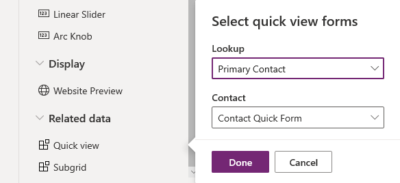

# Create a quick view form to view information about a related table

This article describes how to create a quick view form and how to add a quick view control to a main form.

You can add a quick view form to another form as a quick view control. It provides a template to view information about a related table row within a form for another table row. This means app users don't need to navigate to a different row to see the information they need to do their work.

Note that while a quick view form can appear over a view or a form, it is authored as a form, rather than a view.

In the example here, notice the module that relates to a given lesson within the quick view form.  A one-to-many relationship exists between the two tables for this to be possible.  You can see additional columns of metadata, including the image associated with the module. The form then continues with the metadata associated with the lesson table record.

:::image type="content" source="../../maker/model-driven-apps/media/quick-view-form-control.png" alt-text="view quick view form control":::
  
Quick view controls are associated with a lookup column that is included in a form. If the lookup column value isn't set, the quick view control is not visible.  
  
> [!NOTE]
>
> - You can't edit data in quick view form controls and they don't support form scripts.
> - Because quick view forms are viewed using a quick view control in a form, they don't include header, footer, or navigation areas.
> - Security roles can't be assigned to quick view forms and they can't be activated or deactivated.
> - Custom controls aren't supported in quick view forms, and there is limited customization support for complex controls such as subgrids. If this is required, consider using a [Form component control](form-component-control.md)
  
## Create a quick view form

You create quick view forms by using the form editor, similar to how you create other forms. Quick view forms are read-only. Use them to create forms that are for reading purposes only.  
  
1. Sign in to [Power Apps](https://make.powerapps.com/?utm_source=padocs&utm_medium=linkinadoc&utm_campaign=referralsfromdoc) and then select **Solutions** from the left navigation pane. [!INCLUDE [left-navigation-pane](../../includes/left-navigation-pane.md)]
1. Open the table where you want to create a quick view form, select the table that you want, and then select the **Forms** area.
1. On the toolbar, select **New form** > **Quick view form**.  
1. Enter a **Form name** and **Form description** to differentiate this quick view form from others.
1. Optionally, clear **Get AI-generated column suggestions** if you don't want suggestions from Copilot for the columns to create for the form based on the **Form name** and **Form description** values.
1. Select **Create**.
1. The form designer opens. Drag columns you want to add from the left **Table columns** pane into the form canvas. To remove columns you don't want, select the column, and then select **Delete** on the command bar.

   > [!IMPORTANT]
   > Required columns can't be removed from a form. If you add a required column to the form and want to remove it, you must delete the form and then re-create it. When you set the required property for a column, a row can't be saved without data in the column.

1. Select **Save and publish** to make your changes available to users of the apps that use the form.

## Edit a quick view form

Quick view forms have a simplified layout because they are designed to be viewed within a form section. Only one single column tab is available with quick view forms. You can add only additional single column sections, columns, subgrids, and spacers.

1. Sign in to [Power Apps](https://make.powerapps.com/?utm_source=padocs&utm_medium=linkinadoc&utm_campaign=referralsfromdoc).

1. Open the solution that has the table where you want to edit the form, and open the table you want, and then select the **Forms** area.

1. Open the quick view form.

1. Add or remove the table columns you want.
  
   > [!IMPORTANT]
   > You can't delete required columns. If you add a required column to the form, you can't delete it. If you don't want the column in the form, you must delete the form and then re-create it.
  
1. When you're done editing a quick view form, select **Save and publish** to publish your changes so they're visible in the application.  

## Add a quick view control to a main form

You can add quick view forms to a main form only when a lookup column exists that targets the table of the quick view form.  
  
1. Sign in to [Power Apps](https://make.powerapps.com/?utm_source=padocs&utm_medium=linkinadoc&utm_campaign=referralsfromdoc).  

1. Open the solution that has the table where you want to edit the form, and open the table you want, and then select the **Forms** area.
1. Open a form, which **Type** is **Main**
1. In the form designer, select **Quick view** from the **Components** pane.  
1. In the **Select quick view forms** dialog box, select the **Lookup** column, and then select the lookup column value. More information: [Quick view control properties](quick-view-control-properties-legacy.md).  

   > [!div class="mx-imgBorder"] 
   > 

1. Select **Done** to close the **Select quick View forms** dialog box. The quick view form appears on the form.
1. To save and publish the form select **Save and publish**.  

> [!IMPORTANT]
> Be aware of the behavior that occurs when you create a parent relationship with the same table. For example, if Account has a relationship to Account and a lookup is created that is used by a quick create form that creates a parent row, the first row will not be saved with the lookup that has the parent row value. This is because of the circular reference introduced by using the same table. If this issue is experienced it can be resolved by removing the parent row ID on the quick create form before saving the row.

## Quick view form properties

When the quick view form is used in a main form the following properties can be set or updated.

|Property|Description|  
|--------------|-----------------|  
|**Name**|**Required**: Enter a unique name for the quick view form. Use this name when referencing the form in scripts.|  
|**Label**|**Required**: Enter a label to display for the quick view form.|  
|**Display label on the Form**|Choose whether to display the label on the form.|  
|**Lookup Column**|Choose one of the lookup columns included in the form.|  
|**Related table**|This value depends on the **Lookup Column** chosen. It's usually the primary table for the 1:N table relationship for the lookup.   If the table includes a **Potential Customer** lookup that can accept either an account or contact, in the **Quick View Form** column you can choose a quick view form for both account and contact by changing this value and then choosing another quick view form.|  
|**Quick View Form**|If the **Related table** has any quick view forms these can be selected here. Otherwise, select **New** to create one.   

## Next steps
  
[Create and edit a card form](create-card-forms.md)

[!INCLUDE[footer-include](../../includes/footer-banner.md)]
