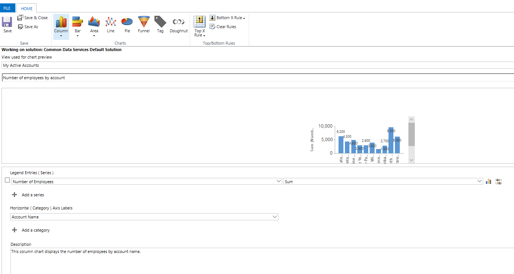

# Create a model-driven app system chart

[!INCLUDE [cc-data-platform-banner](../../includes/cc-data-platform-banner.md)]

In this topic you learn how to create a system chart. System charts are organization-owned charts, which makes them available to anyone with access to read the data running the app. System charts can't be assigned or shared with specific app users.  
  
1. Sign in to [Power Apps](https://make.powerapps.com/?utm_source=padocs&utm_medium=linkinadoc&utm_campaign=referralsfromdoc).  

2. Expand **Data**, select **Tables**, select the table that you want, and then select the **Charts** tab.  
  
3.  On the toolbar, select **Add chart**.  
  
4.  Specify the type of chart, and how the data is displayed in the chart.  
  
    -   Enter the chart name, such as *Number of employees by account*.  
  
    -   In the **Select Column** dropdowns: 
        - In the **Select Column** **Series** axis dropdown select a column such as **Number of Employees**.  
        - In the **Select Column** **Category** axis dropdown select a column such as **Account Name**.
  
    -   Add a description to identify the purpose of the chart, such as *This column chart displays the number of employees by account name*. 

    > [!div class="mx-imgBorder"] 
    > 
  
5.  Select **Save and Close**.  

## Known issues  
In the chart designer, adding a order by on certain calculated columns are not supported and will cause an error.  The calculated columns causing this are using another calculated columns, a related table column, or a local column on the table.

## Next steps  
[Create or edit dashboards](create-edit-dashboards.md)

[!INCLUDE[footer-include](../../includes/footer-banner.md)]