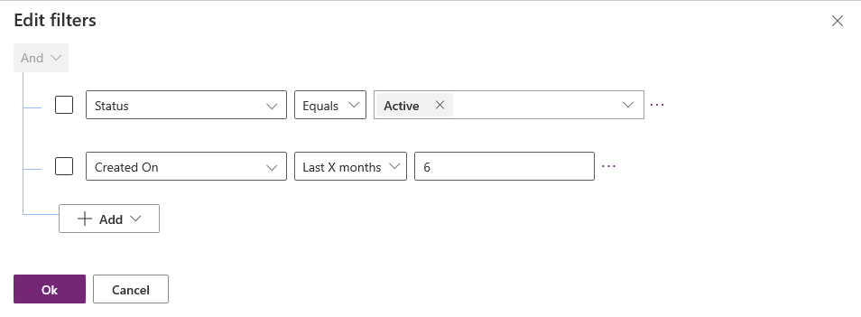

# Create or edit filters in model-driven app views

The filters in a Power Apps view define the records that a user is able to see when selecting the view for the current table. You can add or edit a filter for the columns that you include in a view by selecting the column and selecting **Filter by** in the view designer.

You can also use the expression builder in the view designer. Use the expression builder to add or edit filters for any columns of the table in the current view or any columns in a related table.

In this article, you create or edit filters by performing the following tasks:

- [Edit or remove a filter condition](create-edit-view-filters.md#edit-or-remove-a-filter-condition)
- [Open the expression builder](create-edit-view-filters.md#open-the-expression-builder)
- [Add conditions to a filter](create-edit-view-filters.md#add-conditions-to-a-filter)
- [Add a group condition to a filter](create-edit-view-filters.md#add-a-group-condition-to-a-filter)
- [Add a related table to a condition](create-edit-view-filters.md#add-a-related-table-to-a-condition)
- [Group conditions of a filter](create-edit-view-filters.md#group-conditions-of-a-filter)

## Edit or remove a filter condition

1. Sign in to [Power Apps](https://make.powerapps.com/?utm_source=padocs&utm_medium=linkinadoc&utm_campaign=referralsfromdoc).  
1. On the left pane, select **Solutions**, and then open the solution you want.
1. Open the table that you want, and then select the **Views** area.
1. Open the view that you want to edit. The view properties panel lists existing filters.

   > [!div class="mx-imgBorder"] 
   > 

1. On the view properties panel, select a filter condition.

   > [!div class="mx-imgBorder"] 
   > 

1. Select the conditional operator that you want to use.

1. Type or select the comparison value for the condition.

1. Select **Apply**.

1. To remove a condition, select **Close**. The condition is removed without confirmation.

### Open the expression builder

Use the expression builder to redefine existing filters and add additional clauses.

On the view properties right panel in the view designer, select **Edit filters**.

> [!div class="mx-imgBorder"] 
> 

#### Add conditions to a filter

1. In the [expression builder](#open-the-expression-builder), select **Add** > **Add row**.

2. Select a column for the condition.

3. Select a conditional operator.

4. Select a comparison value.  

   Some filter conditions don't require a comparison value for the condition. For example, the operator **Contains data** doesn't require a comparison value. With other filter conditions, you choose the comparison value from an option set. For example, the **Status** column has the values **Active** and **Inactive**.

    > [!div class="mx-imgBorder"] 
    > 

5. Select **OK**.

#### Add a group condition to a filter

1. In the [expression builder](#open-the-expression-builder), select **Add** > **Add group**.

2. Select the relational operator **Or** for the group. **And** is the default relational operator.

3. Specify the first clause of the grouped condition. Select the column, conditional operator, and comparison value.

4. Select **Add** > **Add group**.

5. Specify the second clause of the grouped condition.

   > [!div class="mx-imgBorder"] 
   > 

    You can select **Collapse** to display the group as a conditional expression.

#### Add a related table to a condition

1. In the [expression builder](#open-the-expression-builder), select **Add** > **Add related table**.

2. Select a column from the current table that is related to another table. The table related to the column is shown in parenthesis. You can select columns that have a many-to-one, one-to-many, or many-to-many relationship with the related table.

3. Select a column of the related table for the condition.

4. Select a conditional operator.

   > [!NOTE]
   > **Contains data** is the only conditional operator that can be used with a related table in a view filter.

5. Select or enter a comparison value.

    > [!div class="mx-imgBorder"]
    > 

#### Group conditions of a filter

1. In the [expression builder](#open-the-expression-builder), select the check box for the conditions that you want to group.

2. Select **More commands** (...) for one of the conditions, and then select **Make group**.

3. To ungroup a group, select **More commands** (...) for the group, and then select **Ungroup**

    > [!div class="mx-imgBorder"] 
    > 

### Next steps

[Configure sorting in views](configure-sorting.md)   
[Converting views into editable grids](make-grids-lists-editable-custom-control.md) 

[!INCLUDE[footer-include](../../includes/footer-banner.md)]
