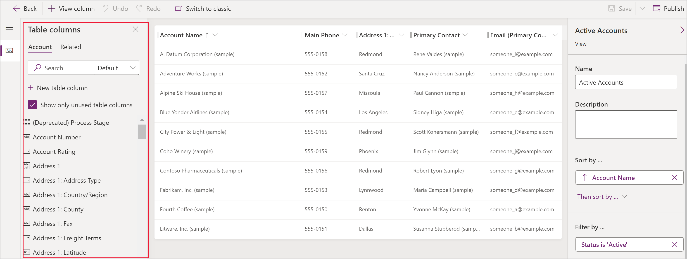
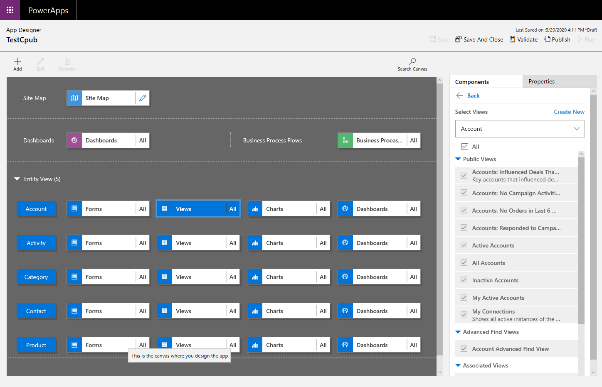

# Create and edit public or system views

Model-driven apps can contain a range of views, so that app users can see the most suitably presented and filtered version of the table that they are investigating.  Views can be **Personal**, **System** or **Public**.

> [!NOTE]
   >   Views are tied a given table however we can select this during the process of creating a model driven app.  By default ALL views will be made available.

:::image type="content" source="media/create-or-edit-model-driven-app-view/switch-views.gif" alt-text="Configure views in model-driven apps":::

> [!TIP]
> For a general introduction into views please read [Understand views in model-driven apps](create-edit-views.md)

## Create a public view in Power Apps
Public views are available to users as when reviewing a table.  App makers can create and configure these using Power Apps.

> [!NOTE]
> Public views created in Power Apps that include **Contains data** or **Does not contain data** filters will not appear in the list of saved views in Advanced Find.

1. Sign in to [Power Apps](https://make.powerapps.com/?utm_source=padocs&utm_medium=linkinadoc&utm_campaign=referralsfromdoc).
1. Select **Solutions** in the left navigation.

1. Create a new solution by selecting **New solution** or select **edit** in the ellipses (**...**) menu of an existing solution. For more  information on creating a model-driven app see:
   - [Create a model driven app](create-model-driven-app.md)
   - [Add a table to a solution](../data-platform/data-platform-create-entity)

From within the solution there are two ways to edit views. *App Designer* and Tables

## Edit public views through tables

In the solution that we opened earlier create a new table or find an existing table that where the public views need to be edited.

1. Expand **Data**, select **Tables**, select the table required, and then select the **Views** tab.
1. On the toolbar, select **Add view**.
:::image type="content" source="media/add-view.png" alt-text="Add view to table":::
1. On the **Create a view** dialog box, enter a name and, optionally, a description, and then select **Create**.
:::image type="content" source="media/create-a-view-dialog.png" alt-text="Create a view":::
1. In the view designer, select **+ View column** to add additional columns needed within the view. Or alternatively, select Table columns in the left navigation and drag the table columns into your view.

   

   > [!TIP]
   > The **Default** view in the **Add column** pane displays all columns. If preferred, select **Standard** or **Custom** to display a subset of columns.
   > :::image type="content" source="media/display-all-columns.png" alt-text="Select All to display all columns":::
1. In the view designer, the following tasks can be performed:

   - To change the column filtering select the header of the column where the filter is required, and then in the dropdown select **Filter by**.
   - To change the column sorting select the header of the column where sorting is needed then select **Sort A-Z** or **Sort Z-A** or **Sort descending** or **Sort ascending**.  
   - Configure column width by clicking and dragging the column to the desired position.
   - Reorder columns by dragging a column to the desired position.
    > [!NOTE]
    > Depending on the data type of the column the term **Sort A-Z**/**Sort Z-A** or **Sort ascending**/**Sort descending** is used

    > [!TIP]
    > It is also possible to change column order by clicking on the column header and selecting **Move Right** or **Move Left**.
2. Select **Publish** to save the view and make it available for other users in your organization.

## Work with views in app designer

An alternative to editing views in the tables is to edit views from the app designer.  

### Open and add a view in the app designer

The following steps explain how to open and add a view in the app designer.

1. In Power Apps select **Solutions** from the left navigation pane, select **...** next to the app required, and then select **Edit**.
1. In the app designer **Table View** section, select **Views**.
   In this example, we have selected **Views** from the **Account** table.

   

1. To add a view, select it by using view types such as Public, Advanced Find, Associated, and Lookup. The view is automatically added to the **Views** list.

    > [!NOTE]
    > Views are displayed based on the table selected. For example, when you select **Account**, views that are related to the Account table are displayed.

More information about the app designer: [Design custom business apps by using the app designer](design-custom-business-apps-using-app-designer.md)

### Next steps

[Make grids editable](make-grids-lists-editable-custom-control.md)

[!INCLUDE[footer-include](../../includes/footer-banner.md)]
