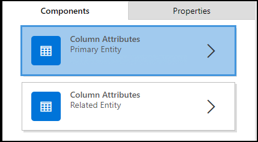
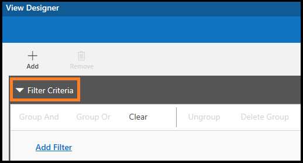
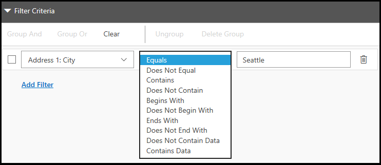
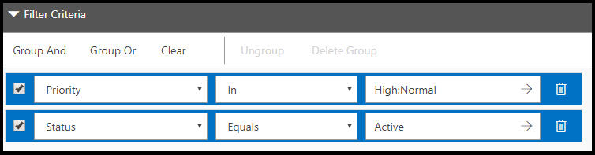
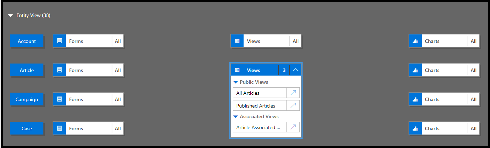

# Tutorial: Create and edit public or system model-driven app views by using the app designer

In this tutorial you perform several tasks required to work with views, such as create a public view, add an existing view to an app, and change columns, filters, and sort order for a view.

In PowerApps, views define how records for a specific entity are  displayed. A view defines the following:
-  The columns (attributes) to display
-  The width of the columns
-  How the records are sorted by default
-  Which filters are applied to determine which records appear in the list by default

Typically, views are classified into three types:
- **Personal:** Individual users can create personal views according to their personal requirements. These views are visible only to the user who created them and anyone they choose to share them with. 
- **Public:** As an app maker, you can create and edit public views to fit your organizational requirements. These views are available in the view selector, and you can use them in subgrids in a form or as a list in a dashboard.
- **System:** As an app maker, you can also modify system views to meet the requirements of your organization. These are special views that the application depends on: they exist for system entities or are automatically created when you create custom entities. These views are available to some or all users, depending on their permissions.

More information: [Understand views](create-edit-views.md)

## Create a public view in PowerApps
As an app maker, you can create and edit public views by using PowerApps.
1. On the [PowerApps](https://web.powerapps.com/?utm_source=padocs&utm_medium=linkinadoc&utm_campaign=referralsfromdoc) site, select **Model-driven** (lower left of the navigation pane).  

     

    > [!IMPORTANT]
    > “If the **Model-driven** design mode isn't available, you may need to [Create an environment](https://docs.microsoft.com/powerapps/administrator/create-environment).   
  
2.  Expand **Data**, select **Entities**, select the entity that you want, and then select the **Views** tab. 

3. On the toolbar, select **Add view**. 

4. On the **View Properties** dialog box, enter a name and, optionaly, a description, and then select **OK**. 
    
5. In the view designer, select **Add Columns** to add additional columns you want to display in the view. More information: [Add a column to your view](#add-a-column-to-your-view)
6. Select **Edit Filter Criteria** to change filtering in the following ways: 
    -  To apply filtering criteria to refine the data that is displayed in the view. More information: [Define filter criteria](#define-filter-criteria). 
    - To group the filters by using **AND** or **OR** options and further refine the data that is displayed in the view. More information: [Group multiple filters](#group-multiple-filters)
7. Select **Configure Sorting** to change the order of the data by configuring the primary and secondary sort order for columns. More information: [Set the primary and secondary column sort order](#set-primary-and-secondary-sort-order-for-columns)
8. (Optional) Configure column width: 
  
    a. Select a column. The **Properties** tab opens.
    
    b. Configure **Set Width** with the column width you want.
    
    > [!NOTE]
    > The column width value ranges from 25 pixels through 300 pixels.
9. (Optional) Reorder columns by dragging a column to the position you want to move it to. 

    You will see a visual indicator when you hold the column over a position it can be moved to.

    

    > [!NOTE]
    > You can also change column order by using keyboard shortcut keys. Cut the column by selecting Ctrl + X, select a column, and then paste by selecting Ctrl + V. The column will be moved to the right of the selected column.
10. (Optional) Attach an icon or a file to a column to differentiate it from other columns during run time. More information: [Define a web resource](#define-a-web-resource)
11. **Save and Close** the view. 
12. Choose **Publish** to make the view available for other users in your organization. 
   

## Open and add a view in the app designer

The following steps explain how to open and add a view in the app designer.
1. In solution explorer select **Apps**, and then select the app you want to edit to open it in app designer. 

2. In the **Entity View** section, select **Views**.

    In this example, we have selected **Views** from the **Account** entity.

    

3. To add a view, select it by using view types such as Public, Advanced Find, Associated, and Lookup. The view is automatically added to the **Views** list.

    > [!NOTE]
    > Views are displayed based on the entity that you have selected. For example, when you select **Account**, views that are related to the Account entity are displayed.

More information about the app designer: [Design custom business apps by using the app designer](design-custom-business-apps-using-app-designer.md)

## Add a column to your view
Views display records in a table that contains rows and columns. Each row is a record, and the fields you display from the record are determined by the columns you add to the view.

1. In app designer, on the **Components** tab, select the **Column Attributes** list for either the **Primary Entity** or **Related Entity**.

     

2. From the list, select the attribute you want  and drag it to the column heading. You can also add the attribute by double-clicking it.
3. Repeat step 2 until you’ve added all the attributes you want to display in your view .

As you add attributes, you can drag them to any position among existing column headings. You can also move columns around after you add them to your view.

## Define filter criteria
You can set filter criteria so that only a subset of the records is displayed in a view. When a user opens the view, only the records that meet the defined filter criteria are displayed. You can select fields from both the primary and related entities to filter on.
1. In the app designer, expand the **Filter Criteria** section.
   
     

2. Select **Add Filter**.
3. Select an attribute from the drop-down list in the first column. 
4. Select an operator from the drop-down list in the second column.

    

5. Enter a value to filter by in the third column.

You can filter data based on the attributes of related entities in addition to the primary entity. 

1. On the **Components** tab, select the **Column Attributes** list for **Related Entity**, select the **Choose an Entity** down arrow in the topmost field, and then choose the entity you want.

    This will add a separate section.

2. Repeat steps 2 through 5 from the previous procedure.

More information: [Create and edit relationships between entities](../common-data-service/create-edit-entity-relationships.md)

## Group multiple filters
You can add multiple filters to your view if you want to filter records by using more than one field. 

1. Select the filters that you want to group.
    
2. Select Group And or Group Or to group the filters.
    
When you select **Group And**, only records that meet both criteria are displayed in the view. When you select **Group Or**, records that meet any of the filter criteria are displayed. For example, to show only records that have priority of High or Normal, and status of Active, select **Group And**.

To remove the filter from a group, select the group, and then select **Ungroup**. 

## Set primary and secondary sort order for columns
When a view is opened, the records it displays are sorted in the order you set when you created the view.   By default, records will be sorted according to the first column in a view when no sort order is selected. You can choose to sort on a single column, or you can choose two columns—one primary and one secondary—to sort by. When the view is opened, the records will first be sorted by the column you want to use for primary sort order, and then by the column you want to use for secondary sort order. 

> [!NOTE]
> You can only set primary and secondary sort order for column attributes you added  from the primary entity.

1. Select the column you want to use for sorting.
2. Select the down arrow, and then choose **Primary Sort** or **Secondary Sort**.
 
     

If you remove the column you chose for the primary sort order, the column you chose for the secondary sort order becomes the primary.

## Define a web resource
Specify a web resource of script type, to associate with a column in your view. These scripts help to display icons for columns.

1. Select the column you want to add a web resource to.
2. On the **Properties** tab, select **Advanced**.
3. In the **Web Resource** drop-down list, select the web resource you want to use.
4. In the **Function Name** box, enter a function name.

## Edit a public or system view
You can change the way a public or system view is displayed by adding, configuring, or removing columns.
1. In the **Views** list for an entity, select the **Show list of references** down arrow .
    
2. Next to the view you want to edit, select **Open the View Designer** . 

    The view opens in the view designer. 

When you edit a public or system  view, you must save and publish your changes before they will be visible in the application.

## Community tools
**View Layout Replicator** and **View Designer** are tools that XrmToolbox community developed for Dynamics 365 Customer Engagement.

More information: [Developer tools](https://docs.microsoft.com/dynamics365/customer-engagement/developer/developer-tools).

> [!NOTE]
> These tools are provided by XrmToolBox and are not supported by Microsoft. If you have questions pertaining to the tool, please contact the publisher. More information: [XrmToolBox](https://www.xrmtoolbox.com/). 

### Next steps
[Create 1:N (one-to-many) or N:1 (many-to-one) relationships](../common-data-service/create-edit-1n-relationships.md)