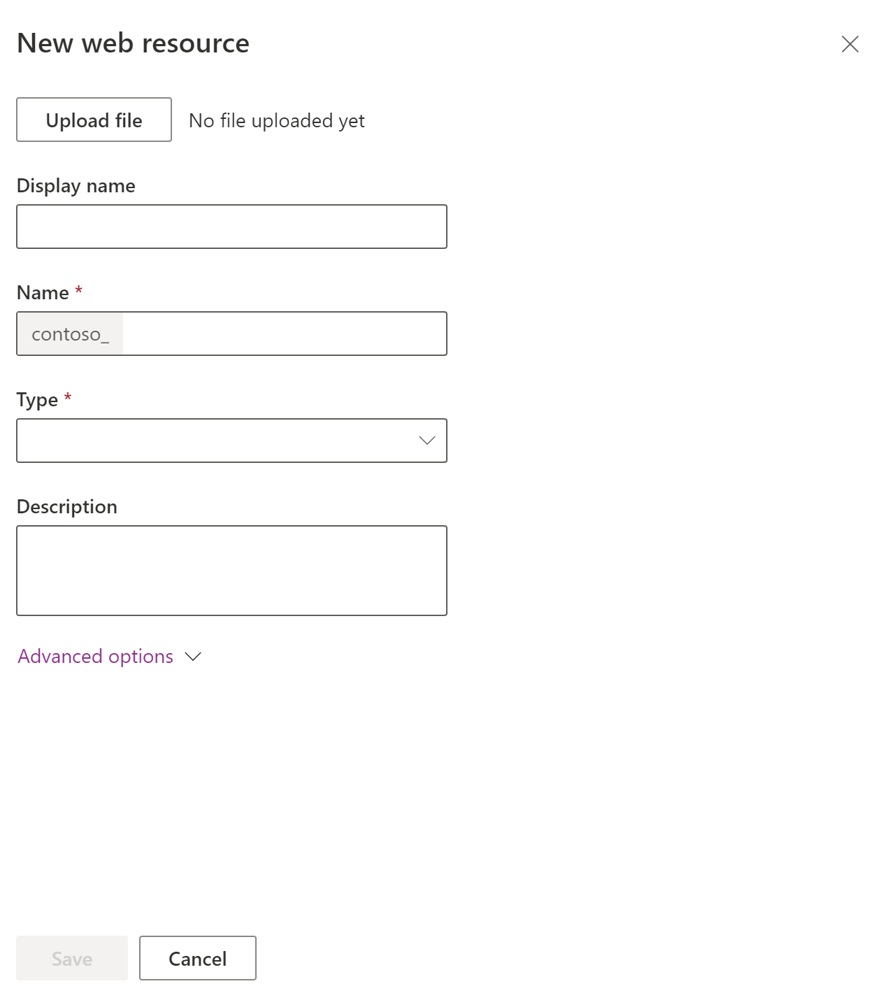

# Create or edit model-driven app web resources to extend an app

[!INCLUDE [cc-data-platform-banner](../../includes/cc-data-platform-banner.md)]

Web resources are typically used by developers to extend an app using files that are used in web development. App users may need to manage web resources provided by a developer or designer.  

> [!TIP]
> For an in-depth discussion of web resources, see [Developer Documentation: Web resources for model-driven apps](../../developer/model-driven-apps/web-resources.md).
   

## What are web resources?  

Web resources are virtual files stored in the system. Each web resource has a unique name that can be used in a URL to retrieve the file. Think of them this way: If you had access to the actual web server running the web app, you could copy files over to that website. But with most online services, you can’t do this.  Instead, you can use web resources to upload files to the system and then reference them by name just as though you had copied them as files to the web server.  
  
For example, if you create an HTML page as a web resource named “new_myWebResource.htm”, you could open that page in a browser using a URL like this:  
 
`<base URL>/WebResources/new_myWebResource.htm`
  
where *\<base URL>* is the part of the URL you use to view apps that ends in `dynamics.com`. Because the web resource is data in the system, only licensed users for your organization can access them this way. Normally, web resources are included in forms rather than referenced directly. The most common usage is to provide JavaScript libraries for form scripts.  
    
Because web resources are data in the system and are solution aware, you can move them to different organizations by exporting them as part of a solution and importing the solution into a different organization. You must use solution explorer to work with web resources.
  
## Solution publisher prefix

Part of the name of any web resource you create is the solution publisher prefix. This is set based on the solution publisher for the solution you’re working in. Make sure that you are working in the unmanaged solution where the publisher prefix is the one you want for this web resource. More information: [Solution publisher](../data-platform/create-solution.md#solution-publisher)  

## View and add web resources
1. Sign in to [Power Apps](https://make.powerapps.com/?utm_source=padocs&utm_medium=linkinadoc&utm_campaign=referralsfromdoc), and then on the left navigation pane select **Solutions**. 
2. Open an unmanaged solution, on the command bar select **Add existing**, point to **Other**, and then select **Web resource**. 
   The list of web resources available are displayed. 
3. To add a web resource to the unmanaged solution, select the web resource, and then select **Add**. To close the list without adding a web resource select **Cancel**. 

## Create a web resource

1. Sign in to [Power Apps](https://make.powerapps.com/?utm_source=padocs&utm_medium=linkinadoc&utm_campaign=referralsfromdoc), and then on the left navigation pane select **Solutions**. 
2. Open an unmanaged solution, on the command bar select **New**, point to **Other**, and then select **Web resource**. 
3. Complete the form to create the web resource:

    
  
|Column|Description|  
|-----------|-----------------|  
|**Name**|*Required*. This is the unique name for this web resource. You can’t change this after you save the web resource. &bull; This name can only include letters, numbers, periods, and nonconsecutive forward slash (“/”) characters.  &bull; The solution publisher customization prefix will be prepended to the name of the web resource.|  
|**Display Name**|The name displayed if you view a list of web resources.|  
|**Description**|A description of the web resource.|  
|**Type**|*Required*. This is the type of web resource. You can’t change this after you save the web resource.|  
|**Text Editor**|When the type of web resource represents a kind of text file, select this button to open a page to edit the content using the text editor. More information: [Use the text editor appropriately](#use-the-text-editor-appropriately)| 
|**Language**|Allows for a selection of a language. This option just tags the row that stores the web resource data. It doesn’t change the behavior of the web resource.|  
|**Upload File**|Select the **Browse…** button to choose a file to upload as a web resource. &bull; You can upload a file when creating a new web resource or to overwrite an existing web resource. &bull; The file name extension of the file must match allowed extensions. &bull; By default the maximum size file that can be uploaded as a web resource is 5MB. This value can be modified by using the **System Settings** > **Email** tab > **Set file size limit for attachments** setting. More information: [System Settings dialog box - Email tab](/dynamics365/customer-engagement/admin/system-settings-dialog-box-email-tab) |  
|**URL**|After you save the web resource, the URL to the web resource will be displayed here. Select this link to view the web resource in your browser.|  
  
4. After you have added your changes, select **Save** and then select **Publish**.  

## Edit a web resource
Open an unmanaged solution and select the web resource to edit it. 

> [!NOTE]
> Changes to a web resource will not be visible in the application until you publish it.
  
### Use the text editor appropriately

The text editor provided in the application for web resources should only be used for simple edits of text files. You can use it to create and edit HTML web resources, but you should only edit HTML web resources that were created using the text editor. The text editor is designed for very simple HTML content. 

> [!IMPORTANT]
> If the content of an HTML web resource wasn’t created using the text editor, don’t use the text editor to edit it.  
> The text editor uses a control that modifies the HTML source in a way that allows it to be edited. These changes can make the page behave differently in the browser and cause more sophisticated code to stop working. Opening an HTML web resource with the text editor and saving it without making any changes can break some HTML web resources.  <!--More information: [Developer Documentation: Use the text editor for HTML web resources](/dynamics365/customer-engagement/developer/webpage-html-web-resources#use-the-text-editor-for-html-web-resources)  -->
  
We recommend that you use an external editor to edit text files and then save them locally before uploading them with the **Upload File** button. This way you can preserve a copy of the web resource if you need to return to an earlier version. You can use a simple editor like Notepad, but a text editor with more advanced capabilities is highly recommended. [Visual Studio Community](https://www.visualstudio.com/vs/community/) and [Visual Studio Code](https://code.visualstudio.com/) are free and provide powerful capabilities for editing the text-based files used by web resources.  

## Create and edit a web resource on a form using solution explorer

You can add or edit web resources on a form to make it more appealing or useful to users. 

> [!NOTE]
> You can’t include a web resource in a form header or footer.  

[!INCLUDE [cc_navigate-solution-from-powerapps-portal](../../includes/cc_navigate-solution-from-powerapps-portal.md)]

### Navigate to a form
With solution explorer open, under **Components**, expand **Entities**, and then expand the table you want to work with.

Choose **Forms**, in the list locate a form of type Main, and then double-click or tap the entry to open and edit the form.

### Add or edit web resource in a form

See [Web resource properties](web-resource-properties-legacy.md) for information about the properties you can set for web resources in a form.

### Preview

To preview how the main form will appear and how events will function:
- On the **Home** tab, select **Preview**, and then select **Create Form**, **Update Form**, or **Read-Only Form**.
- To close the Preview form, on the **File** menu, select **Close**.

### Save

When you finish editing the form, on the **Home** tab, select **Save and Close** to close the form. 

### Publish

When your customizations are complete, publish them:
- To publish customizations for only the component that you are currently editing, in the navigation pane, select the table you have been working on, and then select **Publish**.
- To publish customizations for all unpublished components at one time, in the navigation pane, select **Entities**, and then on the **Actions** toolbar, select **Publish All Customizations**.
   
  
### See also  

[Web resource properties](web-resource-properties-legacy.md)   
[Create and design forms](create-design-forms.md)  
[Understand model-driven app components](model-driven-app-components.md)   
[Developer Documentation: Web resources in model-driven apps](../../developer/model-driven-apps/web-resources.md)

[!INCLUDE[footer-include](../../includes/footer-banner.md)]
