# Create guided help (Learning Path) for your app

Use Learning Path to give your users a custom, in-app Help experience that is tailored to your environment and the specific usage and workflow of your organization. 

> [!IMPORTANT]
> Learning Path is only available with legacy web client apps. Use custom help pages for Unified Interace apps. More information: [Create guided help for your Unified Interface app](../common-data-service/create-custom-help-pages.md)

Learning Path facilitates learning and adoption of your apps and organizational processes, ensures that data is entered and interpreted consistently, and reduces errors and support calls generated by users. [Watch a short video (1:50) about Learning Path](https://community.dynamics.com/crm/b/crmvideos/archive/2016/05/09/introducing-learning-path-for-dynamics-crm).  

   

## How is Learning Path different from customizable Help?  
 Customizable Help allows you to override the default [!INCLUDE[pn_crm_shortest](../../includes/pn-crm-shortest.md)] apps Help and point users in your organization to a different URL for Help. Or you can override the Help for a highly customized entity so that you can better describe your workflow. 

 Learning Path lets you add customizable Help that users see in the app when they open a page, perform an action, or select the Help button (?).   

 For more information about customizable Help, see [Customize the Help experience](https://technet.microsoft.com/library/dn832079.aspx).  

   
## Prerequisites  

 To create Learning Path content, you must:  

- Be using PowerApps or [!INCLUDE[pn_crm_online_shortest](../../includes/pn-crm-online-shortest.md)].  

- Have opted in for Learning Path. This setting is on by default, but it might have been turned off.  

   To ensure that Learning Path is on: On the nav bar, go to **Settings**  > **Opt in for Learning Path**.  

   More information: [On-off switch for Learning Path (guided help)](/dynamics365/customer-engagement/admin/on-off-switch-for-learning-path-guided-help)  

- Have the System Customizer or System Administrator Role, or another role that has the Learning Path Authoring privilege.  

- Enable Learning Path authoring. This creates the [!INCLUDE[pn_Office_365](../../includes/pn-office-365.md)] Learning Path Authors security group.  

- Be a member of the [!INCLUDE[pn_Office_365](../../includes/pn-office-365.md)] Learning Path Authors security group.  

  You can author Learning Path content for web app modules and Unified Interface app modules. This includes [!include].  

   
## Turn on Learning Path for your organization  
 Learning Path is an optional feature that can be turned on or off for your organization. You can display Learning Path content included with [!INCLUDE[pn_crm_shortest](../../includes/pn-crm-shortest.md)], create your own Learning Path content for your users, or both.  

1. Sign in to [PowerApps](https://web.powerapps.com/?utm_source=padocs&utm_medium=linkinadoc&utm_campaign=referralsfromdoc) or [!INCLUDE[pn_crm_shortest](../../includes/pn-crm-shortest.md)] with an admin account.  

2. Go to **Settings**, and then select **Administration** under **System**. More information: [Settings](/powerapps/maker/model-driven-apps/advanced-navigation#settings)

3. On the **Administration** page, select **System Settings**.  

4. On the **General** tab, under **Set custom Help URL**, select **Yes** for **Enable Learning Path** and **Enable Learning Path Authoring**.  

    You can enable Learning Path or customizable Help, but not both at the same time. Confirm that **Use custom Help for customizable entities** and **Append parameters to URL** are set to **No**.  

     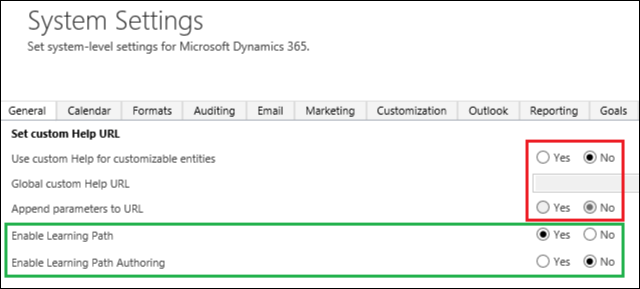  

5. Select **OK**.  

   
## Add a user to the Office 365 Learning Path Authors security group  
 If you're not a member of the [!INCLUDE[pn_Office_365](../../includes/pn-office-365.md)] Learning Path Authors security group, you'll see the following error message when you open the Learning Path Content Library.  

 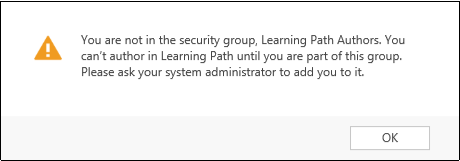  

#### Add a user  

1. Go to the admin portal for your [!INCLUDE[pn_Office_365](../../includes/pn-office-365.md)] tenant by selecting  the **Navigate to other applications** button in the upper-left corner of the page when you're signed in to [!INCLUDE[pn_crm_shortest](../../includes/pn-crm-shortest.md)], and then select **Admin**.  

    You might be asked to reenter your password.  

2. In the **Admin center**, select **Groups**.  

3. On the **Groups** page, select the **Learning Path Authors** security group.  

4. In the **Members** row, select **Edit** to add users to the group.  

5. Select **+ Add members**, and then specify or search for the user(s) you want to add to the group.  

6. Select **Save** when you're finished adding users.  

> [!NOTE]
>  Another way to assign the group to a user account is by selecting **Users** > **Active Users**, selecting the user you want to add, and then selecting **Edit** next to **Group memberships** to select the group(s) to add the user to.  

   
## How does Learning Path work with multiple organizations?  
 When you publish Learning Path content, you can use Publishing Environments to control which organizations associated with the tenant your content is published to. To publish different content to different organizations, create multiple publishing environments and add each organization to one or more of them.  

   
## Learning Path and Common Data Service security roles 
 
 Common Data Service uses security roles to determine what Learning Path content is displayed when a user selects the Help button, navigates to a page, or performs a defined action in Common Data Service.  

 The roles used in Learning Path are the same roles used in your Common Data Service organization for security and data access, but you can create Learning Path content for any or all of the Common Data Service security roles.  Typically, you want the security roles in the Learning Path designer to match your Common Data Service environment. However, you can simplify the user interface in the designer by hiding some Common Data Service security roles from the designer. If you later decide that you want to use a security role that you deleted from Learning Path, you can synchronize the roles between Learning Path and Common Data Service.  

 If your organization has multiple business units, security roles can have parent/child relationships. Only the security roles in the root business unit are synchronized.  

 More information about security roles: [Security roles and privileges](/dynamics365/customer-engagement/admin/security-roles-privileges)  

   
### Learning Path role precedence  
 If a user in your organization is assigned more than one security role, precedence is used to determine which assigned security role is used for displaying Learning Path content. If Learning Path content is associated with a security role, any user assigned that role will see the Learning Path content, even if they are assigned a security role with higher precedence that is not associated with the Learning Path content.  

 Each role included in Learning Path has a numeric value. The first role in the list has the highest precedence, and subsequent roles have lower precedence. When a user is assigned a role that triggers the display of Learning Path content, the user will see that content even if that user has been assigned a role with lower precedence that is not associated with the content. For example, if a user is assigned a role with precedence 1 and a role with precedence 20, the user will see Learning Path content defined only for the role with precedence 1.  

 If you create different content for different roles on the same model-driven app page or screen, users will see the content associated with the role with higher precedence.  

   
### Manage security roles and precedence  
 You can control which security roles are available in the Learning Path designer, and set the order of roles for determining precedence when Learning Path runs. If a user has two roles, and there is different content published for a given context for each of these roles, the user will see the content for the role that appears higher in the list.  

   
#### Configure security roles  

1. Sign in to PowerApps with an account that has Learning Path authoring permissions.  

2. Open the **Content Library**.  

3. Select **Configuration** at the top of the screen.  

4. To synchronize the security roles with your Common Data Service security roles, select **Sync Roles**.  

5. To set the order of precedence for the roles used with Learning Path, use the up or down arrows to move a role higher or lower in the list.  

    Precedence is determined by the order of the roles listed on this page.  

6. To delete a role from being used with Learning Path, select **Delete** next to the role.  

   > [!NOTE]
   >  This does not delete the role from [!INCLUDE[pn_crm_shortest](../../includes/pn-crm-shortest.md)]. It deletes the role in the Learning Path designer to define how content is displayed to users. You can always restore a hidden role by selecting **Sync Roles**.  

7. When you are finished making changes, select **Save**.  

8. Select **Back** to return to the Content Library.  

   
## Create Learning Path controls for [!INCLUDE[pn_dyn_365_tablets](../../includes/pn-dyn-365-tablets.md)]  
 You can create Learning Path controls for [!INCLUDE[pn_dyn_365_tablets](../../includes/pn-dyn-365-tablets.md)] the same way you create controls for the web client. To do this you must use the mobile app simulator in a web browser so that you have access to the mobile UI for pinning your Learning Path controls. This simulator is to be used only for this purpose.  

### Display the mobile app interface simulator in a web browser  

1. Sign in to [!INCLUDE[pn_crm_shortest](../../includes/pn-crm-shortest.md)].  

2. Copy the server name for your Common Data Service organization from the URL displayed in your browser, for example *<https://contososales.crm.dynamics.com/>*.  

    Make sure to include the slash (/) after .com.  

3. Determine the unique name for the org (also called instance) you want to create Learning Path controls for. To get the unique  name, on the site map, select **Settings** > **Customizations**, and then on the **Customization** page, select **Developer Resources**. Copy the value for the **Unique Name** field displayed in the **Instance Reference** section.  

   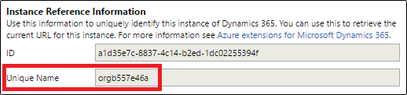  

4. Append the following to the first part of the URL for your org, replacing \<org name> with the unique name for your org determined in the previous step:  

    nga/main.htm?org=*\<org name>*  

    Your URL should look similar to the following: https://contososales.crm.dynamics.com/nga/main.htm?org=orgb557e46a  

5. Append the following to the URL from the previous step, replacing \<server name> with the server name from the first step in this procedure:  

    &server=*\<server name>*  

    Your URL should look similar to the following: https://contososales.crm.dynamics.com/nga/main.htm?org=orgb557e46a&server=https://contososales.crm.dynamics.com/.  

6. Open a new tab or browser window and copy the full URL you created, paste it into the new tab or browser window, and then select Enter.  

    The first time you connect to the mobile app interface, a welcome screen is displayed while the system processes metadata and downloads customizations. After this is completed, your workspace is displayed.  

   > [!NOTE]
   >  When you connect to the mobile app version of the interface, the credentials from your sign-in to the web interface are used to authenticate you. You'll need to leave the web interface open to avoid getting access denied errors when opening the mobile app interface.  

7. Close your workspace to display the Home page for the mobile app interface in your browser. You can then open the Content Library to create or edit Learning Path controls. More information: [Content Library](#ContentLibrary)  

   
## Content Library  
 The Content Library displays all of the content created and available to your organization, in addition to the commands to create, manage, and interact with controls. To create or edit Learning Path controls, first connect to the client interface for which you want to create controls, and then open the Content Library.  

**To open the Content Library from the default web client interface, do one of the following:**  

-   On a sidebar, select the **Content Library** button.  

       

-   Select the **training** tile on the site map, and then select **Content Library**.  

       

**To open the Content Library from the mobile app interface simulator:**  

1.  Select the ellipsis button inside a circle (...) on the lower-right corner of the screen.  

    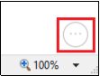  

2.  Select **Learning Path Content Library**.  

    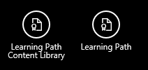  

> [!NOTE]
>  If you do not see all of these columns in the Content Library, it might be because your browser's View zoom is set to higher than 100%. To see all of the columns, set the zoom setting to 100% or lower.  

 The Content Library includes the columns described in the following table:  

|Column|Description|  
|------------|-----------------|  
|**Name**|The name you used when you created the Guided Task or Sidebar. A red lock symbol next to the name indicates that the content is currently checked out. You can hover over the icon to see which user has the content checked out.   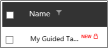   A red asterisk next to the name indicates newly checked-in content.   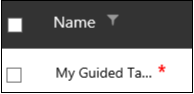|  
|**Title**|The title you provided when you added content to the Guided Task or Sidebar. Titles for Sidebars and Guided Tasks are displayed on Sidebars when they are added as links, or when they are returned as search results.|  
|**Type**|A symbol that indicates the type of content: Sidebar or Guided Task|  
|**Form Factor**|Symbols that represent the form factor  selected for this content when it was created, either **Desktop** or **Tablet**.   The **Form Factor** column is not displayed when you are using the Content Library when connected to the mobile app interface simulator or the Interactive Service Hub.|  
|**Tags**|Displays any tags  applied to this content. You can add tags in the **Advanced Options** dialog box. Use tags to  filter content displayed in the library.|  
|**App Version**|The version of the application that the control was created on.|  
|**Author**|The name of the person who created the control.|  
|**Languages**|A numeric value that represents the number of languages to which the control has been localized.   This col|  
|**Status**|Displays **Published** if the content is currently published; otherwise the status is **Draft**.|  
|**Enabled**|Displays whether the content is enabled or disabled.  Only enabled content is displayed to your users.|  
|**Last Published**|The most recent date when the content was published.|  

   
## Learning Path content types: Guided Tasks and Sidebars  
 You can create two types of content in Learning Path: Guided Tasks and Sidebars.  

   
### Guided Tasks  
 A Guided Task is typically a series of steps, although it can also be a single step. A user can launch a Guided Task by selecting a link on a Sidebar, by navigating to a page, or by selecting a link on a page for which you have created content. In each step, the user selects the **Next** button or completes a defined action to proceed to the next step, or to complete the Guided Task.  

 Guided Tasks are useful for guiding your users through common or new tasks. They can also be used to ensure that tasks are performed consistently in your organization, or that data is entered a specific way to support your organization's processes or workflow. You can include links, videos, and other information in Guided Tasks to help your users become familiar with and learn more about the part of the user interface that the step references.  

   
### Sidebars  
 A Sidebar is displayed when a user selects the Help button, navigates to a page, or selects a link or button on a page for which you have created content. You can also create Home Sidebars that are displayed when the user opens the page or screen, or selects the Home icon on a Sidebar.  

   

 You can also define Error Sidebars that appear when there is a problem displaying the intended sidebar. You can include links, videos, and other information in sidebars to help your users become familiar with and learn more about the page or form displayed, or actions they can take on the page or form.  

   
## Create a Guided Task  

 There are two steps for creating a Guided Task:  

1.  Define how the task is triggered, and assign the roles to which the content applies.  

2.  Use the Flow Editor to add the steps that users will see as they step through the Guided Task.  

### Define the triggers and roles  

1. Go to the page for which you want to create a Guided Task.  

2. Open the Content Library. See [Content Library](#ContentLibrary) to learn how.  

3. In the Content Library, select **Guided Task**.  

    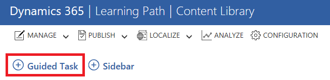  

4. Enter a name, and select the other settings for the Guided Task. Use this table for reference.  

   |              Setting               |                                                                                                                                                                                                                                                                                                                                                                                                                                                                                                                                      Description                                                                                                                                                                                                                                                                                                                                                                                                                                                                                                                                      |
   |------------------------------------|---------------------------------------------------------------------------------------------------------------------------------------------------------------------------------------------------------------------------------------------------------------------------------------------------------------------------------------------------------------------------------------------------------------------------------------------------------------------------------------------------------------------------------------------------------------------------------------------------------------------------------------------------------------------------------------------------------------------------------------------------------------------------------------------------------------------------------------------------------------------------------------------------------------------------------------------------------------------------------------------------------------------------------------------------------------------------------------|
   |    **Disable this guided task**    |                                                                                                                                                                                                                                                                                                                                                                                                                                                                                          Select this check box to disable the Guided Task. When disabled, it will not be displayed to users.                                                                                                                                                                                                                                                                                                                                                                                                                                                                                          |
   | **Make this an error guided task** |                                                                                                                                                                                                                                                                                                                                                                                                                       Select this check box if you want to show this Guided Task only when there is an error with other Guided Tasks, such as a lack of privileges or any issue that prevents other Guided Tasks associated with the page from being displayed.                                                                                                                                                                                                                                                                                                                                                                                                                       |
   |              **Name**              |                                                                                                                                                                                                                                                                                                                                                                                                                                                                                                        The name for the Guided Task that is displayed in the Content Library.                                                                                                                                                                                                                                                                                                                                                                                                                                                                                                         |
   |             **Client**             |                                                                                                                                                                               The client value is set automatically for the platform on which you're creating content. **Warning:**  If you edit an existing control when connected to a different interface than the one on which the control was created, the Client setting will be updated to the current client type. This will cause the control to break and not work on the client for which you originally created the control.    If you are creating controls for the web interface, **Web client** is displayed.   If you are connected to the mobile app interface simulator, **Mobile apps** is displayed.   If you are connected to the Interactive Service Hub, **Interactive Service Hub** is displayed.                                                                                                                                                                               |
   |          **Form factor**           |                                                                                                                                                                       The form factor displayed depends on which interface you are creating content for. If you are using the web client interface, **Desktop** and **Tablet** are displayed. When selected for the web client, **Tablet** refers to browsers running on tablet devices, not the mobile app.   If you are creating controls for the mobile app interface, **Tablet** is displayed. This refers to devices running the [!INCLUDE[pn_crm_shortest](../../includes/pn-crm-shortest.md)] mobile app, but is supported only on tablets.   If you are using the Interactive Service Hub, **Desktop** is displayed. **Important:**  Learning Path is not supported in [!INCLUDE[pn_crm_shortest](../../includes/pn-dyn-365-phones.md)].                                                                                                                                                                        |
   |     **Guided task opens when**     |                                                                                                                                                                                                                                                                                                                                                                                                                                                                              Select whether you want the Guided Task to be displayed when the **Page Loads** or when a **Link Is Clicked** on a Sidebar.                                                                                                                                                                                                                                                                                                                                                                                                                                                                              |
   |        **Lifecycle stage**         |                                                                                                                                                                                                                                                                                                                                                                                                                                                                                                                        This setting is for internal use only.                                                                                                                                                                                                                                                                                                                                                                                                                                                                                                                         |
   |   **Common Data Service security role**   |                                                                                                                                                                                                                                                                                                                                                                                                  Select the security role(s) for which you want the Guided Task to be displayed. You can select as many roles as you want. If a user is assigned more than one role, the Guided Task will appear only for the role with the highest precedence, as described earlier in this topic.                                                                                                                                                                                                                                                                                                                                                                                                   |
   |             **Status**             |                                                                                                                                                                                                                                                                                                                                                                                                                                                                                                Shows the status of the Guided Task. The status will be **Draft** until you publish it.                                                                                                                                                                                                                                                                                                                                                                                                                                                                                                |
   |        **Advanced Options**        | This option is available after you save the Guided Task. The following settings are available under **Advanced Options**:<ul><li>**Make this error guided task**: Select this check box if you want to show this Guided Task only when there is an error with other Guided Tasks.</li><li>**Supported Languages**: Select the languages for this Guided Task, and for import and export.</li><li>**Author**: Change the author defined for this Guided Task.</li><li>**Tags**: Add or remove tags applied to this Guided Task. Use tags  to make it easier to search content in the Content Library, or to categorize your content.</li></ul> You can also set the following under **Publish Info**:<ul><li>**App Version**: Set the [!INCLUDE[pn_crm_shortest](../../includes/pn-crm-shortest.md)] version associated with the content.</li><li>**Version**: Set the version of the content you create.</li><li>**Authoring Group**: Set the Authoring Group for the content you create.</li><li>**Publishing Groups**: Select the publishing group(s) for this content.</li></ul> |

5. When you're finished, select **Save** to start using the Flow Editor.  

### Add steps with the Flow Editor  

1. Add your title where *Guided Task Title* is displayed. This is the title that users will see.  

2. Select whether to show fixed ID controls only. Registered controls are outlined in green and unregistered controls are outlined in blue when you drag the tile to pin it to the UI. If you pin a step to a control that does not have a fixed ID, it might be affected by a future update to [!INCLUDE[pn_crm_shortest](../../includes/pn-crm-shortest.md)]. Updates will not affect fixed ID controls.  

3. Select **Add New Step**, and then select the type of step you want to use for the first step of your Guided Task.  

   |Button type|Description|  
   |-----------------|-----------------|  
   |**Step with Next button**|This step has a Next button that can be used to navigate to the next step in the flow. If this is the last step in the flow, the Next button will not be shown. Drag the tile to pin the step where you want it to appear in the app.|  
   |**Step with User action**|This step does not have a Next button. The user is prompted to select the UI element on which the step is pinned. If page redirection or any change in UI state occurs as a result of this selection, make sure to pin the next step on the changed UI state. Drag the tile to pin the step where you want it to appear in the app.   Pin this type of step to a selectable control in the UI, such as a button or link.|  
   |**User action with Next button**|This step does have a Next button. Selecting the Next button has the same effect as selecting the UI element on which the step is pinned. If page redirection or any change in UI state occurs as a result of this selection, make sure to pin the next step on the changed UI state. Drag the tile to pin the step where you want it to appear in the app.|  
   |**Learning Step**|This step has a customizable button as the end action. This step can only be located at the end of a guided task flow. You can use it to link to a Learning Path sidebar. Drag the tile to pin the step where you want it to appear in the app.|  

   > [!NOTE]
   >  If you've already planned out your Guided Task and know which steps you want to add, you can add them all now. Each step you add will appear in the Flow Editor in the order you add it. You can reorder steps after adding them by dragging them up or down in the list.  

4. Select the type of step you want to add, and then drag the tile to the UI to pin it to a control. It may take a few tries to get used to placing the step where you want it.  

   > [!NOTE]
   >  You can hold the tile for up to 15 seconds. If you don't pin it within 15 seconds, the tile will remain unpinned and the mouse pointer will change back to a normal cursor.  

     

5. When you've positioned the step where you want it, release the mouse button to pin it to the control. The step will appear in the location you selected. To move the step, use the **Drag me** button on the panel next to the step.  

   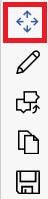  

6. Add content to the step by using the controls displayed next to it. The following settings are available:  

   - **Content Type**: Add text or a video to the step. Select **Edit** to see more settings. You can change font size, color, and style for text, and add a thumbnail for video.  

   - **Placement**: Specify the location of the step on the control you pinned it to. Selections include: Auto position (Selected by default), Top left, Top right, Bottom left, Bottom right, Left-top, Left-bottom, Right-top, and Right-bottom.  

   - **Copy**: Create a copy of the step with identical content pinned to the same location, and insert it in the Guided Task flow directly after the original step.  

7. Select **Save** when you are finished positioning and adding content to the step, and then either close the step by using the Close button in the upper-right corner of the step, or select the arrow in the upper-left corner of the screen to return to the Flow Editor.  

   > [!NOTE]
   >  You can always edit the step later, so don't worry if you accidentally close it before you have it just how you want it.  

8. To add or edit the next step in your Guided Task, select the right arrow  in the upper-left corner of the screen to display the Flow Editor.  

9. Add any additional steps you want to include in your Guided Task, making sure to save each step when you're finished adding content.  

    > [!NOTE]
    >  If you reposition a step or copy it by using the **Copy** button on the toolbar, any unsaved changes on that step will be lost. Be sure to save your changes often.  

10. When you've finished adding steps to your Guided Task, select **Save**.  

11. Select **Preview** to test your Guided Task and see it how it will appear to users.  

    > [!NOTE]
    >  To publish your Guided Task, you'll need to preview it first. When you close a step or use the arrow at the upper-left corner of the screen during Preview mode, you'll see the **Check-in** and **Publish** buttons in the Learning Path designer.  

12. If you're happy with your changes, check them in and publish the Guided Task, or publish it later from the Content Library.  

   
## Create a Sidebar  

 There are two steps for creating a Sidebar:  

1.  Set the Sidebar properties and assign the roles to which it applies.  

2.  Add content to the Sidebar (text, images, links, and buttons).  

### Set the Sidebar properties and roles  

1. Go to the page for which you want to create a Sidebar.  

2. Open the Content Library. See [Content Library](#ContentLibrary) to learn how.  

3. In the Content Library, select **Sidebar**.  

   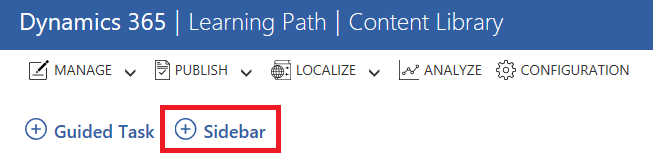  

4. Enter a name, and then select the other settings for the Sidebar. Use this table for reference.  

   |             Setting             |                                                                                                                                                                                                                                                                                                                                                        Description                                                                                                                                                                                                                                                                                                                                                        |
   |---------------------------------|---------------------------------------------------------------------------------------------------------------------------------------------------------------------------------------------------------------------------------------------------------------------------------------------------------------------------------------------------------------------------------------------------------------------------------------------------------------------------------------------------------------------------------------------------------------------------------------------------------------------------------------------------------------------------------------------------------------------------|
   |           **Disable**           |                                                                                                                                                                                                                                                                                                                                       Select this check box to disable the Sidebar.                                                                                                                                                                                                                                                                                                                                       |
   | **Make this an error sidebar**  |                                                                                                                                                                                                                                         Select this check box if you want this Sidebar to be displayed only when there is an error with another Sidebar, such as a lack of privileges or other issues that prevent other Sidebars associated with the page from being displayed.                                                                                                                                                                                                                                          |
   |   **Make this home sidebar**    |                                                                                                                                                                                                                                                                         The Home Sidebar is shown when a user selects the Home button, or if there is no Sidebar on the page and the user selects Help. Each page can have only one Home Sidebar.                                                                                                                                                                                                                                                                         |
   |            **Name**             |                                                                                                                                                                                                                                                                                                                                    The name that is displayed in the Content Library.                                                                                                                                                                                                                                                                                                                                     |
   |           **Client**            | The client value is set automatically for the platform on which you're creating content. **Warning:**  If you edit an existing control when connected to a different interface than the one on which the control was created, the Client setting will be updated to the current client type. This will cause the control to break and not work on the client for which you originally created the control.    If you are creating controls for the web interface, **Web client** is displayed.   If you are connected to the mobile app interface simulator, **Mobile apps** is displayed.   If you are connected to the Interactive Service Hub, **Interactive Service Hub** is displayed. |
   |         **Form factor**         |                                                  The form factor displayed depends on which interface you are creating content for. If you are using the web client interface, **Desktop** and **Tablet** are displayed. When selected for the web client, **Tablet** refers to browsers running on tablet devices, not the mobile app.   If you are creating controls for the mobile app interface, **Tablet** is displayed. This refers to devices running the [!INCLUDE[pn_crm_shortest](../../includes/pn-crm-shortest.md)] mobile app, but is supported only on tablets.   If you are using the Interactive Service Hub, **Desktop** is displayed.                                                  |
   |     **Sidebar opens when**      |                                                                                                                                                                                                                                                                                               Select whether you want the Sidebar to be displayed when the page loads, or when a user selects a link or button on the page.                                                                                                                                                                                                                                                                                               |
   |       **Lifecycle stage**       |                                                                                                                                                                                                                                                                                                                                              This is for internal use only.                                                                                                                                                                                                                                                                                                                                               |
   | **Common Data Service security role** |                                                                                                                                                                                                                  Select the role or roles for which you want the Sidebar to be displayed to users. You can select as many roles as you want. If a user is assigned more than one role, the Sidebar will be displayed only for the role with the highest precedence, as described earlier in this topic.                                                                                                                                                                                                                   |
   |          **Template**           |                                                                                                                                                                                                                                                                                       Select the template to use for the new Sidebar, either **Single Column** or **Two Column**. The default template is a single-column Sidebar.                                                                                                                                                                                                                                                                                        |
   |           **Status**            |                                                                                                                                                                                                                                                                                                              Displays the status of the Sidebar. The status will be **Draft** until you publish the Sidebar.                                                                                                                                                                                                                                                                                                              |
   |      **Advanced Options**       |                                                                         This option is unavailable until you save the Sidebar. The following **Advanced Options** settings are available:<ul><li>**Disable Sidebar Header**</li><li>**Disable Sidebar Title**</li><li>**Disable Sidebar Footer**</li><li>**Author**: Change the author defined for the Sidebar.</li><li>**Tags**: Add or remove tags applied to the Sidebar. Using tags can  make it easier to search content in the Content Library, or to categorize your content.</li><li>**Supported Languages**: Select the languages for this Sidebar, and for import and export.</li></ul>                                                                         |

5. When you're finished, select **Save** to start adding content to your Sidebar in the designer.  

   

### Add content to your Sidebar  

1.  After you save your Sidebar name and properties in the Content Library, the designer opens.  

2.  Enter a title for the Sidebar.  

3.  Add the content you want to display to your users when the Sidebar is displayed.  

4.  To add a new section, select **Add Section**.  

5.  To remove a section from the template, select the section you want to delete, and then select **Delete**.  

6.  When you are finished modifying the content in the sidebar, select **Save** to save your changes, and then close the sidebar by selecting **Close** in the upper-right corner to return to the Content Library.  

7.  Select **Manage** at the top of the page, and then select **Check in** to save your changes and make them available to other users who are creating content.  

### Add links to your Sidebar  
 When you create a Sidebar, there are several options for adding links to it. You can create a link to another Learning Path Guided Task or Sidebar, to another page in [!INCLUDE[pn_crm_shortest](../../includes/pn-crm-shortest.md)], or to a webpage. You can even search for help and training topics to link to while creating a Sidebar. After you set the sidebar properties and roles and are ready to add content, follow these steps to add links to a section of the sidebar you created.  

1. In the section you want to add links to, select the **List Of Links** icon.  

   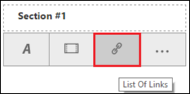  

2. Add a section title, and then select **+ Add Link**.  

   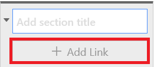  

3. Select the type of link you want to add, and then select **Next**. You can choose from the following options:  

   - **Guided Task**: Creates a link to an existing Learning Path Guided Task. This can be useful for providing information about a task in the Sidebar, and then linking to a Guided Task that steps a user through the task in the [!INCLUDE[pn_crm_shortest](../../includes/pn-crm-shortest.md)] interface.  

   - **Sidebar**: Create a link to an existing Learning Path Sidebar. You can use a link to a Sidebar to  

   - **Page in app**  

   - **Webpage**  

   
## Use videos in your Learning Path controls  
 Only videos hosted on YouTube are supported in Learning Path controls. If you plan to use videos in your Learning Path controls, you'll need to have a YouTube account and channel to upload videos to. You cannot link to videos on a channel that is set to Private, but you can link to videos if your channel is set to Public or Unlisted. You can also set up your channel so that multiple people can manage the video content for your organization.  

 When you add videos to your controls, you can embed the video within the control. If you want your users to view your videos in a new tab or browser window you can add a text section to your sidebar and then add a link to your video in the text section.  

 When you embed videos that are displayed within a Sidebar or Guided Task, you'll use the link that you get from YouTube. Learning Path will automatically update the link to embed the video and size it to fit in Sidebar or Guided Task tile. A user can select **Full screen** to view the video in full screen mode. If a user pauses the playback, or when the playback is finished, YouTube might automatically display links to other videos the user may be interested in. You can prevent this from happening by modifying the link in your control to include **?rel=0** at the end.  

 For example, after you create and upload a video to your channel, you copy the video URL provided by YouTube, which is **https://youtu.be/4TrYMB4pjyw**. To embed this video in a control, you enter that URL into the **Enter video URL** field for your control.  

 When you save the control, Learning Path changes the URL to **https://www.youtube.com/embed/4TrYMB4pjyw**. To turn off the display of links to other videos when the video is paused or finished playing, edit the URL to append **?rel=0** to the end so that your URL looks similar to the following: **https://www.youtube.com/embed/4TrYMB4pjyw?rel=0**.  

More information about using YouTube: [YouTube Help Center](https://go.microsoft.com/fwlink/?linkid=847120)  

   
## Publish Learning Path content  
 Users will only see Learning Path content you create after you publish it. Only content that is checked in can be published.  

1.  Open the Content Library.  

2.  Select the check box next to each Guided Task and Sidebar that you want to publish. Make sure the control you want to publish is checked in.  

3.  Select **Publish** at the top of the page, and then select **Publish**.  

4.  On the **Publish Controls** page, select the publishing environments you want to publish the content to, and then select **Publish**.  

   
### About Publishing Groups  
 Learning Path content is published to a publishing group. When you turn on Learning Path for your organization, a publishing group is created with the same name as the organization name. You can create additional publishing groups as needed. You can add multiple organizations to a publishing group, and an organization can be a member of multiple publishing groups so that you can customize content and easily publish it to different organizations.  

   
### Create a publishing group  

1.  Open the Content Library.  

2.  Select **Configuration** at the top of the screen.  

3.  Select **Publishing Configuration**.  

4.  On the **Publishing Configuration** page, select **New PG**.  

5.  Enter a name and optional description.  

6.  Select the organizations you want to include in the publishing group. You'll see only the organizations for which you have permissions.  

7.  Select **Save**, and then select **OK**.  

   
## Export and import Learning Path content  
 You can export content that you create, perhaps to share with an author of another organization or to make backup copies. The export feature creates a compressed .zip file that contains the .json files used for your content in Learning Path. There will be one folder in the .zip file for each selected Learning Path Sidebar or Guided Task.  

   
### Export your Learning Path content  

1.  In the Content Library, select the check box next to the content you want to export.  

     You can export content without checking it in.  

2.  Select **Manage** at the top of the page, and then select **Export**.  

3.  Select the option you want to use for saving the generated .zip file, and then select a file name and location.  

    > [!NOTE]
    >  The default file name for the .zip file is the same each time you export, so be sure to use a unique name to avoid overwriting files that you previously exported.  

### Import your Learning Path content  

1.  In the Content Library, select **Manage**, and then select **Import**.  

2.  Select **Browse** to select the previously exported file that you want to import, or drag the file to the **Drag controls here** box in the dialog box.  

    > [!CAUTION]
    >  When you import a control, it will overwrite and replace any version of the same control that is already in the library, even if the existing control is newer.  

3.  Confirm that the file name displayed is the file you want to import, and then select **Import**.  

4.  In the confirmation dialog box, select **OK**.  

   
## Localize Learning Path controls  
 You can localize the content in the controls you create in Learning Path so that they are displayed to users in the language they have selected for [!INCLUDE[pn_crm_shortest](../../includes/pn-crm-shortest.md)]. To localize your controls, you can simply export them, localize the strings that are displayed to users, and then import the control that includes the localized content. You can import the control into the same organization or into any organization you want. You can localize the same control into multiple languages, and then just import the specific languages into specific organizations that support users who have that language selected. Localization support in Learning Path follows the OASIS XML Localisation Interchange File Format (XLIFF) 2.0 standard. There are tools and tutorials freely available for working with this common format. More information: [XLIFF Version 2.0](http://docs.oasis-open.org/xliff/xliff-core/v2.0/os/xliff-core-v2.0-os.html)  

 More information about user language settings in [!INCLUDE[pn_crm_shortest](../../includes/pn-crm-shortest.md)]: [Set personal options](/dynamics365/customer-engagement/basics/set-personal-options)  

1.  Select the control you want to localize in the Content Library.  

2.  Select **Localize**, and then select **Export**.  

      

3.  Select the option you want to use for saving the generated .zip file, and then select a file name and location.  

    > [!NOTE]
    >  The default file name for the .zip file is the same each time you export, so be sure to use a unique name to avoid overwriting files that you previously exported.  

4.  After you've localized the content, in the Content Library, select **Localize** and then select **Import**.  

5.  Select **Browse** to select the previously exported file that you want to import, or drag the file to the **Drag controls here** box in the dialog box.  

    > [!CAUTION]
    >  When you import a control, it will overwrite and replace any version of the same control that is already in the library, even if the existing control is newer.  

6.  Confirm that the file name displayed is the file you want to import, and then select **Import**.  

7.  In the confirmation dialog box, select **OK**.  

8.  Publish the localized control to the publishing environments you want to make the localized control available to your users. The localized content will automatically be displayed to users who have selected the same language for their user interface.  

## [!INCLUDE[pn_crm_shortest](../../includes/pn-crm-shortest.md)] apps data center mapping to [!INCLUDE[pn-azure-shortest](../../includes/pn-azure-shortest.md)] regions
The following table lists the [!INCLUDE[pn_crm_shortest](../../includes/pn-crm-shortest.md)] apps datacenter regions and corresponding [!INCLUDE[pn-azure-shortest](../../includes/pn-azure-shortest.md)] regions from where Learning Path will be available.

| [!INCLUDE[pn_crm_shortest](../../includes/pn-crm-shortest.md)] datacenter | [!INCLUDE[pn-azure-shortest](../../includes/pn-azure-shortest.md)] region |
|------------------------------------------------------------------------|------------------------------------------------------------------------|
|                          Asia-Pacific (APAC)                           |                               East Asia                                |
|                              Canada (CAN)                              |                             Canada Central                             |
|       Europe, Middle East, Africa, and Great Britain (EMEA, GBR)       |                              West Europe                               |
|                              India (IND)                               |                             Central India                              |
|                              Japan (JPN)                               |                               Japan East                               |
|                          North America (NAM)                           |                                East US                                 |
|                             Oceania (OCE)                              |                             Australia East                             |
|                          South America (SAM)                           |                              Brazil South                              |

## Privacy notice  
[!INCLUDE[cc_privacy_learning_path_authoring](../../includes/cc-privacy-learning-path-authoring.md)]

### See also  
 [On-off switch for Learning Path (guided help)](/dynamics365/customer-engagement/admin/on-off-switch-for-learning-path-guided-help)
