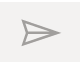
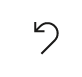
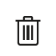

# Create a model-driven app with the app designer (preview)

[!INCLUDE [cc-beta-prerelease-disclaimer](../../includes/cc-beta-prerelease-disclaimer.md)]

In this article, you learn the basics of how to create a model-driven app that can be shared and distributed to other environments.

## Prerequisites

Verify the availability of the following prerequisites before you start to create a model-driven app:

- A Power Platform environment used for app development.
- An environment maker, system administrator, or system customizer security role.

For more information, go to the following articles:

- [Create an environment](/power-platform/admin/create-environment).
- [Environment strategy for ALM](/power-platform/alm/environment-strategy-alm).
- [About predefined security roles](share-model-driven-app.md#about-predefined-security-roles).

## Create an app

1. On the [Power Apps](https://make.powerapps.com/?utm_source=padocs&utm_medium=linkinadoc&utm_campaign=referralsfromdoc) **Home** page, select **Solutions** from the left navigation pane.

1. Open an unmanaged solution or [create a new solution](../data-platform/create-solution.md)
   > [!NOTE]   
   > Unmanaged solutions can be recognized by the open lock in the **Managed Externally?** column.
   > :::image type="content" source="media/unmanaged-solutions.png" alt-text="Viewing solutions within an environment":::
   > Although the **Default Solution** is an unmanaged solution, it is in most circumstances not recommended to create or edit customizations in the default solution.
1. Select **New** > **App** > **Model-driven app**.
1. On the **New model-driven app from blank** dialog box, select **Modern app designer**, and then select **Create**. :::image type="content" source="media/new-model-driven-app-from-blank.png" alt-text="New model-driven app from blank":::
1. On the **New model-driven app** dialog box, enter a **Name** and optionally, a **Description**, and then select **Create**.
1. On the left navigation pane, select **Navigation** to display the navigation tree. 

   :::image type="content" source="media/navigation-area.png" alt-text="Select the navigation area from the navigation pane":::
   > [!TIP]
   > Use the menu toggle to show or hide the names of the menu options. :::image type="content" source="media/menu-toggle.png" alt-text="Toggle the menu to show or hide the name of the menu options":::
1. Notice that a basic navigation structure is already created for you. Expand **Area1**, and then expand **Group1**.
   :::image type="content" source="media/default-site-map.png" alt-text="Default site map is created for you":::
1. Select **Group1** and change the title in the property pane to, for example, *Accounts and Contacts*. :::image type="content" source="media/edit-navigation-group-title.png" alt-text="edit the group's title in the property pane":::
1. Select **Subarea1**, and make changes such as the following:

   - **Content type**: Table
   - **Table**: Account
   - **Title**: Accounts

   > [!NOTE]
   >
   > - A subarea won't appear in the app preview until you add a content type to it.
   > - By default, all forms and views are included for a table that's added to a page. To remove one or more components, see [Create, add, and remove forms, views, or dashboards](create-add-remove-forms-views-dashboards.md).

1. On the command bar, select **New page**, select **Table based view and form**, and then select **Next**.
1. On the **New table view and form pages** dialog box, select **Contact**, leave the **Show in navigation** option selected, and then select **Add**. Note the following: 
   - Notice the preview pane displays your app. Selecting a component, such as a table, affects what's displayed in the preview. If your environment includes data that you have access to view, that also appears in the preview.
   :::image type="content" source="media/create-app.png" alt-text="App created with account and contact tables.":::
1. Select **Save**, and then select **Publish**.

To see how the app runs in a full browser window, on the command bar, select **Play**.

## Add comments (preview)

Comments are notes that are associated with items in your app. Use comments to help your team review the app and provide feedback, or provide additional information on implementation details in your app.  

In the app designer, the anchors, which are what comments attach to, are all of the pages in the pages pane, and any of the items in the **Navigation** pane. This lets you add comments to items such as areas, groups, pages, tables, and dashboards. Comments are stored in a table in Microsoft Dataverse in the default solution.

### Add a comment to a page

1. Open a model-driven app for edit using the app designer.
1. Select an item in the **Pages** pane.
1. Select **Comments** on the command bar. This opens the comments pane for the selected component. You can also open the comments pane by selecting the comment count indicator for existing comments to an item in the left pane.
   :::image type="content" source="media/comments-feature2.png" alt-text="Comments feature in app designer":::
1. Select **New** to create a new comment and type the comment message in the box. Or, type into the **Reply** box to respond to an existing comment. Select  **Post reply** or press Ctrl + Enter to post your comment.

### Edit or delete a comment

You can edit your comments or remove existing comments from appearing in the app.

In the **Comments** pane, next to a comment, select **...**, and then select **Edit comment** or **Delete comment**.

### Resolve a comment

Comments are commonly questions, feedback, or ideas that are important context to live alongside your app. But, they may not be active discussions anymore. You can resolve, or reopen a resolved, comment thread to better track the active comments.  

1. In the **Comments** pane, next to a comment, select **...**, and then select **Resolve comment**.
1. The comment thread appears as **Resolved**.
1. To reopen select  **Reopen thread** or  **Delete thread** to remove the comment.

## Next steps

- [Create, add and remove forms, views or dashboards](create-add-remove-forms-views-dashboards.md)
- [Create and remove pages](create-remove-pages.md)
- [Overview of the model-driven app designer](app-designer-overview.md)
- [Configure app properties (Preview)](manage-app-properties-preview.md)
- [Configure app properties](manage-app-properties.md)
