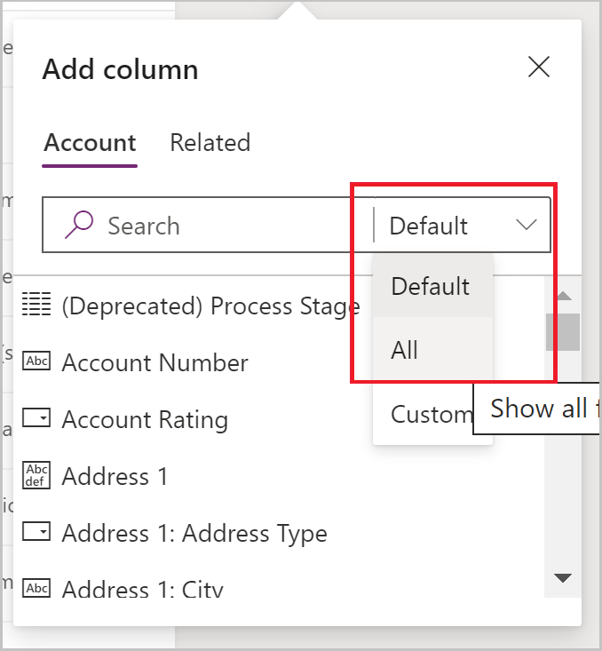
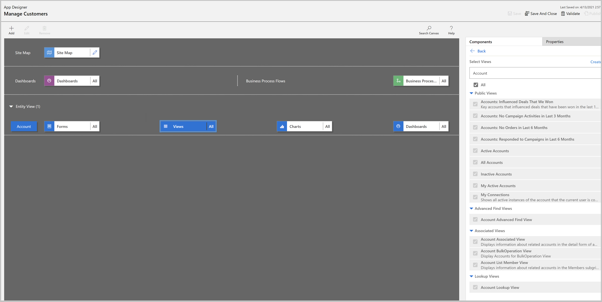
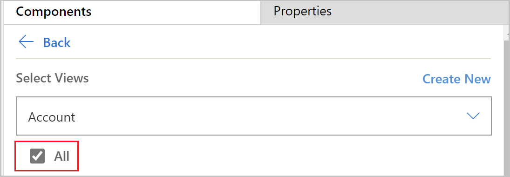
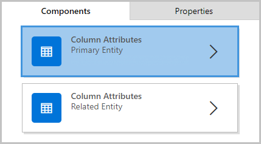
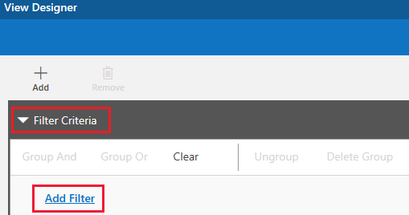
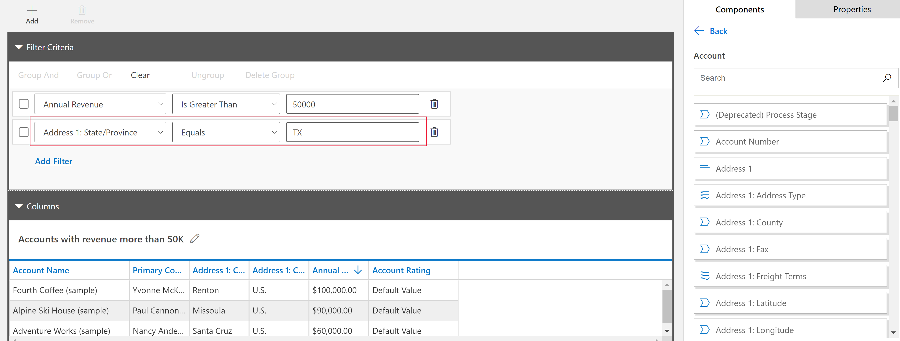
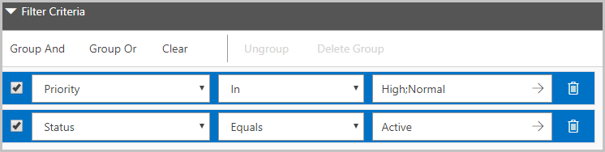
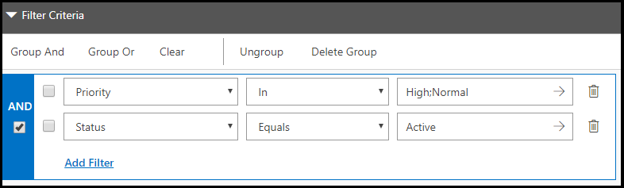
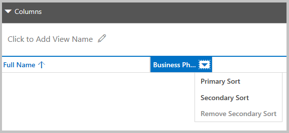
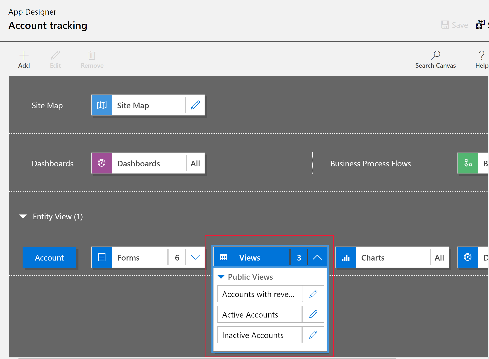

# Create and edit public or system model-driven app views

In Power Apps, views define how records for a specific table are displayed. A view defines the following:
- The columns, also known as attributes, to display.
- The width of the columns in the view.
- How the rows are sorted by default
- Which filters are applied to determine the rows that appear in the list by default.

Typically, views are classified into three types:
- **Personal**: Individual users can create personal views according to their unique requirements. These views are visible only to the user who created them and anyone they choose to share them with.  
- **Public**: As an app maker, you can create and edit public views to fit your organizational requirements. These views are available in the view selector, and you can use them in sub-grids in a form or as a list in a dashboard.
- **System**: As an app maker, you can also modify system views to meet the requirements of your organization. These are special views that the application depends on: they exist for system tables or are automatically created when you create custom tables. These views are available to some or all users, depending on their privileges.

More information: [Understand model-driven app views](create-edit-views)

A drop-down list of views is frequently displayed in the application so that people have options for different views of table data, such as the Donations table in the Fundraiser sample app.
:::image type="content" source="media/create-or-edit-model-driven-app-view/system-views-picker.png" alt-text="Select a system view from the view picker.":::

The rows that are visible in individual views are displayed in a list, sometimes called a grid, which frequently provides options so that people can change the default sorting, column widths, and filters to more easily see the data that's important to them. Views also define the data source for charts that are used in the application.

In this tutorial, we perform several tasks required to work with views, such as create a public view, add an existing view to an app, and change columns, filters, and sort order for a view.

## Create a public view in Power Apps

In this exercise you create a view in the account entity. You then add this view to an app.

1. Sign in to [Power Apps](https://make.powerapps.com/?utm_source=padocs&utm_medium=linkinadoc&utm_campaign=referralsfromdoc).
    
1. Expand **Data**, select **Tables**, select the **Account** table, and then select the **Views** tab.
    
1. On the toolbar, select **Add view**.

1. On the **Create a view** dialog box, enter *Accounts with revenue more than 50K* as the **Name**. Optionally, a description, and then select **Create**.
    
1. In the view designer, select **+ View column** and add the **Address1: City** column the view.

   > [!TIP]
   > The **Default** view in the **Add column** pane displays the commonly used columns. If the column you want isn’t listed, select **All** to display additional columns.

   

1. Repeat the previous step by selecting **Add column** and add the following additional columns to the view: 
   - **Address 1: Country/Region**
   - **Address 1: Primary Contact**
   - **Annual Revenue**

1. Change the column filtering for the Annual Revenue field by selecting the header of the column, and then in the dropdown select **Filter by**. Select **Apply**. 
   :::image type="content" source="media/create-or-edit-model-driven-app-view/accounts-more-50k-rev.png" alt-text="Add a filter for accounts with more than 50,000 revenue.":::
   Notice the view in the designer reacts to the filter.
1. Change the column sorting to sort by the most to least revenue. To do this, select the header of the **Annual Revenue** column, and then select **Larger to smaller**. Notice for text-based columns the sort options are **Sort A to Z** and **Sort Z to A**.

1. Explore additional changes you can make to the view.
   - Configure a column width by selecting and dragging the column to the desired position.
   - Reposition columns by dragging a column to the position you want to move it to. For example, select the **Primary Contact** column header and drag it between the **Account Name** and **Address 1: City** columns.

   > [!NOTE]
   >    You can also change column order by selecting on the column header and selecting **Move Right** or **Move Left**.

1. Select **Save**, and then select **Publish** to make the view available for other users in the environment.

## Add the view in the app designer

1. In Power Apps select **Apps** from the left navigation pane, select **...** next to the unmanaged app you want, and then select **Edit** > **Edit in preview**. If you don't have an app to use, [Build your first model-driven app](build-first-model-driven-app.md).

1. In the Pages section of app designer, select **Account view**.
1. In the right **Properties** pane, select **Manage views**.
1. Select the following views, and then select **Save**.
   - **Active Accounts**
   - **Inactive Accounts**
   - **Accounts with revenue more than 50K**
   :::image type="content" source="media/create-or-edit-model-driven-app-view/select-view-for-app.png" alt-text="Select the views you want to display":::
1. Select **Publish** to save and publish the app.

### Display the view in an app

To see your view in the app from the previous exercise, on the app designer command bar, select **Play**. Notice that the view is displayed and the additional **Active Accounts** and **Inactive Accounts** views are also available by selecting the view selector.
:::image type="content" source="media/create-or-edit-model-driven-app-view/view-displayed-in-app.png" alt-text="Views available from an app":::

## Open and add the view in the classic app designer

1. In Power Apps select **Apps** from the left navigation pane, select **...** next to the unmanaged app you want, and then select **Edit** . If you don't have an app to use, [Build your first model-driven app](build-first-model-driven-app.md).
    
1. In the app designer **Table View** section, select **Views**.

   

3.  By default, all views will be selected. To select specific views to display in the app, uncheck the **All** checkbox

    
4.  To add an existing view to your app, select it from the list of views.

5.  To create a new view from App Designer, select **Create new**

    **Note**

    Views are displayed based on the table that you have selected. For example, when you select **Account**, views that are related to the Account table are displayed.

More information about the app designer: [Design custom business apps by using the app designer](https://docs.microsoft.com/powerapps/maker/model-driven-apps/design-custom-business-apps-using-app-designer)

### Add a column to your view in app designer

Views display rows in a table that contains rows and columns. Each row is a row, and the columns you display from the row are determined by the columns you add to the view.

1.  In app designer, select the table view that you want and then on the right pane next to the view, select **edit** (pencil button).
    
2.  On the **Components** tab, select the **Column Attributes** list for either the **Primary Table** or **Related Table**.

    
3.  From the list, select the attribute you want and drag it to the column heading. You can also add the attribute by double-selecting it.
    
4. Repeat step 3 until you've added all the attributes you want to display in your view.

As you add attributes, you can drag them to any position among existing column headings. You can also move columns around after you add them to your view.

### Define filter criteria in app designer

You can set filter criteria so that only a subset of the rows is displayed in a view. When a user opens the view, only the rows that meet the defined filter criteria are displayed. You can select columns from both the primary and related tables to filter on.

1.  In the app designer, expand the **Filter Criteria** section.

2.  Select **Add Filter**.

3.  Select an attribute from the drop-down list in the first column.

4.  Select an operator from the drop-down list in the second column.

5.  Enter a value to filter by in the third column.

You can filter data based on the attributes of related tables in addition to the
primary table.

1.  On the **Components** tab, select the **Column Attributes** list for **Related Table**, select the **Choose a Table** down arrow in the topmost column, and then choose the table you want. This will add a separate section.
    
2.  Repeat steps 2 through 5 from the previous procedure.

More information: [Create and edit relationships between tables](https://docs.microsoft.com/powerapps/maker/data-platform/create-edit-entity-relationships)

#### Group multiple filters in app designer

You can add multiple filters to your view if you want to filter rows by using more than one column.

1.  Select the filters that you want to group. 

2.  Select Group And or Group Or to group the filters.  When you select **Group And**, only rows that meet both criteria are displayed in the view. When you select **Group Or**, rows that meet any of the filter criteria are displayed. For example, to show only rows that have priority of High or Normal, and status of Active, select **Group And**.

To remove the filter from a group, select the group, and then select **Ungroup**.

### Set primary and secondary sort order for columns in app designer

When a view is opened, the rows it displays are sorted in the order you set when you created the view. By default, rows will be sorted according to the first column in a view when no sort order is selected. You can choose to sort on a single column, or you can choose two columns—one primary and one secondary—to sort by. When the view is opened, the rows will first be sorted by the column you want to use for primary sort order, and then by the column you want to use for secondary sort order.

> [!NOTE]
> You can only set primary and secondary sort order for column attributes you added from the primary table.

1.  Select the column you want to use for sorting.

2.  Select the down arrow, and then choose **Primary Sort** or **Secondary Sort**.

If you remove the column you chose for the primary sort order, the column you chose for the secondary sort order becomes the primary.

### Edit a public or system view in app designer

You can change the way a public or system view is displayed by adding, configuring, or removing columns.

1.  In the **Views** list for a table, select the **Show list of references** down arrow .
    
2.  Next to the view you want to edit, select **Open the View Designer**.  The view opens in the view designer. 

When you edit a public or system view, you must save and publish your changes before they will be visible in the application.
