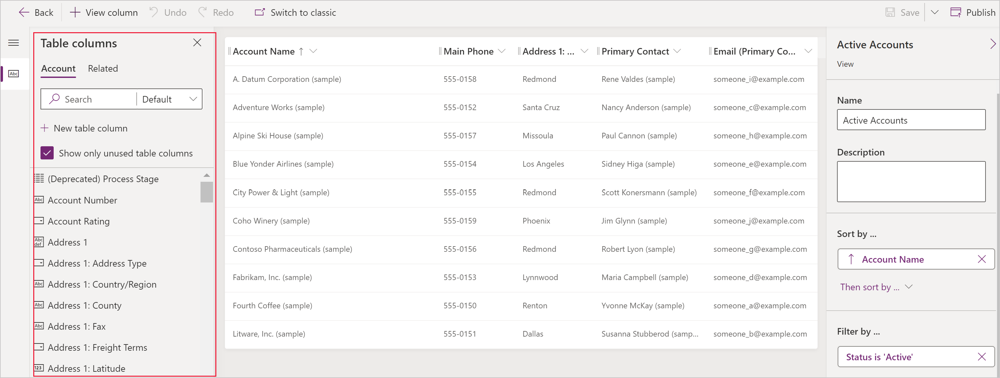

# Create and edit public or system views

Model-driven apps can contain a range of views, so that app users can open the most suitably presented and filtered version of the table.  Views can be **Personal**, **System, or **Public**.

> [!NOTE]
> Views are tied to a given table. However, you can select views during the process of creating a model-driven app. By default, ALL views are made available in an app.

:::image type="content" source="media/create-or-edit-model-driven-app-view/switch-views.gif" alt-text="Configure views in model-driven apps":::

> [!TIP]
> For a general introduction into views, go to [Understand views in model-driven apps](create-edit-views.md)

## Create a public view in Power Apps

Public views are available for users to display table records. App makers can create and configure public views using Power Apps.

1. Sign in to [Power Apps](https://make.powerapps.com/?utm_source=padocs&utm_medium=linkinadoc&utm_campaign=referralsfromdoc) and select an [environment](model-driven-app-glossary.md#environment)
1. On the left navigation pane, select **Solutions**, and open the solution you want. [!INCLUDE [left-navigation-pane](../../includes/left-navigation-pane.md)]
1. Open a table, such as the account table, and then select the **Views** area.
1. Select **New view** on the command bar, and then enter a **View name**, and optionally enter a **Description**.
1. If you want to have suggestions from Copilot for the columns to create for the form based on the **View name** and **Description** values, select **Get AI-generated column suggestions**. For more information about using this AI feature, go to [Column suggestions by Copilot](create-and-edit-forms.md#column-suggestions-by-copilot).
1. Select **Create**.

> [!NOTE]
> Public views created in Power Apps that include **Contains data** or **Does not contain data** filters don't appear in the list of saved views in Advanced Find.

## Edit public views from a table

In the solution that you opened earlier, create a new table or find an existing table where the public views need to be edited.

1. Sign in to [Power Apps](https://make.powerapps.com/?utm_source=padocs&utm_medium=linkinadoc&utm_campaign=referralsfromdoc) and select an [environment](model-driven-app-glossary.md#environment)
1. On the left navigation pane, select **Solutions**, and open the solution you want. [!INCLUDE [left-navigation-pane](../../includes/left-navigation-pane.md)]
1. Open a table, such as the account table, and then select the **Views** area, and then open the view you that want to edit.
1. In the view designer, select **+ View column** to add additional columns needed within the view. Or, in the **Table columns** left navigation pane drag the table columns onto your view.

    > [!TIP]
    > Only include the specific columns you need for the view, as larger numbers of columns in a view can cause degradation of grid performance.  

   

   > [!TIP]
   > The **Default** view in the **Add column** pane displays all columns. If preferred, select **Standard** or **Custom** to display a subset of columns.
   > :::image type="content" source="media/display-all-columns.png" alt-text="Select All to display all columns":::
1. In the view designer, the following tasks can be performed:

   - To change the column filtering select the header of the column where the filter is required, and then in the dropdown list select **Filter by**.
   - To change the column sorting select the header of the column where sorting is needed then select **Sort A-Z**, **Sort Z-A**, **Sort descending**, or **Sort ascending**.
       - You can configure multi-column sorts by holding Shift when selecting a sort option to add a sort condition to the set of the existing sorts.  
   - Configure column width by selecting and dragging the column to the desired position.
   - Reorder columns by dragging a column to the desired position.
   > [!NOTE]
   > Depending on the data type of the column the term **Sort A-Z**/**Sort Z-A** or **Sort ascending**/**Sort descending** is used

   > [!TIP]
   > It is also possible to change column order by selecting the column header and then selecting **Move Right** or **Move Left**.
1. Select **Save and publish** to save the view and make it available for other users in your organization.

### Next steps

[How to configure view columns](choose-and-configure-columns.md)

[Learn about sorting within views](configure-sorting.md)

[Learn about filtering views](create-edit-view-filters.md)

[Make views editable using sub-grids](make-grids-lists-editable-custom-control.md)

[!INCLUDE[footer-include](../../includes/footer-banner.md)]
