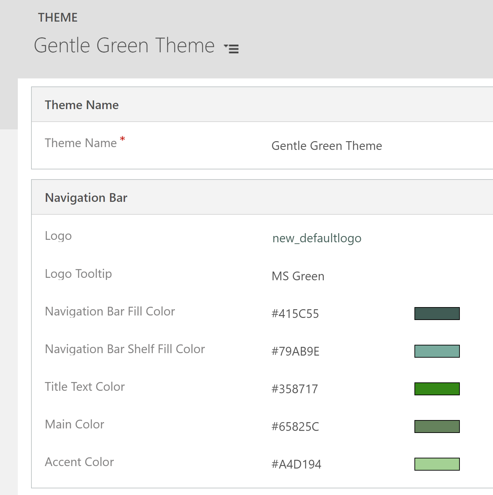
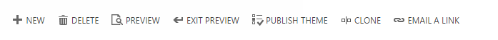

# Use a theme to create a custom look for your app

You can create a custom look and feel (a theme), for your app by making changes to the default colors and visual elements provided in the uncustomized system. For example, you can create your personal product branding by adding a company logo and providing table-specific coloring. A theme can be created by using the **Themes** area, without requiring a developer to write code. You can create, clone, change, or delete themes that are used in your environment.

> [!NOTE]
> There's newer way to create themes in model-driven apps for customizing the model-driven app header. More information: [Use modern themes](modern-theme-overrides.md)
>
> You can define multiple themes, but only a single theme can be active in an environment and is identified as the default theme. To make a theme active, you publish it.
  
## Use themes to enhance the user interface and create your product branding

Theming is used to enhance the app user interface, not drastically alter it. The theme colors are applied globally throughout your model-driven apps. For example, you can enhance the following visual elements in the UI:  
  
- Change navigation colors to create product branding.
  
- Adjust accent colors, such as hover or selection colors.
  
- Provide table-specific coloring.

- Logo. (Use an existing or add a new image file as a web resource.)
  
- Logo tooltip.
  
- Navigation bar color.  
  
- Title text color.  
  
- Selected link color.  
  
- Hover link color.  
  
- Legacy accent color (primary background for process controls).
  
- Default color for tables.
  
- Default custom tables color.
  
- Control fill color.
  
- Control border color.
  
## Solution awareness

Themes aren't solution aware. The changes made for an organization's theme aren't included in  solutions exported from the organization. The data is stored in the theme table that can be exported and reimported in another environment. The imported theme must be published to take effect.  
  
## Copy and alter the existing theme

 The easiest and quickest way to create a new theme is to clone and alter an existing theme. Then save, preview, and publish it.

1. Sign in to [Power Apps](https://make.powerapps.com/?utm_source=padocs&utm_medium=linkinadoc&utm_campaign=referralsfromdoc), select **Settings**  (upper right), and then select **Advanced settings**.
1. On the classic settings page, select **Settings** >  **Customizations** > **Themes**.
1. Under **All themes**, select the theme you want to clone, such as the **CRM Default Theme**. Select **Clone** on the command bar.
1. Open the cloned theme, and then replace an existing UI item's hexadecimal number, such as the **Title Text Color**, with the hexadecimal value that represents the color you want.

For example, the **CRM Default Theme** was cloned and changed using mostly varying shades of green color. The following screenshots show the new colors for navigation and highlighting. A custom logo was also added that appears in the upper left corner of an app.  
 
 > [!div class="mx-imgBorder"] 
 > 

 > [!div class="mx-imgBorder"] 
 >   
  
 The following image shows an app account view with the new colors and logo.

 > [!div class="mx-imgBorder"] 
 >   

> [!IMPORTANT]
> Logos that are too large don't display. The image used in the example is 156 pixels wide x 48 pixels height.

## Preview and publish a theme  

To preview and publish a theme, do the following steps:  
  
1. Create a **New** theme from scratch or **Clone** an existing one.  
1. **Preview** the new theme. To exit the preview mode, choose **Exit Preview** on the command bar.  
1. Publish the theme. Select **Publish Theme** on the command bar to make it the active (default) theme in the environment.  
  
 The following screenshot shows the buttons on the command bar for preview and publishing.  
  
   
  
## Best practices

Following are the recommendations for designing theme contrasts and choosing colors.  
  
### Theme contrast

We recommend the following approach to providing contrast colors:  
  
- Carefully choose the contrasting colors. The Microsoft Dataverse out-of-the-box default theme has the correct contrast ratios to ensure optimal usability. Use similar contrast ratios for your new themes.  
  
- For high contrast mode, use the default color settings.  
  
### Theme colors

We recommend that you don't use a large number of different colors. Although you can set a different color for every table, we recommend one of two patterns:  
  
- Make all tables in neutral colors and highlight the key tables.  
  
- Use the same color for similar tables or related tables, such as queue and queue item, or product catalog tables. Keep the total number of groups low.  
  
## Custom theme considerations

You should consider the following when planning on using custom themes:  
  
- Most updated user interface (UI) areas will be displayed in the custom theme colors.  
  
- Even though the theme colors are applied globally throughout the application, some legacy UI areas, such as gradient buttons, retain the default colors.  
  
- Certain areas must use dark or light colors to contrast with the default icon colors. The icon color isn't customizable.  
  
- A table can't be displayed in different colors under different Sitemap nodes.  
  
- The Sitemap nodes colors aren't customizable.  

## Known issues with mobile devices and themes

### The custom theme isn't applied on devices running the Power Apps mobile app

When you run the Power Apps mobile app with an environment that is using a custom theme as the default theme, the mobile device displays the system CRM Default Theme.  

### Card forms aren't displayed in table views in a web browser

On a mobile device running the app in a web browser, the view is displayed in the standard view, which isn't optimized for small screens and is displayed similar to the image here. For more information about card forms, see [Create a card form](create-card-forms.md).

:::image type="content" source="media/standard-view-theme-mobile-browser.png" alt-text="Standard view displayed on a mobile device due to custom theme":::

## See also  

[Query and edit an organization theme](../../developer/model-driven-apps/query-and-edit-an-organization-theme.md)

[!INCLUDE[footer-include](../../includes/footer-banner.md)]
