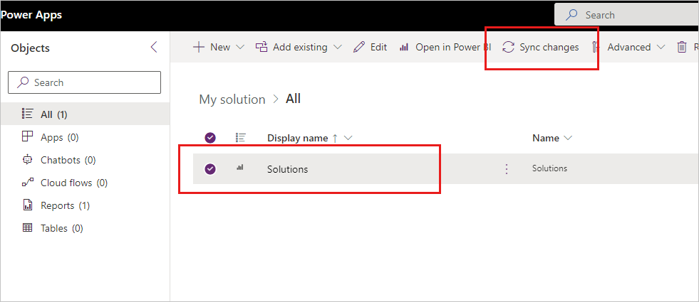
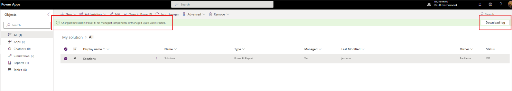
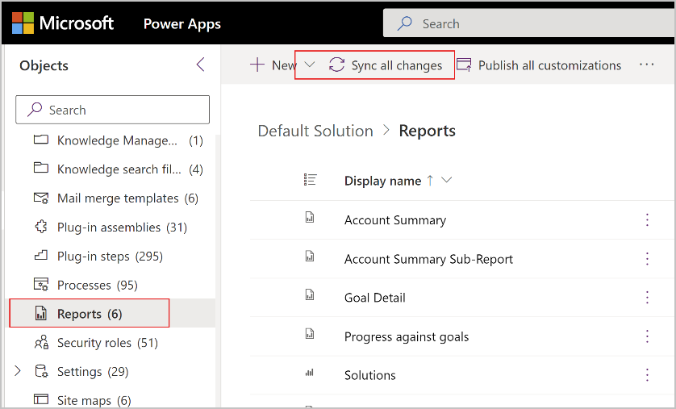
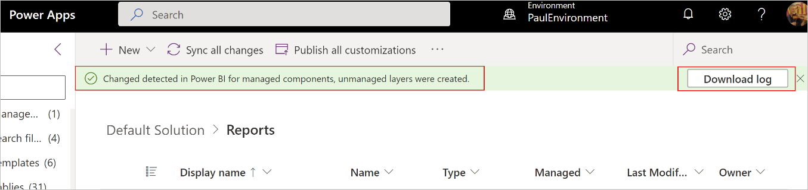
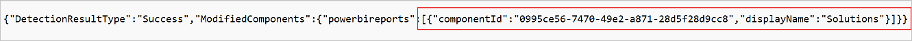

# Customize and manage Power BI components (preview)

> [!IMPORTANT]
>
> - This feature reached retirement on July 31, 2024 and is no longer available. We recommend removing all Power BI report and dataset components from existing solutions and use [Power BI embedded system dashboard](./create-edit-powerbi-embedded-page.md) instead.
> - Using the Power BI embedded system dashboard doesn't deploy Power BI reports and datasets in a Power BI workspace. Power Apps will no longer create a dedicated environment aware workspace in Power BI. Additionally, embedding the Power BI embedded system dashboard in forms, similar to the feature described in this article, isn't possible.

[!INCLUDE [cc-beta-prerelease-disclaimer](../../includes/cc-beta-prerelease-disclaimer.md)]

In general, Power BI components are customized and managed much like other components in Power Apps. However, there are a number of characteristics of Power BI components that require additional steps or that have additional considerations. This article discusses these special characteristics.

> [!IMPORTANT]
> - This is a preview feature.
> - [!INCLUDE[cc_preview_features_definition](../../includes/cc-preview-features-definition.md)]

## Customization with Power BI components

Once you've imported a managed solution, you can make changes to the report or the dataset in order to make a customization. To bring the changes into Power Apps as an unmanaged layer, Power BI and Power Apps must be synced manually. You first make the changes in Power BI, then detect and synchronize the changes in Power Apps. More information: [Solution layers - Power Apps](../data-platform/solution-layers.md)

The basic flow is as follows:

1. Start with a managed solution that has the report and/or dataset you want. You can import a managed solution either from the marketplace or you can use your own.

1. Create a new solution.

1. Add an existing report and/or dataset component from the managed solution (From Dataverse) to the new solution.

1. Once the report or dataset has been added to your new solution, select the solution  components you want, and then choose **Open in Power BI**.

    
    
    This opens the report/dataset in Power BI, where you make your desired changes either directly in the service or by overwriting the current report/dataset with an updated .pbix file.

1. Return to Power Apps, select the report or dataset and then choose **Sync changes**. 

    

    A banner notifies you if changes were detected and if an unmanaged layer was created. Select **Download log** to view where the changes were detected.

    

1. Once you've created an unmanaged layer, you can export your solution which will also export the report/dataset as a whole, or, if you want to roll back the changes, you can remove the unmanaged layer. Removing the unmanaged layer rolls back the changes to the managed solution components.

    > [!NOTE]
    > Power BI can work only with the top active layer of the component. Exporting the unmanaged layer exports the complete report/dataset not only the changes you made to the report/dataset. For example, when making a customization to a report you can continue to update the dependent dataset but updates to managed layers beneath the active layer aren't applied to the report/dataset.  

### Removing unmanaged layer/customization 

After syncing changes, an unmanaged layer is created. Removing the unmanaged layer rolls back the changes to the active managed layer. The Power BI items (report and/or dataset) in the Power BI environment workspace also reverts to the original managed active layer. 

### Using the Default solution to sync all changes

In some cases, it might be difficult to know exactly where the changes from Power BI are coming from. To make sure you sync all changes, go to the Default solution, select **Reports** or **Datasets**, and choose **Sync all changes**.

The banner notifies you if changes were detected and if an unmanaged layer was created. Select **Download log** to view where the changes were detected.

The log shows the changed items.

## Permission sync between Power Apps environment and Power BI workspace

Customizing or updating a Power Apps solution that includes Power BI components requires sufficient permissions both in the Power Apps environment and in the dedicated workspace that was created in Power BI when the Power BI components were created. Since privileges in the Power Apps environment and workspace permissions in Power BI are independent of one another, the Power Apps solutions/Power BI integration provides a synchronization mechanism that enables you to easily manage all the necessary permissions from the Power Apps environment. All that's required is to make sure that synchronization is enabled, and to work with a small set of predefined roles that allow inheritance of permissions to Power BI, as described below.  

To make sure that collaborators can customize solutions that include Power BI components, assign them to one of the following predefined groups (whichever is appropriate) in the Power Apps environment.

* Power BI workspace admin
* Power BI workspace contributor
* Power BI workspace viewer
* System administrator
* System customizer 

These groups sync automatically with special groups in the dedicated Power BI workspace and ensure that the people you add to them get the Power BI workspace permissions they need for customizing solutions that include Power BI components. More information: [Assign a security role to a user](/power-platform/admin/assign-security-roles)
The table below shows:

* Column 1: The special predefined groups in the Power Apps environment that you assign users to. The system administrator and system customizer security roles are automatically included in the Power BI workspace admin and Power BI workspace contributor roles, respectively.
* Column 2: The [Power BI workspace roles](/power-bi/collaborate-share/service-roles-new-workspaces) to which each group is assigned. The workspace roles determine what permissions the users will have on the items in the workspace.

|Assign user to one of the following predefined roles in the Power Apps environment   |As a result, users get these workspace roles in the dedicated Power BI workspace     |
|---------|---------|
|Power BI workspace admin; System administrator      |Admin        |
|Power BI workspace contributor; System customizer      |Contributor         |
|Power BI workspace viewer     |Viewer         |

### Notes 

* The special Power Platform-related groups in the dedicated Power BI workspace must not be removed. If any are removed, synchronization won’t work, and users might not be able to customize and update solutions due to lack of required permissions in Power BI.

* Permissions synchronization is on by default. If synchronization is disabled, users who have access to the Power BI workspace thanks to membership in one of the predefined security roles in the Power Apps environment will lose access to the Power BI workspace. However, Power Apps users who have been granted access to the Power BI workspace manually in Power BI will still have access.

* If permissions synchronization is disabled, you can still grant users access to the dedicated Power BI workspace manually via the workspace’s **Access** tab in Power BI.

* Currently, you can only display group membership by looking at the predefined group in the Power Apps environment. You can't open the special Power Platform-related groups in the dedicated Power BI workspace to view membership. 

## Updating a solution with Power BI components

Updating a solution with Power BI components automatically updates the relevant artifacts of the dedicated environment workspace in Power BI for both managed and unmanaged solutions.

## Authenticating Power BI dataset against data sources after deployment to new environment

Importing a solution might require additional steps in Power BI such as authentication against data sources and dataset refresh.

### See also

* [Create Power BI report and dataset components](./create-edit-powerbi-report-dataset-components.md)
* [Power BI content management in Power Apps solutions](./power-bi-content-management-power-apps-solutions.md)

[!INCLUDE[footer-include](../../includes/footer-banner.md)]
