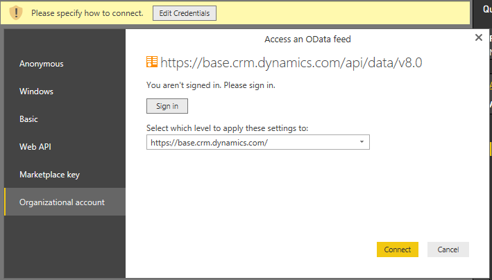
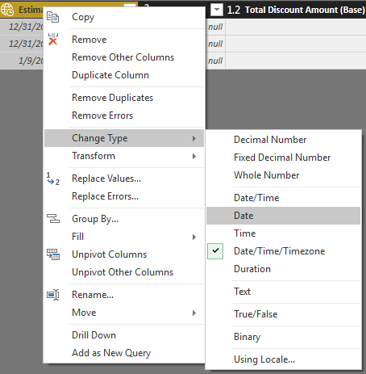
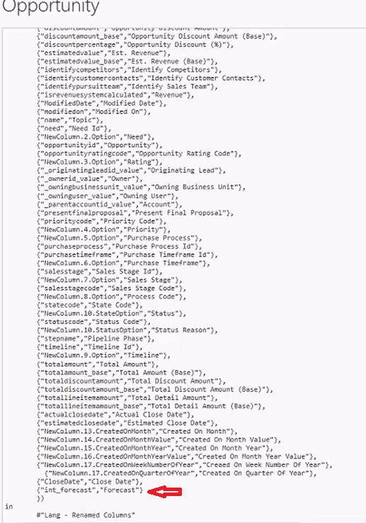
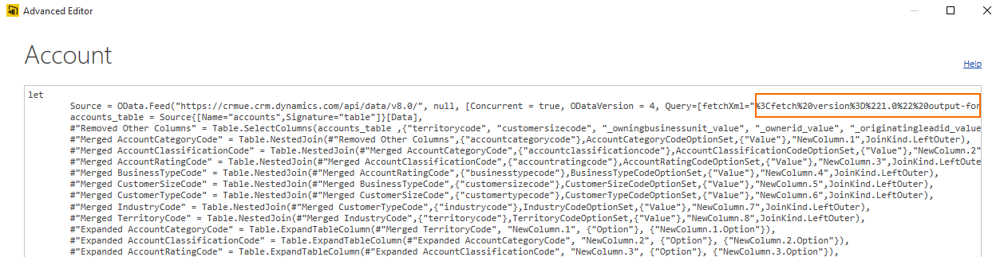
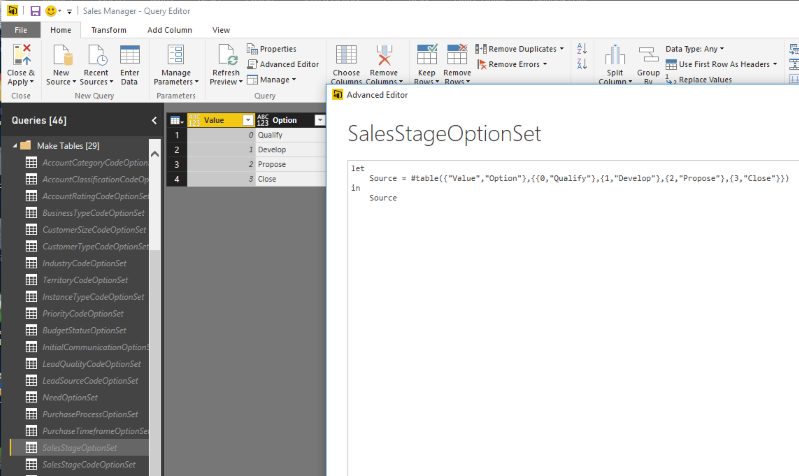
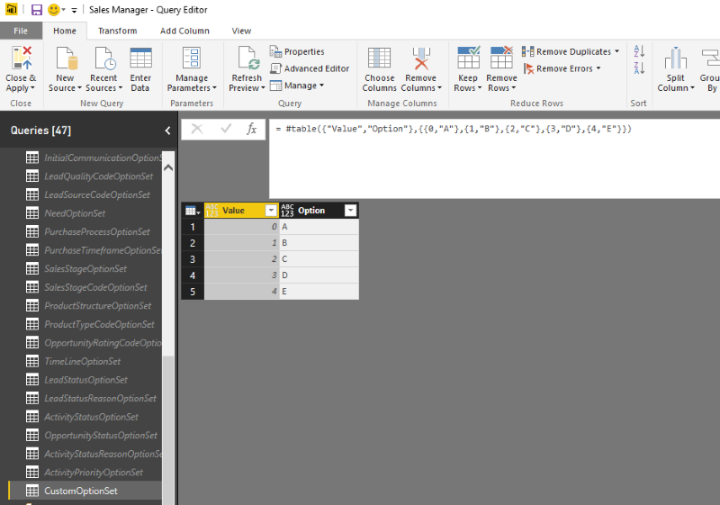
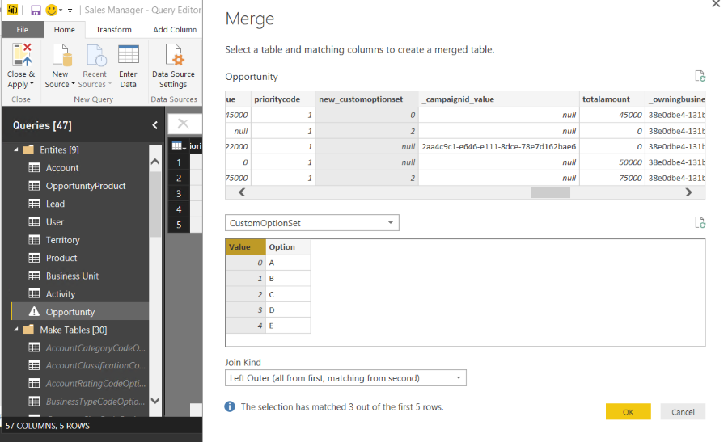
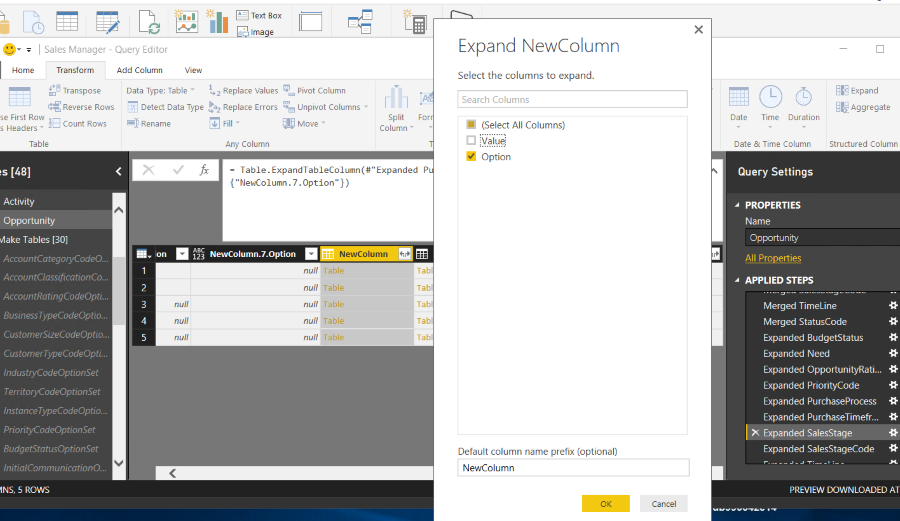
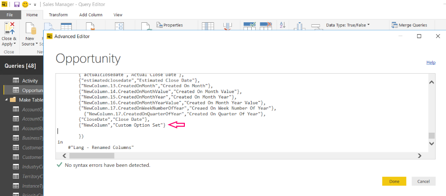
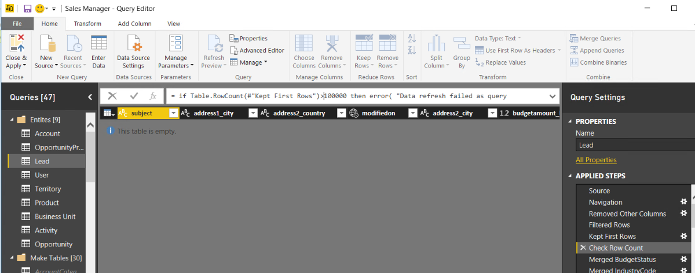

# Customize Dynamics 365 apps Power BI content packs

Power BI is a comprehensive collection of services and  tools that you use to visualize your business data.  Content packs are available that make it easy to visualize and analyze the Dynamics 365 Sales, Service, and Marketing apps data with Power BI based on a standard data model. The content packs are built with a set of entities and fields that are useful for most sales, service, or marketing reporting scenarios.  
  
 Dynamics 365 apps are often extended with custom fields. These custom fields don’t automatically show up in the Power BI model. This topic describes the different ways that you can edit or extend the reports included in a content pack to include custom fields in the Power BI model.  
    
<a name="PBI_edit_first"></a>   
## Do this before you customize a content pack for Power BI reports  
 
Before you customize a content pack, read  the information here and perform each task  as necessary.  
  
### Meet the requirements  
  
- [Power BI service registration](http://powerbi.com/).  
  
- [Power BI Desktop](https://powerbi.microsoft.com/desktop) application for editing Power BI reports.  
  
- PBIX file for the content pack that you want to customize.  
  
  -   [Download the Dynamics CRM Online Sales Manager PBIX](http://download.microsoft.com/download/9/2/B/92BCBDCE-CE01-4BC9-A306-2A92653B683E/Sales%20Manager.pbix)  
  
  -   [Download the Dynamics CRM Online Service Manager PBIX](http://download.microsoft.com/download/9/2/B/92BCBDCE-CE01-4BC9-A306-2A92653B683E/Customer%20Service%20Manager.pbix)  
  
  -   [Download the Microsoft Dynamics 365 Process Analyzer PBIX](http://download.microsoft.com/download/9/2/B/92BCBDCE-CE01-4BC9-A306-2A92653B683E/Process%20Analyzer%20-1.34b.pbix)  
  
  Dynamics 365 content packs are currently only supported in the U.S. English language.  
  
### Prepare a content pack for customization  
  
> [!IMPORTANT]
>  To connect the OData feed to your instance you must follow the steps described here before you customize the content pack.  
> 
> Currently, the Power BI service isn’t compatible with the Dynamics 365 version 9.0 OData endpoint. When you try to use the version 9.0 OData endpoint with the Power BI service the error message “The feed's metadata document appears to be invalid” is displayed. To work around this incompatibility, use the Dynamics 365 version 8.2 OData endpoint.For more information about the different endpoint versions, see [Compose HTTP requests and handle errors](../../developer/common-data-service/webapi/compose-http-requests-handle-errors.md).
  
1. Start Power BI Desktop.  
  
    Select **File** > **Open**,  open a content pack, such as Sales Manager.bpix,  and then select **Open**.  
  
    Several pages of reports within the content pack are loaded and displayed in Power BI Desktop.  
  
2. On the Power BI Desktop ribbon, select **Edit Queries**.  
  
3. In the left navigation pane of the Edit Queries window, under **Queries**, select the **CRMServiceUrl** query, and then on the ribbon, select **Advanced Editor**. In the source definition, replace **base.crm.dynamics.com** with your apps instance URL. For example, if the organization name is *Contoso*, the URL looks like this:  
  
    Source = "https://*contoso*.crm.dynamics.com/api/data/v8.0/"  
  
4. Select **Done**, and then select **Close & Apply** in the Query Editor.  
  
5. When the Access an OData feed dialog appears, select **Organizational account**, and then select **Sign-in**.  
  
     
  
6. When the sign-in page appears, enter your credentials to authenticate to your instance.  
  
7. In the Access an Odata feed dialog, select **Connect**.  
  
    The content pack queries are updated. This may take several minutes.  
  
<a name="PBI_edit_report"></a>   
## Customize aDynamics 365 content pack  
 [Change the date format that is displayed in a report](#PBI_edit_date)  
  
 [Add a custom field to a report for any entity except Account](#PBI_edit_field)  
  
 [Add a custom field to a report for the Account entity](#PBI_field_Account)  
  
 [Add an option set field to a report](#PBI_optionset_field)  
  
 [Increase the number of rows queried](#BPI_increaserows)  
  
<a name="PBI_edit_date"></a>   
### Convert a DateTime field to a Date field for reporting  
 In Dynamics 365 apps, some dates are saved in a Date/Time/Timezone format, which may not be the preferred format for aggregating data in  a report. You can convert the date displayed in reports for an entity field. For example, the Opportunity Created On field can be converted to a date to report the Opportunities created by day.  
  
1. In Power BI Desktop, select **Edit Queries**.  
  
2. In the left navigation pane of the Query Editor, under **Queries**, select the query that has the date field that you want to change, such the **Estimated Close Date** in the **Opportunity** entity query.  
  
3. Right-click the column heading, such as *Estimated Close Date*, point to **Change Type**, and then select another date type, such as **Date**.  
  
     
  
4. Select **Close & Apply** to close the Query Editor.  
  
5. On the main Power BI page, select **Apply Changes** to update the associated reports.  
  
<a name="PBI_edit_field"></a>   
### Add a custom field to a report  
 The following procedure describes how to add a custom field that is a date, string, or number to a report for all available entities except the account entity.  
  
> [!NOTE]
>  To add a field to the Account entity, see [Add a custom field to a report for the Account entity](#PBI_field_Account). To add a field that is an option set type, see [Add an option set field to a report](#PBI_optionset_field).  
  
1. In Power BI Desktop, select **Edit Queries**.  
  
2. In the  left navigation pane of the Query Editor, under **Queries**, select the query that has the custom field that you want to make available for reports, such as the **Opportunity** entity query.  
  
3. In the right pane, under **APPLIED STEPS**, select the settings button  next to **Removed Other Columns**.  
  
4. The **Choose Columns** list shows all fields for the entity, including custom fields. Select the custom field that you want, and then select **OK**.  
  
    The entity query is updated and a column is added in the entity table for the custom field that you selected.  
  
5. In the right pane, under **APPLIED STEPS**, select **Lang – Renamed Columns** and then select **Advanced Editor** to add the mapping for the field to the entity query. For example, if the custom field name for the opportunity entity is *int_forecast* and the display name is *Forecast*, the entry should appear like this.  
  
   ```  
   {"int_forecast","Forecast"}  
   ```  
  
     
  
6. After you add your field mapping, make sure there are no syntax errors displayed at the bottom of the Advanced Editor. Also, make sure the field name appears exactly as it appears in the column heading, including the correct letter case. If no syntax or table errors are detected, select **Done**.  
  
7. Click **Close & Apply** in the Query Editor.  
  
    The custom field is now available in the right pane under **Fields** for the entity, and can be added to new or existing reports.  
  
<a name="PBI_field_Account"></a>   
## Add a custom field to a report for the Account entity  
 Because the Account query uses Fetch XML to filter the query, the steps to add a field are different than for other entity queries that use OData. To add a custom field to the OData queried  entities, see [Add a custom field to a report](#PBI_edit_field).  
  
1. Copy the encoded Fetch XML query for the account entity. To do this, follow these steps:  
  
   1.  In Power BI Desktop, select **Edit Queries**.  
  
   2.  In the  left navigation pane of the Query Editor, under **Queries**, select the **Account** entity query,  and then on the ribbon, select **Advanced Editor**.  
  
   3.  From the first line, beginning with %3Cfetch and ending with fetch%3E, copy the entire encoded Fetch XML.  
  
   4.  The encoded Fetch XML that you copy  should look similar to this:  
  
        %3Cfetch%20version%3D%221.0%22%20output-format%3D%22xml-platform%22%20mapping%3D%22logical%22%20distinct%3D%22true%22%3E%3Centity%20name%3D%22account%22%3E%3Cattribute%20name%3D%22territorycode%22%20%2F%3E%3Cattribute%20name%3D%22customersizecode%22%20%2F%3E%3Cattribute%20name%3D%22owningbusinessunit%22%20%2F%3E%3Cattribute%20name%3D%22ownerid%22%20%2F%3E%3Cattribute%20name%3D%22originatingleadid%22%20%2F%3E%3Cattribute%20name%3D%22revenue%22%20%2F%3E%3Cattribute%20name%3D%22sic%22%20%2F%3E%3Cattribute%20name%3D%22marketcap%22%20%2F%3E%20%3Cattribute%20name%3D%22parentaccountid%22%20%2F%3E%3Cattribute%20name%3D%22owninguser%22%20%2F%3E%3Cattribute%20name%3D%22accountcategorycode%22%20%2F%3E%3Cattribute%20name%3D%22marketcap_base%22%20%2F%3E%3Cattribute%20name%3D%22customertypecode%22%20%2F%3E%3Cattribute%20name%3D%22address1_postalcode%22%20%2F%3E%3Cattribute%20name%3D%22numberofemployees%22%20%2F%3E%3Cattribute%20name%3D%22accountratingcode%22%20%2F%3E%3Cattribute%20name%3D%22address1_longitude%22%20%2F%3E%3Cattribute%20name%3D%22revenue_base%22%20%2F%3E%3Cattribute%20name%3D%22createdon%22%20%2F%3E%3Cattribute%20name%3D%22name%22%20%2F%3E%3Cattribute%20name%3D%22address1_stateorprovince%22%20%2F%3E%3Cattribute%20name%3D%22territoryid%22%20%2F%3E%3Cattribute%20name%3D%22accountclassificationcode%22%20%2F%3E%3Cattribute%20name%3D%22businesstypecode%22%20%2F%3E%3Cattribute%20name%3D%22address1_country%22%20%2F%3E%3Cattribute%20name%3D%22accountid%22%20%2F%3E%3Cattribute%20name%3D%22address1_latitude%22%20%2F%3E%3Cattribute%20name%3D%22modifiedon%22%20%2F%3E%3Cattribute%20name%3D%22industrycode%22%20%2F%3E%3Clink-entity%20name%3D%22opportunity%22%20from%3D%22parentaccountid%22%20to%3D%22accountid%22%20alias%3D%22ab%22%3E%3Cfilter%20type%3D%22and%22%3E%3Ccondition%20attribute%3D%22opportunityid%22%20operator%3D%22not-null%22%20%2F%3E%3Ccondition%20attribute%3D%22modifiedon%22%20operator%3D%22last-x-days%22%20value%3D%22365%22%20%2F%3E%3C%2Ffilter%3E%3C%2Flink-entity%3E%3C%2Fentity%3E%3C%2Ffetch%3E  
  
2. Decode the encoded Fetch XML. It must be valid encoded Fetch XML and, once encoded, should look similar to this:  
  
    \<fetch version="1.0" output-format="xml-platform" mapping="logical" distinct="true"> \<entity name="account"> \<attribute name="territorycode" /> \<attribute name="customersizecode" /> \<attribute name="owningbusinessunit" /> \<attribute name="ownerid" /> \<attribute name="originatingleadid" /> \<attribute name="revenue" /> \<attribute name="sic" /> \<attribute name="marketcap" />  \<attribute name="parentaccountid" /> \<attribute name="owninguser" /> \<attribute name="accountcategorycode" /> \<attribute name="marketcap_base" /> \<attribute name="customertypecode" /> \<attribute name="address1_postalcode" /> \<attribute name="numberofemployees" /> \<attribute name="accountratingcode" /> \<attribute name="address1_longitude" /> \<attribute name="revenue_base" /> \<attribute name="createdon" /> \<attribute name="name" /> \<attribute name="address1_stateorprovince" /> \<attribute name="territoryid" /> \<attribute name="accountclassificationcode" /> \<attribute name="businesstypecode" /> \<attribute name="address1_country" /> \<attribute name="accountid" /> \<attribute name="address1_latitude" /> \<attribute name="modifiedon" /> \<attribute name="industrycode" /> \<link-entity name="opportunity" from="parentaccountid" to="accountid" alias="ab"> \<filter type="and"> \<condition attribute="opportunityid" operator="not-null" /> \<condition attribute="modifiedon" operator="last-x-days" value="365" /> \</filter> \</link-entity> \</entity> \</fetch>  
  
   > [!TIP]
   >  Many URL encoder and decoder tools are freely available on the web.  
  
3. In the Fetch XML, add your custom entity  as an attribute node between the \<entity> nodes. For example, to add a custom field named *customclassificationcode*, add the node after another attribute node, such as **industrycode**.  
  
   ```  
  
   <attribute name="industrycode" />  
   <attribute name=" customclassificationcode "/>  
   <link-entity name="opportunity" from="parentaccountid" to="accountid" alias="ab">  
   ```  
  
4. URL encode the updated Fetch XML. The Fetch XML that includes the new custom attribute must be encoded and then used to replace the existing OData feed query that comes with the content pack. To do this, copy the updated FetchXML to the clipboard and paste it into a URL encoder.  
  
5. Paste the encoded Fetch XML URL into the OData feed. To do this, paste the encoded URL between the quotation marks after the **Query=[fetchXml=** text, replacing the existing encoded FetchXML, and then select **Done**.  
  
    The screen shot below indicates where the left-most quotation is located.  
  
     
  
6. In the right pane, under **APPLIED STEPS**, select the settings button  next to **Removed Other Columns**.  
  
7. The Choose Columns list shows all fields for the entity, including custom fields. Select the custom field, such as *customclassificationcode*, that you added to the Fetch XML query earlier, and then select **OK**.  
  
   > [!NOTE]
   >  The field name that you select in the Column Chooser and the field name that you add to the FetchXML query must match.  
  
    The entity query is updated and a column is added in the entity table for the custom field that you selected.  
  
8. Select **Close & Apply** in the Query Editor.  
  
    The custom field is now available in the right pane under **Fields** for the entity and can be added to new or existing reports.  
  
<a name="PBI_optionset_field"></a>   
## Add a custom option set field to a report  
 Option set fields allow you to choose from multiple values. Examples of out-of-box option set fields are the Rating and Sales Stage fields for an opportunity. Imagine you have  a custom option set field on the main opportunity form that has the following values and labels.  
  
   
  
 To add the custom option set field to a report, follow these steps.  
  
1. Add the custom field column.  
  
   -   In the left navigation pane of the Query Editor, under **Queries**, select the entity that has the associated custom option set, such as the *Opportunity* entity.  
  
   -   In the right pane, under **APPLIED STEPS**, select the settings button  next to **Removed Other Columns**.  
  
   -   The Choose Columns list shows all fields for the entity, including custom fields. Select the custom field, such as *new_customoptionset*, and then select **OK**.  
  
   -   Select **Save**, and then when prompted, select **Apply**.  
  
        The column for the custom field appears in the entity table.  
  
2. Create the option set query.  
  
   1.  In Power BI Desktop, select **Edit Queries**.  
  
   2.  In the left navigation pane of the Query Editor, under **Queries**, select the query under the **Make Tables** group that has the option set field that is the most similar to the option set you want to add to a report. For this example, the **SalesStageOptionSet** query has four options so is a good choice.  
  
   3.  Select **Advanced Editor**.  
  
        The option set query is displayed.  
  
     
  
   4.  Copy the entire query to the clipboard. You can paste it in to a text editor, such as Notepad, for later reference.  
  
   5.  In the Query Editor, right-click the **Make Tables** group, select **New Query**, and then select **Blank Query**.  
  
   6.  In the right pane, under **Name** enter a name, such as *CustomOptionSet*, and then press Enter.  
  
   7.  Select **Advanced Editor**.  
  
   8.  In the Advanced Editor, paste in the query you copied earlier.  
  
   9. Replace the existing values and options with your custom values and options. In this example, you change this.  
  
       ```  
       let  
           Source = #table({"Value","Option"},{{0,"Qualify"},{1,"Develop"},{2,"Propose"},{3,"Close"}})  
       in  
           Source  
  
       ```  
  
        To this.  
  
       ```  
       let  
           Source = #table({"Value","Option"},{{0,"A"},{1,"B"},{2,"C"},{3,"D"},{4,"E"}})  
       in  
           Source  
  
       ```  
  
   10. Make sure there are no syntax errors, and then select **Done** to close the Advanced Editor. The table of values and options appears in the Query Editor.  
  
     
  
   11. Select **Save**, and then when prompted, select **Apply**.  
  
3. Insert a merge query for the entity and custom option set tables.  
  
   1.  In the left pane of the Query Editor, under **Entities**, slect the entity that includes the custom option set. For this example, the **Opportunity** entity query is selected.  
  
   2.  On the ribbon select **Merge Queries** and, when you are prompted to insert a step, select **Insert**.  
  
   3.  In the Merge dialog, select the column heading for the custom option set, such as *new_optionset*. In the drop-down list, select the corresponding option set  query that you created earlier.  When the option set table appears, select the **Value** column heading to select it.  
  
     
  
   4.  Leave the join kind as **Left Outer (all from first, matching from second)**, and then select **OK**.  
  
       > [!TIP]
       >  Rename the merge query. Under **APPLIED STEPS**, right-click the merge query that you created,  select **Rename**, and enter a descriptive name, such as *Merge CustomOptionSet*.  
  
4. Define the column so that only the labels display.  
  
   1.  In the left pane of the Query Editor, under Entities, select the entity that includes the custom option set. For this example, the **Opportunity** entity query is selected.  
  
   2.  In the right pane, under **APPLIED STEPS**, select one of the expanded queries to reveal the merged columns, such as **Expanded SalesStage**.  
  
   3.  Locate and select the column heading for the new column that was created as part of the earlier merge query step.  
  
   4.  On the **Transform** tab, select **Expand**.  
  
   5.  In the Expand new column dialog, clear the column that corresponds to the values (because only the labels should appear in the column). Select **Done**.  
  
     
  
   6.  Select **Save**, and then when prompted, select **Apply**.  
  
5. Change the column name for report building.  
  
   1.  In the left pane of the Query Editor, under **Entities**, select the entity that includes the custom option set. For this example, the **Opportunity** entity query is selected.  
  
   2.  Select **Advanced Editor**.  
  
   3.  Add a renamed column line item, make sure there are no syntax errors, and then select **Done**. In this example, the custom option set column name that you created earlier is **NewColumn** that is being renamed to *Custom Option Set*.  
  
     
  
   4.  Select **Save**, and then when prompted, select **Apply**.  
  
6. Select **Close & Apply** to close the Query Editor.  
  
    The custom option set can now be used to build Power BI reports.  
  
<a name="BPI_increaserows"></a>   
## Increase the number of rows queried  
 By default, all Power BI entity queries in the content packs cannot exceed 100,000 rows. To increase the number of rows that can be queried, follow these steps.  
  
> [!IMPORTANT]
>  Increasing the row count limit can significantly impact the time it takes for a report to refresh. Additionally, the Power BI service has a 30-minute limit for running queries. Use caution when increasing the row count limit.  
  
1. In Power BI Desktop, select **Edit Queries**.  
  
2. In the  left navigation pane of the Query Editor, under **Queries**, select the entity query that you want to increase the  row count limit, such as the **Lead** entity.  
  
3. In the right pane, under **APPLIED STEPS**, select **Kept First Rows**.  
  
4. Increase the filtered row number. For example to increase to 150,000, change Table.FirstN(#"Filtered Rows",100001) to Table.FirstN(#"Filtered Rows",150000)  
  
5. In the right pane, under **APPLIED STEPS**, select **Check Row Count**.  
  
6. Locate the **>100,000** part of the step.  
  
     
  
7. Increase the value to a larger number, such as *150,000*.  
  
8. Select **Close & Apply** in the Query Editor.  
  
<a name="BPI_publish"></a>   
## Publish your report to the Power BI service  
 Publish your report for organizational sharing and access from anywhere on most any device.  
  
1. On the Power BI Desktop main page **Home** tab ribbon, select **Publish**.  
  
2. If you are prompted to sign in to the Power BI service, select **Sign in**.  
  
3. If multiple destinations are available, select the one you want, and then select **Publish**.  
  
### See also  
 [Use Power BI with Dynamics 365 Customer Engagement (on-premises)](use-power-bi.md)
