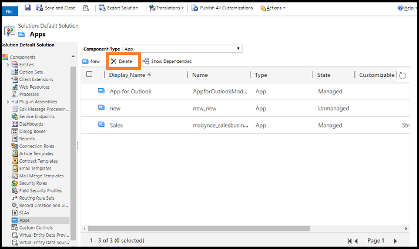

# Delete a model-driven app

Delete or remove apps that are obsolete in your environment.

1. Sign in to [PowerApps](https://web.powerapps.com/).
2. Open [solution explorer](advanced-navigation.md#solution-explorer). 
3. In the solution window, under **Components**, select **Apps**.
4. Select the app that you want to delete, and then select **Delete** on the command bar.

    

5. In the confirmation message that appears, select **Delete**.

   The app is deleted from your environment.
  
If the component has dependencies (such as relationships), you must remove the dependencies before you can delete the app. To see the dependencies of an app, select the app, and then select **Show Dependencies** on the command bar.

> [!NOTE]
> When you delete the app, we recommend that you delete its associated site map. If you do not delete the associated site map, the site map designer displays an error the first time you try to create another app with the same name. However, you can ignore the error, and the error will not appear when you try to create the app again.

