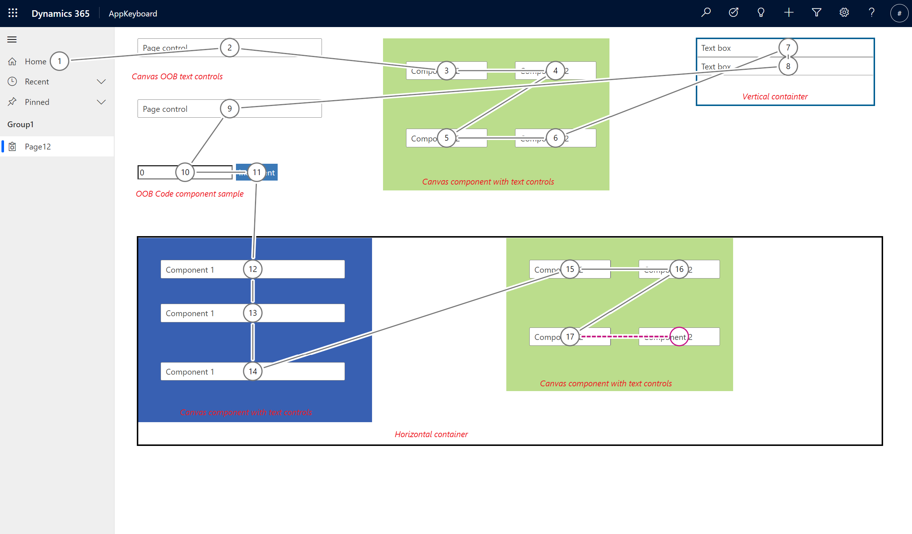

# Design a custom page for your model-driven app (preview)

[!INCLUDE [cc-beta-prerelease-disclaimer](../../includes/cc-beta-prerelease-disclaimer.md)]

This topic provides tips for designing a custom page for use in a model-driven app.

  > [!IMPORTANT]
  > - This is a preview feature, and isn't available in all regions.
  > - [!INCLUDE[cc_preview_features_definition](../../includes/cc-preview-features-definition.md)]

## Supported controls in a custom page

Custom page authoring currently supports a subset of controls and interaction with these controls currently isn't supported.

  | Control | Control Type | Notes |
  | --- | --- | --- |
  |Label<sup>1</sup>|Display||
  |Text Box<sup>1</sup>|Input||
  |Date Picker<sup>1</sup>|Input|
  |Button<sup>1</sup>|Input|
  |Combo Box<sup>1</sup>|Input|
  |Check Box<sup>1</sup>|Input|
  |Toggle<sup>1</sup>|Input|
  |Radio Group<sup>1</sup>|Input|
  |Slider<sup>1</sup>|Input|
  |Rating<sup>1</sup>|Input|
  |Vertical Container|Layout|New responsive horizontal layout container|
  |Horizontal Container|Layout|New responsive horizontal layout container|
  |Rich Text Editor|Input|
  |Gallery|List|
  |Icon|Media|
  |Image|Media|
  |Edit Form|Input|
  |Display Form|Input|
  |Code components|Custom| [Add code components to a custom page](page-code-components.md)|
  |Canvas components|Custom| [Add canvas components to a custom page](page-canvas-components.md)|
  
<sup>1</sup> - Control is a new modern control. The control was introduced for [canvas apps in Teams]( /power-platform-release-plan/2020wave1/microsoft-powerapps/build-apps-teams-modern-controls). The control is based on [Fluent UI library](https://developer.microsoft.com/fluentui#/controls/web) wrapped with  [Power Apps Component Framework](../../developer/component-framework/overview.md).

## Custom components support for custom page

You can add both low-code (canvas components) and pro-code( code components) custom UX components to your environment and make them available for all makers. For custom page specific UX extensibility articles go to [add canvas components to a custom page for your model-driven app](/powerapps/maker/model-driven-apps/page-canvas-components) and [add code components to a custom page for your model-driven app.](/powerapps/maker/model-driven-apps/page-code-components) 

In general, the low code extensibility approach is simpler to build, test, and has a lower maintenance cost. We recommend evaluating canvas components first and then use code components only if there is a need for more complex and advanced customization.

More information:
- [Canvas component gallery,](https://powerusers.microsoft.com/t5/Canvas-Apps-Components-Samples/bd-p/ComponentsGallery)
- [Code components OOB samples](../../developer/component-framework/use-sample-components.md)
- [Code components community resources](../../../developer/component-framework/community-resources.md)

## Enable responsive layout with container control

Responsive custom page layouts are defined by building a hierarchy of **Horizontal layout container** and **Vertical layout container** controls.  These controls are found in the canvas app designer under Layout in the **Insert** tab.

Resize the topmost container to fill the entire space with these properties.

  ```powerappsfl
  X=0
  Y=0
  Width=Parent.Width
  Height=Parent.Height
  ```

More information: [Building responsive layout](../canvas-apps/build-responsive-apps.md "Building responsive layout").

### Vertical container with fixed header, flexible body, fixed footer

1. On the **Vertical Container**, set **Align (horizontal)** to **Stretch**

1. Insert three **Horizontal Container** controls within the parent **Vertical Container**

1. On the first and third child horizontal container controls, set **Stretch height** off and reduce height to space needed, such as *Height=80*.

### Horizontal container with two even child containers

1. On the parent horizontal container, set **Align (vertical)** to **Stretch**.

1. Insert two **Vertical Container** controls within the parent **Horizontal Container**.

## Styling custom page controls to align to model-driven app controls

By creating the custom page from the modern app designer, the important properties use the default values.  

1. Theme for the custom page.
   
    Theme values for the controls used in a custom page are automatically set to match the default blue theme of the Unified Interface. This default theme is used both in the studio and at application runtime. Explicit theme selector is removed from custom page authoring experience.

1. Controls need to use a different font size, which is based on their position in the page hierarchy.

    > [!Note]
    > Custom page text has a upscaling of 1.33 so you need to divide the target **FontSize** by 1.33 to get the desired size.


    | Label Type | Target FontSize | FontSize to use |
    | --- | --- | --- |
    |Page title|17|12.75|
    |Normal labels|14|10.52|
    |Small labels|12|9.02|

1. Primary and secondary button controls need the following styling changes

    Primary buttons:
    ```powerappsfl
    Color=RGBA(255, 255, 255, 1)
    Fill=RGBA(41,114,182,1)
    Height=35
    FontWeight=Normal
    ```

    Secondary buttons:
    ```powerappsfl
    Color=RGBA(41,114,182,1)
    Fill=RGBA(255, 255, 255, 1)
    BorderColor=RGBA(41,114,182,1)
    Height=35
    FontWeight=Normal
    ```

## Tab navigation and keyboard accessibility for custom pages

Custom page follow the same tab navigation design that's used by the hosting model-driven app. Visually aligned semantic HTML structure helps users navigate the custom pages seamlessly when using a keyboard or a screen reader. Note that unlike stand alone canvas apps, custom page controls and other UX elements don't need explicit tab numbers assignments. Modern controls don't have a `TabIndex` property and utilize the semantic HTML structure for navigation. 

Various elements like controls, canvas and code components, containers and so on can be tabbed based on their position in the custom page layout. The tab navigation follows Z order navigation. Individual tab-stops inside larger grouping elements like components, containers are navigated first before the tab moves out to the next element in the document object model (DOM) tree.

Here is an example navigation with the page containing controls, code, and canvas components and containers.

  > 

  > [!NOTE]
  > Overlapping controls and elements on the custom page will not have their DOM merged so tab stops can be out of sync from visual layout. Same is true for the dynamic element positioning using formulas.  

### See also

[Model-driven app custom page overview](model-app-page-overview.md)

[Using PowerFx in custom page](page-powerfx-in-model-app.md)

[Building responsive layout](../canvas-apps/build-responsive-apps.md)

[Add a custom page to your model-driven app](add-page-to-model-app.md)

[Navigating to and from a custom page in your model-driven app](navigate-page-examples.md)
