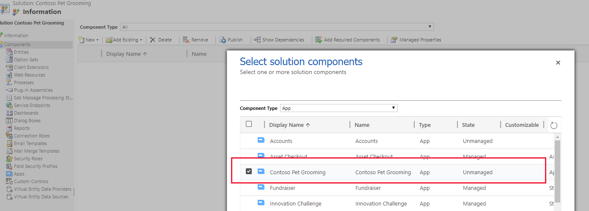

# Distribute a model-driven app using a solution

[!INCLUDE [cc-data-platform-banner](../../includes/cc-data-platform-banner.md)]

Model-driven apps are distributed as solution components. After you have created a model-driven app, you can make it available for other environments to use by packaging the app into a solution and then exporting it into a zip file. After the solution (.zip file) is successfully imported in the target environment, the packaged app is available for use. 
  
## Add an app to a solution
In order to distribute your app, you create a solution so the app can be packaged for export.

1. Sign in to [Power Apps](https://make.powerapps.com/?utm_source=padocs&utm_medium=linkinadoc&utm_campaign=referralsfromdoc).

2. Select **Solutions** and then select **New solution**.
3. Complete the columns on the **New Solution** page, and then select **Save**. More information: [Create a solution](../data-platform/create-solution.md)
4. The **Solution** page appears. Select **Add Existing**, select **App**, select **Model-driven app**, select the app that you want to add to the solution, and then select **Add**. 

    

5. If a **Missing Required Components** page appears we recommend that you select **Yes, include required components** to add necessary components such as tables, views, forms, charts, and site map that are part of the app. Select **OK**.

## Export a solution
To distribute your app so it can be imported into other environment or made available on [Microsoft AppSource](https://appsource.microsoft.com/), you export the solution to a zip file. Then, the zip file that contains the app and components can be imported into other environments.

1. Go to the **Solutions** area of Power Apps. 
2. Select the solution you want to export, and then on the toolbar select **Export**. 
3. On the **Before you export** pane, we recommend that you **Publish all changes** and **Check for issues**, before you select **Next**.
4. On the **Export this solution** pane, accept the incremented version number already provided or enter a different one, select **Unmanaged** or **Managed**, and the select **Export**. For more information about solution package types, see [Solutions overview](../data-platform/solutions-overview.md).
5. Depending on your browser and settings, a .zip package file is built and copied to the default downloads folder. The file name of the package is based on the unique name of the solution appended with underscores and the solution version number.

	> [!NOTE]
	> When you export an app by using a solution, the app URL is not exported.
  
## Import a solution  
When you receive a solution zip file which contains the app that you want to import, open the solutions component page and import the solution. When the solution has been successfully imported, the app will be available in your environment.

1. Sign in to [Power Apps](https://make.powerapps.com/?utm_source=padocs&utm_medium=linkinadoc&utm_campaign=referralsfromdoc).

2. Go to the **Solutions** area, and then on the toolbar select **Import**.
3. Browse to the file you want to import, and then choose **Next**.
4. Select **Import**.

## See also
[Change the solution publisher prefix](../data-platform/create-solution.md#solution-publisher)

[!INCLUDE[footer-include](../../includes/footer-banner.md)]