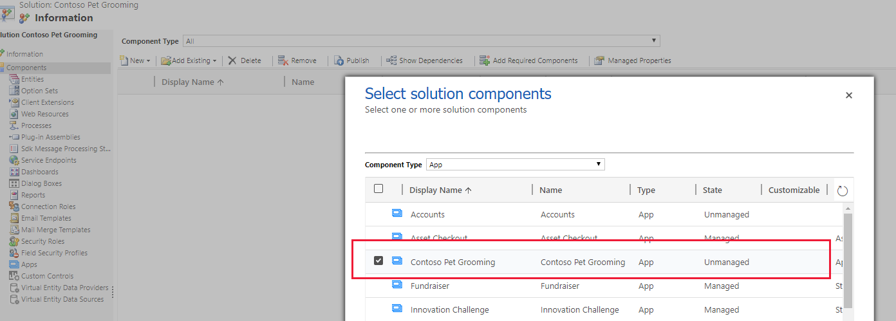

# Distribute a model-driven app using a solution

Model-driven apps are distributed as solution objects. After a model-driven is created, it can be made available for other [environments](model-driven-app-glossary.md#environment) to use by adding the app to a [solution](model-driven-app-glossary.md#solution) and then exporting it.

After the exported solution (a .zip file) is successfully imported in the target environment, the app is available for use provided users have the [security roles](model-driven-app-glossary.md#security-role) relevant to the tables or other objects in the app.

Moving solutions between environments is the basis for how you apply [application lifecycle management](model-driven-app-glossary.md#application-lifecycle-management) to the products created.

This article describes how to work with solutions in a basic fashion. Go to this article for [detailed guidance on working with solutions](../../maker/data-platform/solutions-overview.md).
  
## Add an app to a solution

To distribute an app, you create a solution so that the app can be packaged for export.

1. Sign in to [Power Apps](https://make.powerapps.com/?utm_source=padocs&utm_medium=linkinadoc&utm_campaign=referralsfromdoc).
2. Select **Solutions** on the left navigation pane, and then select **New solution**. [!INCLUDE [left-navigation-pane](../../includes/left-navigation-pane.md)]
3. Enter the properties on the **New Solution** page, and then select **Save**. More information: [Create a solution](../data-platform/create-solution.md)
4. The **Solution** page appears. Select **Add Existing**, select **App**, select **Model-driven app**, select the app that is to be added to the solution, and then select **Add**.

    

5. If a **Missing Required Components** page appears we recommend selecting **Yes, include required components** to add necessary components such as tables, views, forms, charts, and site map that are part of the app. Select **OK**.

## Export a solution

To distribute an app so it can be imported into other environments or made available on [Microsoft Marketplace](https://marketplace.microsoft.com/), export the solution to a zip file. Then, the zip file that contains the app and components can be imported into other environments.

1. Select **Solutions** on the left navigation pane of Power Apps. [!INCLUDE [left-navigation-pane](../../includes/left-navigation-pane.md)]
2. Select the solution, and then on the toolbar select **Export solution**.
3. On the **Before you export** pane, we recommend that you **Publish**, before selecting **Next**.
4. If there a are missing dependencies, the **Manage solution dependencies** pane appears. Select **Next** to add the missing dependencies.
5. On the **Export this solution** pane, accept the incremented version number already provided or enter a different one, select **Unmanaged** or **Managed**, and then select **Export**. For more information about solution package types, go to [Solutions overview](../data-platform/solutions-overview.md).
   > [!NOTE]
   > - Typically you export a solution as **Managed** because you want to continue to work on the project in the current environment. Unmanaged versions of your solutions should be considered your source for Microsoft Power Platform assets and checked into your source control system. We don't recommend that you import unmanaged solutions into non-development environments.
   > - By default, **Run solution checker on export** is selected. We recommend that you allow solution checker to run to identify issues that might occur with the export.

6. Depending on the browser and settings, a .zip package file is built and copied to the default downloads folder. The file name of the package is based on the unique name of the solution appended with underscores and the solution version number.
   > [!NOTE]
	 > When you export an app by using a solution, the app URL isn't exported.
  
## Import a solution

When you receive a solution zip file that contains the app that you want to import, open the solutions component page and import the solution. When the solution has been successfully imported, the app is available in the environment.

1. Sign in to [Power Apps](https://make.powerapps.com/?utm_source=padocs&utm_medium=linkinadoc&utm_campaign=referralsfromdoc).
1. Select **Solutions** on the left navigation pane, and then on the toolbar select **Import solution**. [!INCLUDE [left-navigation-pane](../../includes/left-navigation-pane.md)]
1. Select from these options for where to import the solution from: 
   - **This device**. Select Browse and locate the zip file, and then choose **Next**.
   - **Pipelines**. If the solution is part of a pipeline in Power Platform select this option. More information: [Use pipelines in Power Platform to deploy solutions](../data-platform/use-pipelines.md)
1. Select **Import** and wait for the solution to be imported. This can take a varying amount of time based on the complexity of the solution.

## Related articles

[Learn more about solutions](../../maker/data-platform/solutions-overview.md)

[Change the solution publisher prefix](../data-platform/create-solution.md#solution-publisher)

[!INCLUDE[footer-include](../../includes/footer-banner.md)]
