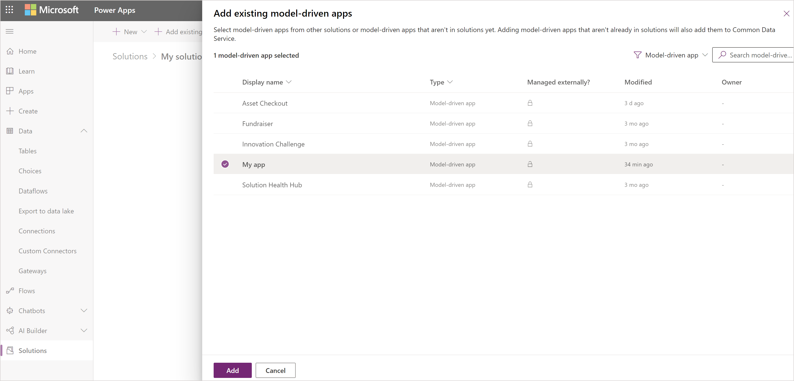

# Distribute a model-driven app using a solution

[!INCLUDE [cc-data-platform-banner](../../includes/cc-data-platform-banner.md)]

## The purpose of solutions

Model-driven apps are distributed as solution components. After a model-driven has been created, it can be made available for other [environments](model-driven-app-glossary.md#environment) to use by packaging the app into a **solution** and then exporting it into a zip file.

After the solution (.zip file) is successfully imported in the target environment, the packaged app is available for use provided users are in the [security roles](model-driven-app-glossary.md#security-role) relevant to the tables in the app.

The fact that we can move solutions between environments is the basis upon which we can apply [application lifecycle management](model-driven-app-glossary.md#application-lifecycle-management) to the products created.

This page describes how to work with solutions in the most basic fashion.  However you may wish to review [detailed guidance on working with solutions](../../maker/data-platform/solutions-overview.md).
  
## Add an app to a solution
In order to distribute an app, a solution is created so that the app can be packaged for export.

1. Sign in to [Power Apps](https://make.powerapps.com/?utm_source=padocs&utm_medium=linkinadoc&utm_campaign=referralsfromdoc).

2. Select **Solutions** and then select **New solution**.
3. Complete the columns on the **New Solution** page, and then select **Save**. More information: [Create a solution](../data-platform/create-solution.md)
4. The **Solution** page appears. Select **Add Existing**, select **App**, select **Model-driven app**, select the app that to be added to the solution, and then select **Add**.

    

5. If a **Missing Required Components** page appears we recommend selecting **Yes, include required components** to add necessary components such as tables, views, forms, charts, and site map that are part of the app. Select **OK**.

## Export a solution

To distribute an app so it can be imported into other environment or made available on [Microsoft AppSource](https://appsource.microsoft.com/), export the solution to a zip file. Then, the zip file that contains the app and components can be imported into other environments.

1. Go to the **Solutions** area of Power Apps. 
2. Select the solution required, and then on the toolbar select **Export**.
3. On the **Before you export** pane, we recommend that you **Publish all changes** and **Check for issues**, before selecting **Next**.
4. On the **Export this solution** pane, accept the incremented version number already provided or enter a different one, select **Unmanaged** or **Managed**, and the select **Export**. For more information about solution package types, see [Solutions overview](../data-platform/solutions-overview.md).
    >[!Note]
    >We typically export as a **managed solution** as we want to continue to work on the product in the current environment.  Selecting unmanaged would enable the solutions in the two environments to be developed separately.

5. Depending on the browser and settings, a .zip package file is built and copied to the default downloads folder. The file name of the package is based on the unique name of the solution appended with underscores and the solution version number.
    > [!NOTE]
	  > When exporting an app by using a solution, the app URL is not exported.
  
## Import a solution

On receipt of a solution zip file which contains the app that need to be imported, open the solutions component page and import the solution. When the solution has been successfully imported, the app will be available in the environment.

1. Sign in to [Power Apps](https://make.powerapps.com/?utm_source=padocs&utm_medium=linkinadoc&utm_campaign=referralsfromdoc).

2. Go to the **Solutions** area, and then on the toolbar select **Import**.
3. Browse to the zip file, and then choose **Next**.
4. Select **Import** and wait for the solution to be imported.  This will take a varying amount of time based on the complexity of the solution.

## See also

[Learn more about solutions](../../maker/data-platform/solutions-overview.md)

[Change the solution publisher prefix](../data-platform/create-solution.md#solution-publisher)

[!INCLUDE[footer-include](../../includes/footer-banner.md)]