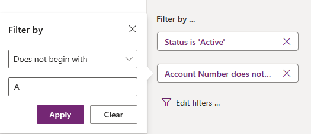
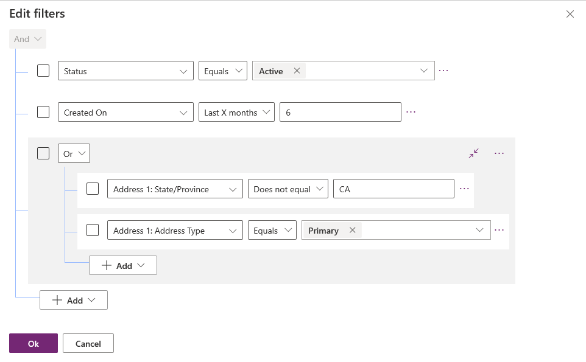
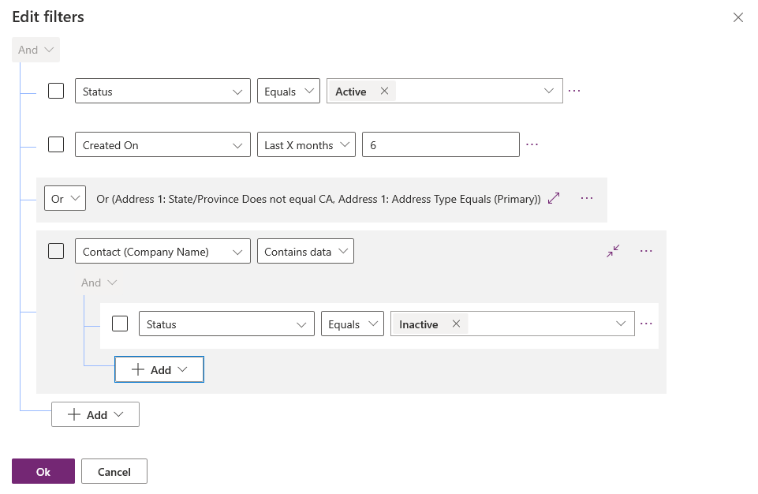

# Edit filter criteria for a table view

[!INCLUDE [cc-data-platform-banner](../../includes/cc-data-platform-banner.md)]

   

Along with the [columns](../model-driven-apps/model-driven-app-glossary.md#column), displayed in a [view](../model-driven-apps/model-driven-app-glossary.md#view), the filter criteria applied to a view is a critical part of the value provided by the view. It is possible to add or edit **filter criteria** and change the **sort order** for the columns included in a view. If a sort order is not set for a view, by default the view is sorted by the **primary column** in the view in ascending order (A to Z).

## Editing the filter criteria of a view

1.  Sign in to [Power Apps](https://make.powerapps.com/?utm_source=padocs&utm_medium=linkinadoc&utm_campaign=referralsfromdoc).  

2.  Expand **Data**, select **Tables**, select the table required, and then select the **Views** tab.

> [!note]
> Many customisations to a table take place within [solutions](../model-driven-apps/model-driven-app-glossary.md#solution).  To update a table within a solution first navigate to your **solution**, then select the **table** followed by the **views** tab.

3.  Select a column, and from the column menu, select **Filter by**.

    > [!div class="mx-imgBorder"] 
    > 

4.  Select the conditional operator.

5.  Type or select the comparison value for the condition.

6.  Select **Apply**.

    The filter expressions for a view are shown in the View properties panel.
    
7.  To edit a filter expression, select the filter select expression from the View properties panel.

8.  To remove a filter expression, select the **X** button.

## Working with the filter expression builder

The expression builder in the view designer can be used to add, edit filters or remove for any columns of the table in the current view or any columns in a related table.

### Edit or remove a filter condition with the expression builder

1. Select a view to open it. The view properties panel lists existing filters.

    > [!div class="mx-imgBorder"] 
    > 

2. On the view properties panel, select a filter condition.

    > [!div class="mx-imgBorder"] 
    > 

3. Select the conditional operator.

4. Type or select the comparison value for the condition.

5. Select **Apply**.

6. To remove a condition, select **Close**. The condition is removed without confirmation.

### Working with multiple filter conditions

1. In the expression builder, select **Add** > **Add row**.

    > [!div class="mx-imgBorder"] 
    > 

2. Select a column for the condition.

3. Select a conditional operator.

4. Select a comparison value.  

    Some filter conditions don't require a comparison value for the condition. For example, the operator **Contains data** doesn't require a comparison value. With other filter conditions, a comparison value must be chosen from an option set. For example, the **Status** column has an option set that contains the values **Active** and **Inactive**.

    > [!div class="mx-imgBorder"] 
    > 

5. Select **OK**.

### Add a group condition to a filter

1. In the expression builder, select **Add** > **Add group**.

2. Select the relational operator **Or** for the group. **And** is the default relational operator.

3. Specify the first clause of the grouped condition. Select the column, conditional operator, and comparison value.

4. Select **Add** > **Add group**

5. Specify the second clause of the grouped condition.

    > [!div class="mx-imgBorder"] 
    > 

    You can select **Collapse** to display the group as a conditional expression.

### Add a related table to a condition

1. In the expression builder, select **Add** > **Add related table**.

2. Select a column from the current table that is related to another table. The table related to the column is shown in parenthesis. You can select columns that have a many-to-one, one-to-many, or many-to-many relationship with the related table.

3. Select a column of the related table for the condition.

4. Select a conditional operator.

5. Select or enter a comparison value.

    > [!div class="mx-imgBorder"] 
    > 

### Group conditions of a filter

1. In the expression builder, select the check box for the conditions where grouping is needed.

2. Select **More commands** (...) for one of the conditions, and then select **Make group**.

3. To ungroup a group, select **More commands** (...) for the group, and then select **Ungroup**

    > [!div class="mx-imgBorder"] 
    > 

## Use solution explorer to edit filter criteria

### Change the filter criteria for a view.

1.  When creating or editing the view in the view designer, in the **Common Tasks** pane, select **Edit Filter Criteria**.  
  
2.  The dialog shows a user interface similar to **Advanced Find**. You can use **AND** and **OR** clauses to specify and group criteria by selecting the filter claus and then selecting **Group AND** or **Group OR**.  

3.  Select **OK** to save and the filter criteria.  
  
For more information about constructing filter clauses, see [Create, edit, or save an Advanced Find search](/dynamics365/customer-engagement/basics/save-advanced-find-search).

## Next steps

[Configure sorting in a view](configure-sorting.md)

[Table views overview](create-edit-views.md)

[Creating and editing table views using the app designer](create-edit-views-app-designer.md)

[!INCLUDE[footer-include](../../includes/footer-banner.md)]