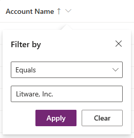

# Edit filter criteria and change sort order in model-driven app views

[!INCLUDE [cc-data-platform-banner](../../includes/cc-data-platform-banner.md)]

   

Along with the columns displayed in a view, the filter criteria applied to a view is a critical part of the value provided by the view. You can add or edit filter criteria and change the sort order for the columns that you include in a view. If a sort order is not set for a view, by default the view is sorted by the primary column in the view in ascending order (A to Z).

## Change the sort order of a view

1.  Sign in to [Power Apps](https://make.powerapps.com/?utm_source=padocs&utm_medium=linkinadoc&utm_campaign=referralsfromdoc).  

2.  Expand **Dataverse**, select **Tables**, select the table you want, and then select the **Views** tab.

3.  Select a view to open it in the view designer.

    > [!div class="mx-imgBorder"] 
    > 

4.  Select a column name in the column head, and from the column menu, select **Sort A to Z** or **Sort Z to A**. The sort order is indicated in the column head with an up arrow or a down arrow.

You can also change the sort order by using the view properties panel. 

1.  If a sort order has not been set for the view, select **Sort by**, and then select the primary sort by column.

2.  If you want to sort the view by additional columns, select **Then sort by** and then select a additional sort by column for the view.

    You may want to sort by more than one column when you have data that you want to group by the same value in one column, and then sort another column within that group of equal values.

3.  To remove a sort expression, select **Remove sort expression** (the **X** button).

## Add or edit filter

1.  Select a column, and from the column menu, select **Filter by**.

    > [!div class="mx-imgBorder"] 
    > 

2.  Select the conditional operator that you want to use.

3.  Type or select the comparison value for the condition.

4.  Select **Apply**.

    The filter expressions for a view are shown in the View properties panel.
    
5.  To edit a filter expression, select the filter select expression from the View properties panel.

6.  To remove a filter expression, select the **X** button. 

You can also use the expression builder in the view designer to add or edit filters for any columns of the table in the current view or any columns in a related table. More information: [Create or edit filters in model-driven app views](create-edit-view-filters.md)

## Use solution explorer to edit filter criteria and change sort order

Change the sort order for a view.

1.  Open [solution explorer](advanced-navigation.md#solution-explorer), expand **Tables**, select the table you want, select **Views**, and then open the view you want.

2.  In the view designer, select **Configure Sorting**.  

    > [!div class="mx-imgBorder"] 
    > 
  
3.  In the **Configure Sort Order** dialog box, in the **Sort By** list, select the column you want to sort, then select **Ascending Order** or **Descending Order**.  
  
4.  Select **OK** to save the sort order.  

Change the filter criteria for a view.

1.  When you create or edit the view in the view designer, in the **Common Tasks** pane, select **Edit Filter Criteria**.  
  
2.  The dialog shows a user interface similar to **Advanced Find**. You can use **AND** and **OR** clauses to specify and group criteria by selecting the filter claus and then selecting **Group AND** or **Group OR**.  

3.  Select **OK** to save and the filter criteria.  
  
For more information about constructing filter clauses, see [Create, edit, or save an Advanced Find search](/dynamics365/customer-engagement/basics/save-advanced-find-search).   
 
## Next steps
[Understand views](create-edit-views.md)

[!INCLUDE[footer-include](../../includes/footer-banner.md)]