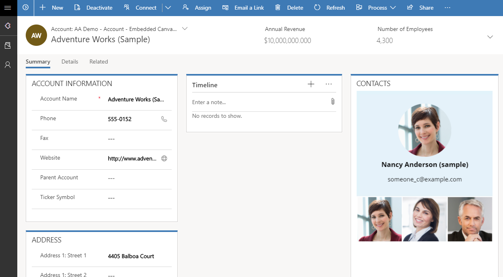

# Embed a canvas app on a model-driven form

## What are canvas apps?
Canvas apps enable makers to easily design and create custom layouts using the low-code, WYSIWYG canvas app designer. Canvas apps also enable makers to connect and display data from over 400 data sources.

## How embedding canvas apps can help us build better solutions
With embedded canvas apps, makers can bring the power of canvas apps to their model-driven forms. Using embedded canvas apps, it is possible to create rich visual areas on a form and display data from a variety of sources right next to data from the Microsoft Dataverse.

   > [!div class="mx-imgBorder"] 
   > 

Canvas apps are embedded in model-driven forms in the same way other custom controls are added. An embedded canvas app includes rich data integration capabilities that bring in contextual data from the host model-driven form to the embedded canvas app.

## Embedding using the modern designer (preview)

The **modern designer** permits apps built over Dataverse to be embedded into a model-driven app natively.  

Modern apps introduce the concept of [pages](model-driven-app-glossary.md#page) which can either be canvas apps or model-driven apps.
 [Learn more about building modern apps](app-designer-overview.md)

## Embedding using the classic designer (current)
We can add canvas apps from our environments into our model-driven apps that can either be contextually aware, or simply render the app within the model-driven experience.  [Learn how to add an embedded canvas app on a model-driven form - classic designer](embedded-canvas-app-add-classic-designer.md).

## Sharing canvas apps

After an embedded canvas app has been added to your model-driven form, learn how to share the embedded canvas app with other users. More information: [Learn how to share an embedded canvas app](share-embedded-canvas-app.md).

For guidelines on working with embedded canvas apps as well as helpful tips to troubleshoot any issues, please refer to: [Guidelines on working with embedded canvas apps](embedded-canvas-app-guidelines.md).

## See also
[What are canvas apps in Power Apps?](../canvas-apps/getting-started.md)  
[Add and configure a canvas-app control in Power Apps](../canvas-apps/add-configure-controls.md)  
[Overview of canvas-app connectors for Power Apps](../canvas-apps/connections-list.md)  
[Add an embedded canvas app on a model-driven form](embedded-canvas-app-add-classic-designer.md)  
[Edit a canvas app embedded on a model-driven form](embedded-canvas-app-edit-classic-designer.md)  
[Customize the screen size and orientation of a canvas app embedded on a model-driven form](embedded-canvas-app-customize-screen.md)  
[Perform predefined actions on the host form from within an embedded canvas app](embedded-canvas-app-actions.md)  
[ModelDrivenFormIntegration control's properties and actions](embedded-canvas-app-properties-actions.md)  
[Share an embedded canvas app](share-embedded-canvas-app.md)  
[Guidelines on working with embedded canvas apps](embedded-canvas-app-guidelines.md)  
[Migrating embedded canvas apps on model-driven forms created using the public preview release to latest](embedded-canvas-app-migrate-from-preview.md)  

[!INCLUDE[footer-include](../../includes/footer-banner.md)]