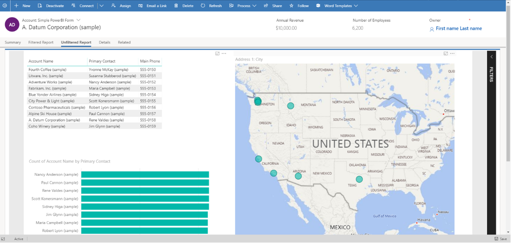
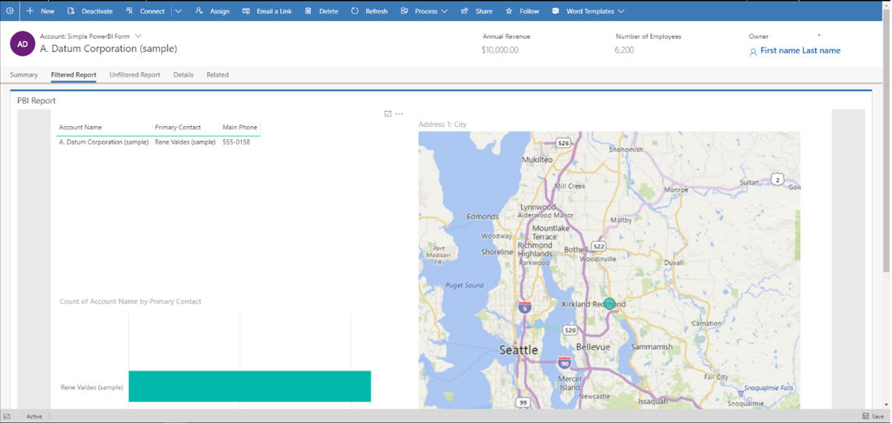
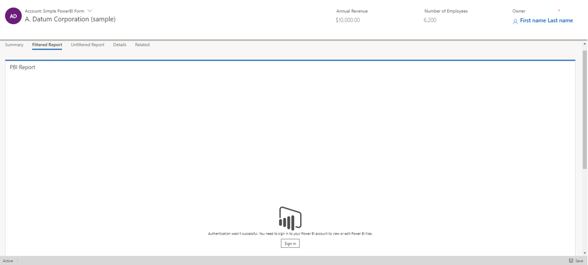
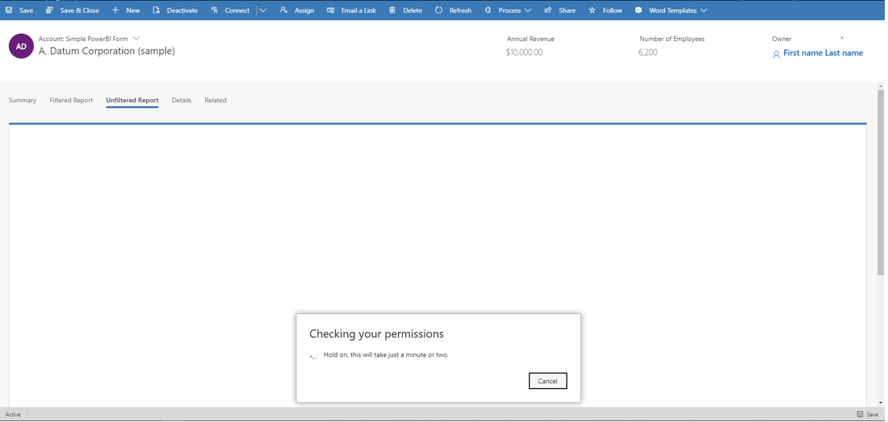
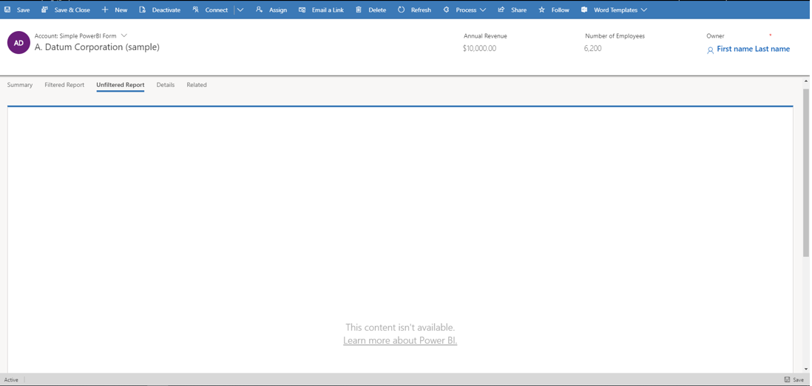

# Embed a Power BI report in a model-driven system form

[!INCLUDE [cc-data-platform-banner](../../includes/cc-data-platform-banner.md)]

You can use Power BI reports in Power Apps model-driven apps to bring rich reporting and analytics to your system forms and empower your users to accomplish more. This unlocks the power to aggregate data across systems, and tailor it down to the context of a single row.
 
## Prerequisites
Embedding Power BI content is an optional feature and is disabled on all environments by default. You must enable it before you can embed Power BI content. More information: [Enable Power BI visualizations in the organization](/power-platform/admin/use-power-bi#embed--visualizations-on-personal-dashboards).

This feature requires exporting a solution, modifying it to add the xml snippet, and then importing back into the environment. Be sure to import the changes on your target environment via a managed solution only. See [Import, update, and export solutions](../data-platform/import-update-export-solutions.md) for guidance on installing an update to an existing managed solution.

## Embed without contextual filtering
You can use your Power BI reports and tiles by simply embedding them, and get the exact same report. This does not involve contextualizing them to the current model-driven form, and hence you get the same report or tile on all rows of the table. For example, the following report shows the geographic location of all accounts at once, and is useful to show summary information.

> [!div class="mx-imgBorder"] 
> 

You can embed a section that hosts Power BI reports and tiles in your system forms by adding the following code snippet inside the `<sections>` block of the form XML. Make the changes to the form XML for your Power BI report. Then, import the solution in the target environment. 

```xml
<section id="{d411658c-7450-e1e3-bc80-07021a04bcc2}" locklevel="0" showlabel="true" IsUserDefined="0" name="tab_4_section_1" labelwidth="115" columns="1" layout="varwidth" showbar="false">
	<labels>
		<label languagecode="1033" description="Unfiltered Power BI embedding demo"/>
	</labels>
	<rows>
		<row>
			<cell id="{7d18b61c-c588-136c-aee7-03e5e74a09a1}" showlabel="true" rowspan="20" colspan="1" auto="false">
				<labels>
					<label languagecode="1033" description="Accounts (Parent Account)"/>
				</labels>
				<control id="unfilteredreport" classid="{8C54228C-1B25-4909-A12A-F2B968BB0D62}">
					<parameters>
						<PowerBIGroupId>00000000-0000-0000-0000-000000000000</PowerBIGroupId>
						<PowerBIReportId>544c4162-6773-4944-900c-abfd075f6081</PowerBIReportId>
						<TileUrl>https://xyz.powerbi.com/reportEmbed?reportId=544c4162-6773-4944-900c-abfd075f6081</TileUrl>
					</parameters>
				</control>
			</cell>
		</row>
		<row/>
	</rows>
</section>
```
> [!IMPORTANT]
> Be sure to use the control `classid="{8C54228C-1B25-4909-A12A-F2B968BB0D62}"` as indicated in the XML sample.

 This table describes the properties in the previous example.

|                                                 Property                                                  |                                                                                                                                                                                                                                                                                                                                                                                                                                                                                                                                                                                                                                                                                                                                      Description                                                                                                                                                                                                                                                                                                                                                                                                                                                                                                                                                                                                                                                                                                                                       |
|-----------------------------------------------------------------------------------------------------------|----------------------------------------------------------------------------------------------------------------------------------------------------------------------------------------------------------------------------------------------------------------------------------------------------------------------------------------------------------------------------------------------------------------------------------------------------------------------------------------------------------------------------------------------------------------------------------------------------------------------------------------------------------------------------------------------------------------------------------------------------------------------------------------------------------------------------------------------------------------------------------------------------------------------------------------------------------------------------------------------------------------------------------------------------------------------------------------------------------------------------------------------------------------------------------------------------------------------------------------------------------------------------------------------------------------------------------------------------------------------------------------------------------------------------------------------------------------------------------------|
|                         **PowerBIGroupId**                          |                                                                                                                                                                                                                                                                                                                                                                                                                                                                                                                                                                                                                                                                                                                 The Power BI workspace Id. If your report is in **My workspace** then a workspace Id isn't required. Otherwise, add the workspace Id. You can find the Id of the workspace in the Power BI service URL. For example, https://app.powerbi.com/groups/0ddbe381-256d-44bc-93de-34e47f3d9ab4/ More information: [Find the Power BI workspace and report Ids](#find-the-power-bi-workspace-and-report-ids).                                                                                                                                                                                                                                                                                                                                                                                                                                                                                                                                                                                                                                                                                                                  |
|                               **PowerBIReportId**                                |                             The Power BI report Id. Replace this with the report that you want to embed. You can find the Id of your report in the Power BI service URL. For example, https://app.powerbi.com/groups/me/reports/544c4162-6773-4944-900c-abfd075f6081. More information: [Find the Power BI workspace and report Ids](#find-the-power-bi-workspace-and-report-ids)                                                                                                                                                                                                                                                                                                                                                                                                                                                                                                                                                                                                                                                                                                                                                                                                                                                                                                                                                                                                                                                                                                                                                                                                                                                                                                                                                                                                                                                          |
|                                       **TileUrl**                                       |                                                                                                                                                                                                                                                                                                                                                                                                                                                                                                                        The Power BI report or tile URL that you want to embed. Be sure to use the correct Power BI subdomain name (you might need to replace app.powerbi.com with your own) and report Id (replace reportId=544c4162-6773-4944-900c-abfd075f6081 with your own). For example, https://app.powerbi.com/reportEmbed?reportId=544c4162-6773-4944-900c-abfd075f6081.                                                                                                                                                                                                                                                              

## Embed with contextual filtering

You can make the Power BI reports and tiles more meaningful by applying contextual filters to the current model-driven form, so that the report or tile is filtered based on attributes of the current row. For example, the following report shows the geographic location of an account, by filtering the Power BI report using the account name. This allows a single report to show contextualized information for all rows of the table.

> [!div class="mx-imgBorder"] 
> 

The filtering is done by adding a `<PowerBIFilter>` element in the `<parameter>` block as shown here. You can use any attribute of the form's table to construct the filter expression. More information: [Constructing Filters](https://github.com/Microsoft/PowerBI-JavaScript/wiki/Filters#contructingfilters) to understand how to create your own filters.
	
```xml
<control id="filteredreport" classid="{8C54228C-1B25-4909-A12A-F2B968BB0D62}">
	<parameters>
		<PowerBIGroupId>00000000-0000-0000-0000-000000000000</PowerBIGroupId>
		<PowerBIReportId>544c4162-6773-4944-900c-abfd075f6081</PowerBIReportId>
		<TileUrl>https://xyz.powerbi.com/reportEmbed?reportId=544c4162-6773-4944-900c-abfd075f6081</TileUrl>
		<PowerBIFilter>{"Filter": "[{\"$schema\":\"basic\",\"target\":{\"table\":\"My Active Accounts\",\"column\":\"Account Name\"},\"operator\":\"In\",\"values\":[$a],\"filterType\":1}]", "Alias": {"$a": "name"}}</PowerBIFilter>
	</parameters>
</control>
```

Note that this uses the same control as the unfiltered report embedding, and hence the control class id remains unchanged. 

This table describes any additional properties used in the previous example.

|                                                 Property                                                  |                                                                                                                                                                                                                                                                                                                                                                                                                                                                                                                                                                                                                                                                                                                                      Description                                                                                                                                                                                                                                                                                                                                                                                                                                                                                                                                                                                                                                                                                                                                       |
|-----------------------------------------------------------------------------------------------------------|----------------------------------------------------------------------------------------------------------------------------------------------------------------------------------------------------------------------------------------------------------------------------------------------------------------------------------------------------------------------------------------------------------------------------------------------------------------------------------------------------------------------------------------------------------------------------------------------------------------------------------------------------------------------------------------------------------------------------------------------------------------------------------------------------------------------------------------------------------------------------------------------------------------------------------------------------------------------------------------------------------------------------------------------------------------------------------------------------------------------------------------------------------------------------------------------------------------------------------------------------------------------------------------------------------------------------------------------------------------------------------------------------------------------------------------------------------------------------------------|
|                         **PowerBIFilter**                          |        The filter expression that contextualizes the Power BI report by passing the form attributes as parameters. To make it more readable, the filter is constructed as shown here. 	|

```json
	{
	        "Filter": "[{
	                \"$schema\":\"basic\",
	                \"target\":{
	                        \"table\":\"My Active Accounts\",
	                        \"column\":\"Account Name\"
	                },
	                \"operator\":\"In\",
	                \"values\":[$a, $b],
	                \"filterType\":1
	        }]",
	        "Alias": {
	                "$a": "firstname",
	                "$b":"lastname"
	        }
	}
```

The target part of the previous expression identifies the table and the column to apply the filters on. The operator identifies the logic and values identify the data passed from the Power Apps model-driven app. To parameterize in a generic way, the values are constructed by aliasing. In the previous expression, the value of an account's **firstname** and **lastname** are passed, and either of them is searched in the **Account Name** column in the Power BI report. Note that **firstname** and **lastname** are the unique names of attributes of the account table, whose value will be passed here. 

You can create more complex filter expressions by looking at examples from [Constructing Filters](https://github.com/Microsoft/PowerBI-JavaScript/wiki/Filters#contructingfilters) and providing the appropriate values for $schema and filterType. Be sure to escape every literal in the filter part using *\"*, so that the JSON is generated correctly.

## Remove unmodified attribute before import

Before you import the solution into the target environment, make sure the unmodified attribute isn’t included in formXml section of the customizations.xml file. If the unmodified attribute is present in the XML that includes the Power BI control XML, remove the attribute before you import the solution into the target environment. For example, replace `<systemform unmodified="1">` with `<systemform>`.

Additionally, when you export the solution as managed, add the **solutionaction="Added"** attribute to the formXml as indicated in the **cell** element below: 

```xml
<cell id="{7d18b61c-c588-136c-aee7-03e5e74a09a1}" showlabel="true" rowspan="20" colspan="1" auto="false" solutionaction="Added">
  <labels>
    <label languagecode="1033" description="Accounts (Parent Account)"/> 
  </labels> 
  <control id="unfilteredreport" classid="{8C54228C-1B25-4909-A12A-F2B968BB0D62}">
    <parameters>
      <PowerBIGroupId>00000000-0000-0000-0000-000000000000</PowerBIGroupId>
      <PowerBIReportId>544c4162-6773-4944-900c-abfd075f6081</PowerBIReportId>      
      <TileUrl>https://xyz.powerbi.com/reportEmbed?reportId=544c4162-6773-4944-900c-abfd075f6081</TileUrl>        
     </parameters> 
  </control> 
</cell>
```

## Find the Power BI workspace and report Ids
1. The workspace Id for this example is efc85277-2bdb-47bc-9762-363f64335108.
1. The report Id for this example is 643ab643-7126-4a57-bd82-ca8f1fb676fc.
:::image type="content" source="media/embed-powerbi/power-bi-service-url.png" alt-text="Power BI workspace Id and report Id example":::

## Known issues and limitations

- This integration is available only in the Unified Interface client, on supported web browsers and mobile devices.
- Opening this form in the Power Apps form designer will not show the control in a meaningful way. This is because the control is customized outside of the form designer.
- Users will be authenticated into Power BI automatically with their Power Apps username and password. If a Power BI account with matching credentials doesn’t exist, a sign in prompt is displayed as illustrated here. 

   > [!div class="mx-imgBorder"] 
   > 

    No data will display if an incorrect account is used to log into Power BI. To sign in with the correct credentials, sign out, and then sign in again.

   > [!div class="mx-imgBorder"] 
   > 

   > [!div class="mx-imgBorder"] 
   > 

- The view of the report data shown inside Power Apps is the same as that in Power BI, and Power Apps security roles and privileges don't affect the data that is displayed. Hence, the data is essentially the same as what the creator of the Power BI dataset would see. To apply data access restrictions similar to Power Apps security roles and teams, use [Row-level security (RLS) with Power BI](/power-bi/service-admin-rls).
- If the form doesn’t show the Power BI report after importing the solution and publishing customizations, open it in the model-driven form editor and save it, so that the form JSON is regenerated.

### Common issues

- The group ID is not specified in the `TileUrl` node of the control parameters when it may need to be. This example includes a group ID.
```xml
<parameters>
	<PowerBIGroupId>fd266a4c-9a02-4553-9310-80e05ee844f3</PowerBIGroupId>
	<PowerBIReportId>544c4162-6773-4944-900c-abfd075f6081</PowerBIReportId>
	<TileUrl>https://xyz.powerbi.com/reportEmbed?reportId=544c4162-6773-4944-900c-abfd075f6081&amp;groupId=fd266a4c-9a02-4553-9310-80e05ee844f3</TileUrl>
</parameters>
```
- Fields have different data types in PowerBI and Dataverse. They need to be the same type, such as string in Power BI and string in Dataverse.
- String fields don't have escaped quotes in the Power BI filter. Below, notice ```values``` has ```[\"$a\"]``` rather than ```[$a]```.
```json
	{
	        "Filter": "[{
	                \"$schema\":\"basic\",
	                \"target\":{
	                        \"table\":\"My Active Accounts\",
	                        \"column\":\"Account Name\"
	                },
	                \"operator\":\"In\",
	                \"values\":[\"$a\"],
	                \"filterType\":1
	        }]",
	        "Alias": {
	                "$a": "name",
	        }
	}
```

### See also

[Embed a Power BI dashboard in a Power Apps model-driven personal dashboard](../../user/add-powerbi-dashboards.md)

[Use Power BI with Dynamics 365 apps](/power-platform/admin/use-power-bi)

[Import, update, and export solutions](../data-platform/import-update-export-solutions.md)


[!INCLUDE[footer-include](../../includes/footer-banner.md)]
