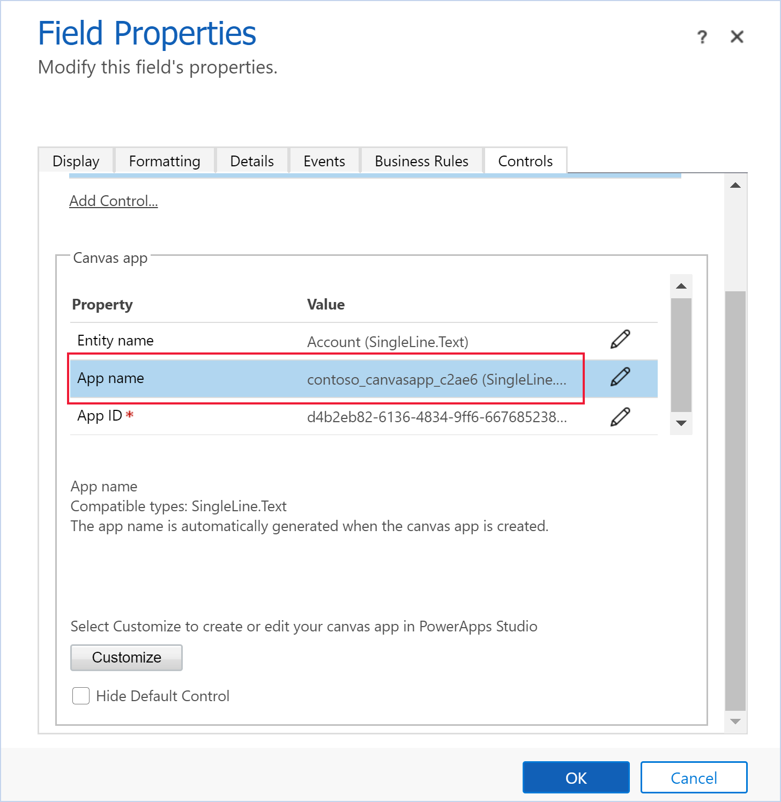

# Add an embedded canvas app on a model-driven form
Display data from a variety of sources right next to data from Microsoft Dataverse. This article explains how to embed a canvas app on a model-driven form.

:::image type="content" source="media/embedded-canvas-app.png" alt-text="Example of an embedded canvas app on a model-driven app main form":::

Imagine that you want to embed a canvas app on a model-driven app main form, such as the main form for the Accounts table. To do this, follow these steps:

1. Sign in to [Power Apps](https://make.powerapps.com/?utm_source=padocs&utm_medium=linkinadoc&utm_campaign=referralsfromdoc).
1. [Create or edit the main form](create-and-edit-forms.md) of a table. 
1. In the form designer, select the section on the form where you want the embedded canvas app to appear.
1. Add a required form field to the section, such as Account Name.

   > [!TIP]
   > You may want to change the table column name that you add to something more meaningful, such as the name or a short description of the canvas app that you’re embedding onto the form.

1. On the table column properties pane, expand **Components**, select **+ Component**, and then select **Canvas app**. 

    :::image type="content" source="media/add-canvas-app-control.png" alt-text="Add the canvas app control to a table column":::
1. On the **Add canvas app** pane, enter the following properties, and then select **Done**: 
   - The **Entity name** area specifies the table that will provide the data to your embedded canvas app.

       - **Bind to table column**: When you select **Bind to table column**, the list changes to allow you to select what table column to bind to. When you choose to bind to a table column, the column will be defined by the table column value. For example, when you select **Bind to table column** for the **App Name**, at app runtime the value of the app name takes the value of the column, such as the value from a custom text column.
           > [!IMPORTANT]
           > For most situations, we don’t recommend using the **Bind to table column** option with the canvas app control.

       - **Static value**: Use this to add a name for you to refer to the canvas app. Notice that this value has no effect on the embedded canvas app. It is meant only to serve as a reference for you.

   - The **App Name** area specifies the name of the canvas app.
       - **Bind to table column**: When you select **Bind to table column**, the list changes to allow you to select what table column to bind to. When you choose to bind to a table column, the column will be defined by the table column value. For example, when you select **Bind to table column** for the **App Name**, at app runtime the value of the app name takes the value of the column, such as the value from a custom text column.
           > [!IMPORTANT]
           > For most situations, we don’t recommend using the **Bind to table column** option with the canvas app control. 

       - **Static value**: Specifies the name of the canvas app to embed. The model-driven form looks for the canvas app with the specified name in the current environment. If a canvas app with that name can't be found in the environment, the canvas app control will use the App ID to load the canvas app. Enter the App Name for an existing canvas app.

   - The App ID area specifies the app ID for the canvas app. 
       - **Bind to table column**: When you select **Bind to table column**, the list changes to allow you to select what table column to bind to. When you choose to bind to a table column, the column will be defined by the table column value. For example, when you select **Bind to table column** for the **App Name**, at app runtime the value of the app name takes the value of the column, such as the value from a custom text column.
           > [!IMPORTANT]
           > For most situations, we don’t recommend using the **Bind to table column** option with the canvas app control. 

       - **Static value**: Enter the app ID for an existing canvas app. The canvas App ID can be found on Power Apps, go to **Apps**, select the canvas app, and then select **Details** on the command bar.
    - **Show components area**. Specifies the client type to display the embedded canvas app. Choose from **Web**, **Mobile**, and **Tablet**.
1. Select **Save**. Then, to publish your app to make it available to users select **Publish**.

After you have published an embedded canvas app to your model-driven form, share your embedded canvas app with other users. More information: [Share an embedded canvas app](share-embedded-canvas-app.md).

When users open a model-driven app that includes the form you have modified, they see the embedded canvas app on the form. Changing the record displayed on the main form changes the data context that is passed to the form, and the embedded app refreshes to show the relevant data.

This article showed you how to get started with embedding a canvas app in a model-driven form. You can further customize the embedded canvas app to connect and bring in data from various data sources. Use the Filter, Search, and LookUp functions and the context passed in from the host model-driven form to filter or find specific records in those data sources. Use the WYSIWYG canvas app editor to easily design the interface to match your requirements.

## Add an embedded canvas app on a model-driven form using the classic experience

1.	Sign in to [Power Apps](https://make.powerapps.com/?utm_source=padocs&utm_medium=linkinadoc&utm_campaign=referralsfromdoc).
2.  [Create or edit the main form](create-and-edit-forms.md) of a table, Accounts table in our example. 
3.  In the command bar, select **Switch to classic** to open the form in the classic form designer.
4.	In the classic form designer, select the section on the form where you want the embedded canvas app to appear.
5.	Using the column pane, add a required column, such as **Account Name**.
      > [!IMPORTANT]
      > Always use a required column that is guaranteed to have a value. If your column does not have a value, your embedded canvas app will not refresh in response to any change in data on the host model-driven form.
6.	With the column selected, on the **Home** tab in the **Edit** group, select **Change Properties**.
7.	On the **Column Properties** dialog box, select the **Controls** tab.
8.	On the **Controls** tab, select **Add Control**.
9.	On the **Add Control** dialog box, in the list of available controls, select **Canvas app** and then select **Add**.
10.	On the **Column Properties** dialog box, in the list of controls select **Canvas app**, and then select the **Web** option.
11.	In the section below the controls list, the lists of properties available to the canvas app control are displayed.
     - The **Table name** property specifies the table that will provide the data to your embedded canvas app. It will be set to the table that contains the column you added in an earlier step.
         - Notice that, even though this property appears changeable, changing it has no effect on the embedded canvas app. It is meant only to serve as a reference for you.
     - The **App Name** property specifies the name of the canvas app to embed. The model-driven form looks for the canvas app with the specified name in the current environment. If a canvas app with that name can't be found in the environment, the canvas app control will use the App ID to load the canvas app. Enter the App Name for an existing canvas app.
     - The **App ID** property specifies the ID of the embedded canvas app. You can enter an App ID for an existing canvas app or an App ID will be automatically generated and filled-in for you when you create or edit a canvas app by selecting **Customize**. The canvas App ID can be found on Power Apps, go to **Apps**, select the canvas app, and then select **Details** on the command bar.
         
      > [!NOTE]
      > Notice that any change to the **App ID** value breaks the link from the model-driven form to the embedded canvas app.
      >
      > If neither the App Name or App ID match an existing canvas app, the form displays the message "Sorry, we didn't find that app."

12.	Go to step 20 if you're adding a completed canvas app. If you are creating a new or editing an existing canvas app, continue to follow these steps. Select **Customize** to create or edit a canvas app. This opens Power Apps Studio in a new tab.
	   > [!NOTE]
       > If opening Power Apps Studio is blocked due to a web browser pop-up blocker you must enable the make.powerapps.com site or temporarily disable the pop-up blocker and then select **Customize** again.
13.	Observe the following: 
    - In Power Apps Studio notice that there is a special **ModelDrivenFormIntegration** control in the left pane. This control is responsible for bringing contextual data from the host model-driven form to the embedded canvas app.
    - Observe that a [canvas app form control](../canvas-apps/controls/control-form-detail.md) was automatically added to your embedded canvas app and displays the data being passed to it from the host model-driven form via the ModelDrivenFormIntegration control. 
    - Select the **View** tab, and then select **Data sources**. Notice that a data source for the parent table of your host model-driven form, Accounts in this case, was automatically added to your embedded canvas app. - Select the **Form1** control and observe that the **DataSource** property is set to **Accounts**.
    - With the **Form1** control still selected, observe that the **Item** property is set to **ModelDrivenFormIntegration.Item**.
  	> [!NOTE]
  	> The embedded canvas app has full access to read from the host model-driven form via ModelDrivenFormIntegration.Item. 
  	> As an example, to get the value of a column with the name **accountnumber** and display name **Account Number**, you can use **ModelDrivenFormIntegration.Item.accountnumber** or **ModelDrivenFormIntegration.Item.'Account Number'**.
18.	In the property pane on the right, next to **Columns**, select **Edit columns**.
19.	Select **+ Add column** to add another column to the canvas app form or reorder existing columns using drag and drop. Close the data pane when you are done adding and reordering columns.
20.	Select the **File** tab, and then select **Save**.
21.	Select the **The cloud** tab. Provide a unique name for the app and then select **Save** located on the lower right. Note the following behavior: 
    -  Saving an app for the first time automatically publishes the app.
	  -  On subsequent saves, select **Publish** and then select **Publish this version** to make your changes available.
22. On the menu, select **Back**.
23. Select the browser tab that has the classic form designer open. Observe that the **App ID** and **App Name** properties of the canvas app control now have a value automatically filled in.
	> [!IMPORTANT]
	> - The form designer has a direct link with Power Apps Studio that was opened in another browser tab in an earlier step.
	> - Make sure the App name has a value similar to the screenshot below. The App name property specifies the unique name that will be used to reference the canvas app at runtime. If this name isn’t set, the App ID property will be used to reference the canvas app, which may cause issues when you import the canvas app as part of a solution. We recommend that you set this name to ensure proper canvas app referencing between environments. To set it, go back to step 12 and follow the steps to create the canvas app to embed.

     
24.	On the **Column Properties** dialog box, select the **Display** tab.
25.	Clear **Display label** on the form and then select **OK**.
    - 	If you already have a canvas app embedded on this form, a message is displayed that “Only one canvas app can be enabled on a form.” To add the new canvas app, you must first [disable the current embedded canvas app](embedded-canvas-app-guidelines.md#disable-an-embedded-canvas-app). Then, [enable the new embedded canvas app](embedded-canvas-app-guidelines.md#enable-an-embedded-canvas-app).
26.	On the **Home** tab, select **Save**, and then select **Publish**.

### See also
[Edit a canvas app embedded on a model-driven form](embedded-canvas-app-edit-classic-designer.md)  
[Perform predefined actions on the host form from within an embedded canvas app](embedded-canvas-app-actions.md)  
[ModelDrivenFormIntegration control's properties and actions](embedded-canvas-app-properties-actions.md)  
[Guidelines on working with embedded canvas apps](embedded-canvas-app-guidelines.md)  
