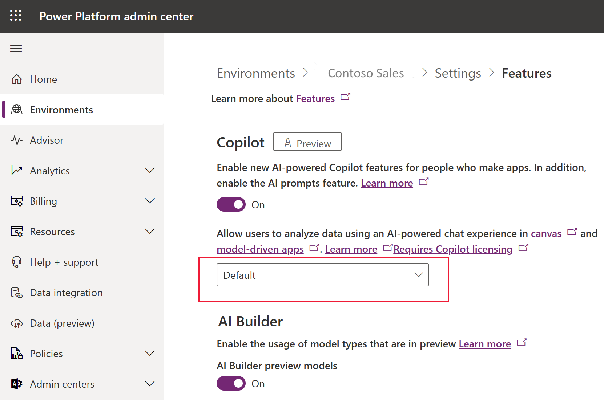
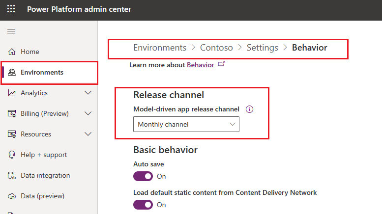
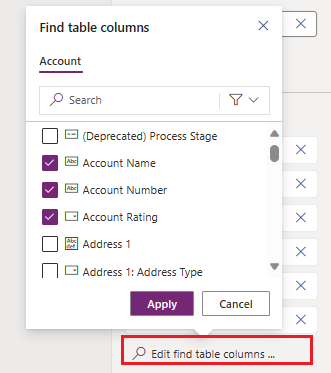

[This topic is pre-release documentation and is subject to change.]

> [!IMPORTANT]
>
> - This is a preview feature.
> - To use this capability your environment must be in the US region.
> - Preview features aren’t meant for production use and may have restricted functionality. These features are available before an official release so that customers can get early access and provide feedback.
> - For more information, go to our [preview terms](https://go.microsoft.com/fwlink/?linkid=2189520).
> - This capability is powered by [Azure OpenAI Service](/azure/cognitive-services/openai/overview).
> - This capability  may be subject to usage limits or capacity throttling.

# Enable Copilot for end users in model driven apps

Copilot for app users in model-driven apps is a next-generation AI assistant that provides data insights on Dataverse tables through natural language conversation. Copilot helps app users boost productivity through AI-powered insights and intuitive app navigation. More information: [Copilot for app users in model-driven apps](https://learn.microsoft.com/en-us/power-apps/maker/model-driven-apps/add-ai-copilot).

## Turn on Copilot feature for your environment
Environment administrators can enable Copilot feature in model-driven apps for all the users in their environments in [Power Platform admin center](https://admin.powerplatform.microsoft.com).

1. Sign in to the Power Platform admin center at https://admin.powerplatform.microsoft.com.

2. In the navigation pane, go to **Environments** and select the enviornment where you want to enable Copilot for app users in model-driven apps in. Click on **Settings** for this environment in the top menu.

  > [!div class="mx-imgBorder"]
  > 
 
3. In **Settings** for the seleceted environment, navigate to **Product** section and select **Features** option.

  > [!div class="mx-imgBorder"]
  > 

4. In **Features** section, set the value for **Allow users to analyze data using an AI-powered chat experience in canvas and model-driven apps** to **On** in the dropdown control.
   
  > [!div class="mx-imgBorder"]
  > 

 
## Enable your environment to receive monthly updates for model-driven apps
Makers must set their environment to receive monthly model-driven apps updates as a prerequisite for having Copilot for end users in model-driven apps.
1. Sign in to the Power Platform admin center at https://admin.powerplatform.microsoft.com.
2. In the navigation pane, go to **Environments** and select the enviornment where you want to enable Copilot for app users in model-driven apps in. Click on **Settings** for this environment in the top menu.
3.  Go to **Product** section and select **Behavior** option.  Set **Release channel** for model-driven apps to **Monthly channel** in the dropdown control.
   
  > [!div class="mx-imgBorder"]
  > 

 More information: [Behavior settings](/power-platform/admin/settings-behavior#settings) and [Changing release channels for model-driven apps](channel-change.md).
 
## Configure Dataverse tables and columns for better Copilot insights
   
Environment administators must configure which Dataverse tables Copilot is to use for the responses. You must choose both the tables and the columns of importance for Copilot to search accross to produce relevant, high quality data inisghts.

More information: [Configure tables to use Copilot](https://learn.microsoft.com/en-us/power-apps/maker/data-platform/table-settings-for-copilot).

For every Dataverse table to be used by Copilot, do these 2 Steps in **Tables** pane at [Power Apps](https://make.powerapps.com/) to index your tables and columns for Copilot use:

* Select a Dataverse table and go to its **Properties > Advanced options** option in the top menu. Enable **Track Changes** and **Appear in search results** settings for the table and **Save**. More information: [Enable table indexing](https://learn.microsoft.com/en-us/power-apps/maker/data-platform/table-settings-for-copilot#enable-indexing).
 

* Open this table and select **Views** option from **Data experiences** section and open **Quick Find [table name]** view. Then select **Edit find table columns** option at the bottom of the right hand pane. Select the columns of importance and click **Apply** to add them to the list. Next, **Save and publish** your changes. 

  > [!div class="mx-imgBorder"]
  > 

More information: [Enable column indexing](https://learn.microsoft.com/en-us/power-apps/maker/data-platform/table-settings-for-copilot#configure-columns).

## See also
[Copilot for app users in model-driven apps](https://learn.microsoft.com/en-us/power-apps/maker/model-driven-apps/add-ai-copilot)  
[FAQ for Copilot in model-driven apps](../common/faqs-copilot-model-driven-app.md)  
[Responsible AI FAQs for Power Apps](../common/responsible-ai-overview.md)  
[Add Copilot control to a canvas app (preview)](../canvas-apps/add-ai-copilot.md)
