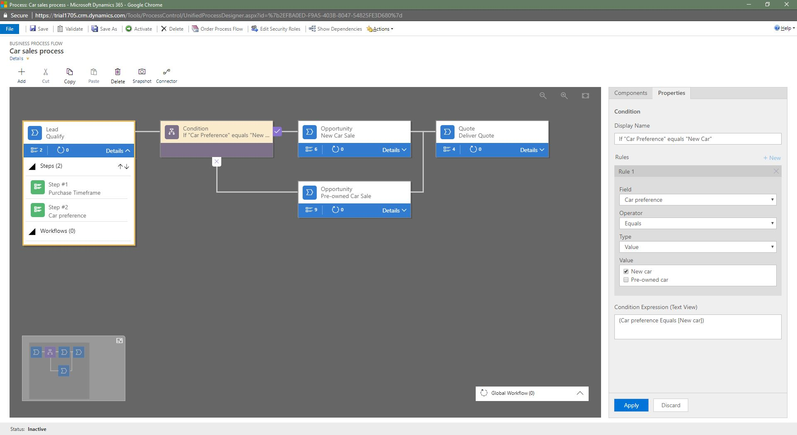
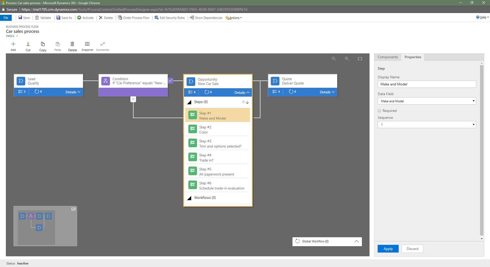
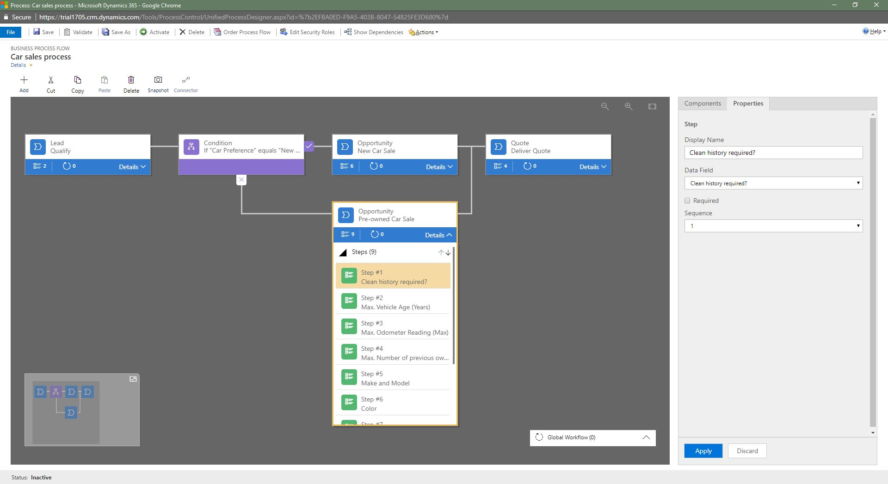
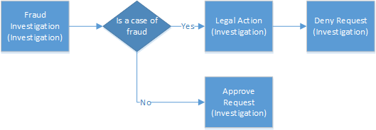

# Tutorial: Enhance business process flows with branching

Business process flows guide you through various stages of sales, marketing, or service processes toward completion. In simple cases, a linear business process flow is a good option. However, in more complex scenarios, you can enhance a business process flow with branching. If you have the create permissions on business process flows, you’ll be able create business process flow with multiple branches by using the `If-Else` logic. The branching condition can be formed of multiple logical expressions that use a combination of `AND` or `OR` operators. The branch selection is done automatically, in real time, based on rules defined during the process definition. For example, in selling cars, you can configure a single business process flow, which after a common qualification stage splits into two separate branches on the basis of a rule (Does the customer prefer a new car or pre-owned car, is their budget above or below $20,000, and so on. ), one branch, for selling new cars and another branch, for selling pre-owned cars. For more information about Business process flows, see [Business process flows overview](business-process-flows-overview.md).  
  
 The following diagram shows a business process flow with branches.  
  
   
  
   
## What you need to know when designing business process flows with branches  
 Take notice of the following information when you design the business process flow with the branches:  
  
-   A process can span across a maximum of 5 unique entities.  
  
-   You can use a maximum of 30 stages per process and a maximum of 30 steps per stage.  
  
-   Each branch can be no more that 5 levels deep.  
  
-   Branching rule must be based on the steps in the stage that immediately precedes it.  
  
-   You can combine multiple conditions in a rule by using the `AND` operator or the `OR` operator, but not both operators.  
  
-   When you define a process flow, you can optionally select an entity relationship. This relationship must a 1:N (One-to-Many) entity relationship.  
  
-   More than one active process can run concurrently on the same data record.  
  
-   You can rearrange tiles (Stages, Steps, Conditions etc.) on the process flow  using drag and drop.  
  
-   When merging branches, all peer branches must merge to a single stage. The peer branches must all either merge to a single stage, or each peer branch must end the process. A peer branch can’t merge with other branches and at the same time end the process.  
  
> [!NOTE]
> - An entity used in the process can be revisited multiple times (multiple closed entity loops).  
> - A process can go back to the previous stage regardless of an entity type. For example, if the active stage is **Deliver Quote** on a quote record, process users can move the active stage back to the **Propose** stage on an opportunity record.  
>   
>   In another example, suppose a process is currently in the **Present Proposal** stage in your process flow: **Qualify Lead** > **Identify Needs** > **Create Proposal** > **Present Proposal** > **Close**. If the proposal presented to the customer requires more research to identify customer needs, users can simply select the **Identify Needs** stage of your process and choose **Set Active**.  
  
   
## Dynamics 365 customer engagement example: Car selling process flow with two branches
 
Let’s look at the example of the business process flow with two branches, for selling new and pre-owned cars.  
  
 First, we’ll create a new process named **Car Sales Process**.  
  
1.  [Open solution explorer](advanced-navigation.md#solution-explorer) and then in the left navigation pane select **Processes**.  
  
2.  Select **New** to create a new process.  
  
3.  Specify the **Category** as **Business Process Flow** and for the primary **Entity** choose **Lead**.  
  
4.  Add the first stage to the process called **Qualify** and add steps **Purchase Time frame** and **Car Preference**.  
  
5.  After the common **Qualify** stage, we split the process into to two separate branches, by using the **Condition** tile.  
  
    1.  Configure the condition tile with rules that meet your business requirements  
  
    2.  To add the first branch for a stage, add a Stage tile on the “Yes” path of the condition tile  
  
    3.  To add the second branch that is executed when condition is not satisfied, add another Stage tile on the “No” path of the condition tile  
  
> [!TIP]
>  You can add another condition on the “no” path of an existing condition tile to create more complex branching.  
  
   
  
 If the **Car preference** = **New**, the process branches out to the **New Car Sales** stage, otherwise, it jumps to the **Pre-Owned Car Sales** stage, in the second branch, as shown below.  
  
   
  
   
  
 After completing all the steps in the **New Car Sales** stage or **Pre-Owned Car Sales** stage, the process returns back to the main flow, with the **Deliver Quote** stage.  
  
   
  
   
## Prevent information disclosure  
 Consider a business process flow with branches for processing a loan request at a bank, as shown below. The custom entities used in the stages are shown in parenthesis.  
  
   
  
 In this scenario, the bank loan officer needs access to the Request record, but she shouldn’t have any visibility into the investigation of the request. At first glance, it looks that we can easily do this by assigning the loan officer a security role that specifies no access to the Investigation entity. But, let’s look at the example in more detail and see if this is really true.  
  
 Let’s say that a customer puts in the loan request for over $60,000 to the bank. The loan officer reviews the request in the first stage. If the branching rule that checks if the amount owed to the bank will exceed $50,000 is satisfied, the next stage in the process is to investigate if the request is fraudulent. If it’s determined that this is indeed a case of fraud, the process moves on to taking a legal action against the requestor. The loan officer shouldn’t have visibility into the two investigative stages as she doesn’t have access to the Investigation entity.  
  
 However, if the loan officer opens the Request record, she would be able to see the entire end-to-end process. Not only will she be able to see the fraud investigation stage, but she’ll also be able to identify the outcome of the investigation by having been able to see the Legal Action stage in the process. Also, she’ll be able to preview the steps in the investigative stages by choosing the stage. While she won’t be able to see the data or the step completion status, she’ll be able to identify the potential actions that were taken against the submitter of the request during the investigation and legal action stages.  
  
 In this process flow, the loan officer will be able to see the Fraud Investigation and Legal Action stages, which constitutes an improper information disclosure. We recommend paying special attention to the information that may become disclosed due to branching. In our example, split the process into two separate processes, one for the request processing and another one for the fraud investigation, to prevent the information disclosure. The process for the loan officer will look like this:  
  
   
  
 The process for the investigation will be self-contained and include the following stages:  
  
   
  
 You will need to provide a workflow to synchronize the Approve/Deny decision from the Investigation record to the Request record.  
  
### Next steps  
 [Create a business process flow](create-business-process-flow.md)   
 [Create custom business logic with processes](guide-staff-through-common-tasks-processes.md)   
 
