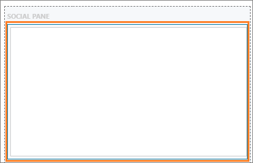

# FAQs for timeline control

## Why do I receive the message "Records could not be loaded because of unexpected error"?

The timeline section retrieves data about and displays in the form cards. By default, the timeline retrieves data for the 10 standard activity entities, which are:

-	Email
-	Task
-	Incident resolution
-	Fax
-	Opportunity close
-	Letter
-	Appointment
-	Phone call

As an administrator when you perform the following procedure, users will see an error at runtime:

**Procedure**
-	Create any additional custom activities
-	Enable custom activities for mobile
-	Select a **Card Form** for all the custom activities 

**Error:** Records could not be loaded because of an unexpected error.

   > [!div class=mx-imgBorder] 
   > 

This error is caused as the number of activity entities for the data retrieval has exceeded the maximum limit of 10.

   > [!div class=mx-imgBorder] 
   > 

### Workaround

To work around the issue, you must reduce the number of entities to 10 or less. Follow the steps to reduce the entities to 10 or less.

1.	Sign in to your `https://<YourOrgURL>.dynamics.com/apps` environment.

2. Open a model-driven app, and then on the command bar select **Settings**  > **Advanced  Settings**.

3.	Go to **Settings** > **Customization** > **Customize the System**. The solution explorer page opens in a new browser window.

4.	 Expand **Entities** under **Components** in the default solution pane.

5.	Select an entity and select **Forms**. For example, select the Account entity.

6.	Select the **Account** record that is of **Main** form. The **Account** form opens in a new browser window.

7.	Double-click the field in the **Social Pane** section. The **Activities Tab Properties** dialog is displayed.

    > [!div class=mx-imgBorder] 
    >  

8.	Select **Show selected** option for the **Show these activities** field in the **Filter by** container.

9.	Select the activities you want to display to the users.

10.	Select **OK**, and then select **Save**.

11.	Select **Publish** to publish the customizations.

## Why I can't assign or delete an activity from the timeline

If you use the **HideCustomActions** rule to hide the buttons, such as **Assign** and **Delete** in the ribbon command bar definition, then those buttons that are present in the Timeline control will not work. The buttons in the command bar is same as in the timeline control and hence, when a user selects the assign or delete button in the timeline control, an error message is displayed.

**You do not have permission to perform this action. Please contact your system administrator.**

To mitigate the issue, unhide the buttons in the command bar definitions.

## See also

[Set up timeline control](set-up-timeline-control.md)

[Timeline in the Customer Service Hub app](https://docs.microsoft.com/dynamics365/customer-service/customer-service-hub-user-guide-basics#timeline)