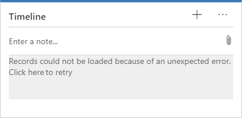
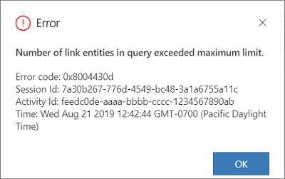
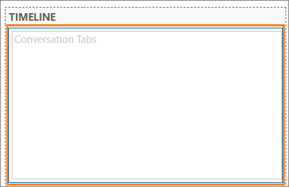

# FAQs for timeline control

[!INCLUDE [cc-data-platform-banner](../../includes/cc-data-platform-banner.md)]

## Why do I receive the message "Records could not be loaded because of unexpected error"?

The **Timeline** section retrieves data about and displays in the form cards. By default, the timeline retrieves data for the 10 standard activity tables, which are:

-    Email
-    Task
-    Incident resolution
-    Fax
-    Opportunity close
-    Letter
-    Appointment
-    Phone call

When you perform the following procedures as an administrator, users will see an error at runtime:

**Procedure**
-    Create any additional custom activities
-    Enable custom activities for mobile
-    Select a **Card Form** for all the custom activities 

**Error:** Records could not be loaded because of an unexpected error.

   > [!div class="mx-imgBorder"] 
   > 

This error is caused because the number of activity tables for the data retrieval has exceeded the maximum limit of 10.

   > [!div class="mx-imgBorder"] 
   > 

### Workaround

To work around the issue, you must reduce the number of tables to 10 or fewer. To do this, follow the steps below.

1.  Sign in to [Power Apps](https://make.powerapps.com/?utm_source=padocs&utm_medium=linkinadoc&utm_campaign=referralsfromdoc).

2.  Open a model-driven app, and then on the command bar select **Settings**  > **Advanced  Settings**.

3.   Go to **Settings** > **Customization** > **Customize the System**. The solution explorer page opens in a new browser window.

4.   Expand **Tables** under **Components** in the default solution pane.

5.   Select a table and select **Forms**. For example, select the **Account** table.

6.   Select the **Account for Interactive experience** record that is a **Main** form type. The **Account for Interactive experience** form opens in a new browser window.

      > [!div class="mx-imgBorder"] 
      > 

      For Unified Interface, you need to use the form name that has `<Entity> for Interactive experience`.

7.    Double-click the **Conversation Tabs** column in the **Timeline** section. The **Activities Tab Properties** dialog is displayed.

      > [!div class="mx-imgBorder"] 
      >   

8.    Select the **Show selected** option for the **Show these activities** column in the **Filter by** container.

9.    Select the activities you want to display to the users.

10.    Select **OK**, and then select **Save**.

11.    Select **Publish** to publish the customizations.

## Why can't I assign or delete an activity from the timeline?

If you use the **HideCustomActions** rule to hide buttons, such as **Assign** and **Delete** in the ribbon command bar definition, then those buttons that are present in the Timeline control will not work. The buttons in the command bar are same as the buttons in the Timeline control; therefore, when a user selects the **Assign** or **Delete** button in the Timeline control, an error message is displayed.

**You do not have permission to perform this action. Please contact your system administrator.**

To mitigate the issue, unhide the buttons in the command bar definitions.

## Why do my users see different activities and records in their My activities stream in the dashboard?

**My activities** stream in the dashboard shows the records and activities that are owned by a particular user. For example, user **A** see records and activities that are owned by **A**, and user **B** see records and activities that are owned by **B**.

## Why do my agents see the filter pane even when the Expand filter pane by default check box is cleared?

When the timeline is displayed on more than one column, the filter pane is displayed as a column alongside the timeline records. Even though you've cleared **Expand filter pane by default** check box in the Timeline configurations, the filter pane will always be displayed to your agents.

## See also

[Set up timeline control](set-up-timeline-control.md)

[Timeline section in the Customer Service Hub app](/dynamics365/customer-service/customer-service-hub-user-guide-basics#timeline)

[Add an appointment, email, phone call, note, or task activity to the timeline](../../user/add-activities.md)

[!INCLUDE[footer-include](../../includes/footer-banner.md)]