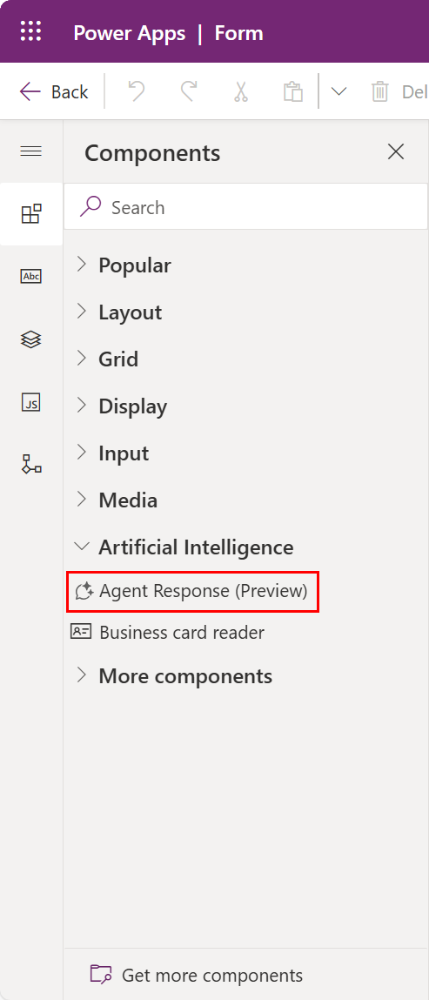

# Add agents response use the form designer (Preview)

[!INCLUDE [preview-banner](~/../shared-content/shared/preview-includes/preview-banner.md)]

The agent response component enables displaying the response from the Copilot Studio agent associated with the model-driven apps.

Agent Response component can be added to a model-driven app form which can directly call an Microsoft Copilot Studio (MCS) topic and display the response to the user. This builds on the [Code Component Agent API executeEvent](developer/component-framework/bring-intelligence-using-agent-apis) and simplifies usage by not requiring a new custom component.  The implicit context of the app, page, and record are available in MCS.

This component supports the following responses from MCS:

* Markdown
* Adaptive card
* Image
* Video

> [!IMPORTANT]
>
> - This is a preview feature.
> - Preview features aren't meant for production use and might have restricted functionality. These features are subject to [supplemental terms of use](https://go.microsoft.com/fwlink/?linkid=2216214), and are available before an official release so that customers can get early access and provide feedback.

## Add a agent response component using drag and drop

1. Open the form designer to create or edit a form. More information: [Create a form](create-and-edit-forms.md#create-a-form) or [Edit a form](create-and-edit-forms.md#edit-a-form)
1. In the form designer, select **Component** on the command bar.
1. In the Components pane, expand **Artificial Intelligence**
1. Drag the **Agent Response** onto the form preview.

> [!div class="mx-imgBorder"]
> 

> [!NOTE]
> Form preview will display a warning message "Agent Response is only available when you play the app" since live preview is not yet supported. Save and publish the form and validate the component in a running app.

## Configure agent response on a form

These are the properties available to configure an agent response when you create or edit a form using the form designer.

## See more

[Overview of the model-driven form designer](form-designer-overview.md) 
[Add, configure, move, or delete components on a form](add-move-configure-or-delete-components-on-form.md) 
[Using the tree view in the form designer](using-tree-view-on-form.md)
