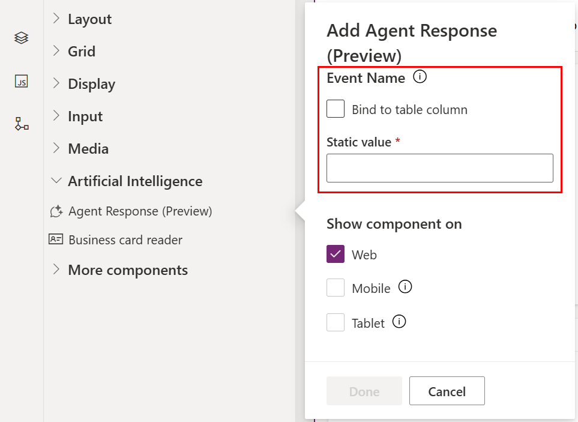

# Add agent response with the form designer (preview)

[!INCLUDE [preview-banner](~/../shared-content/shared/preview-includes/preview-banner.md)]

Add the agent response component to a model-driven app form, which can directly call a Microsoft Copilot Studio topic and display the response to the user. This builds on the [Agent API executeEvent](../../developer/component-framework/bring-intelligence-using-agent-apis.md) and simplifies usage by not requiring a new custom component. The implicit context of the app, page, and record are available in Copilot Studio.

This component supports the following responses from Copilot Studio:

* Markdown
* Adaptive card
* Image
* Video

[!INCLUDE [preview-note-pp.md](../../../shared/preview-includes/preview-note-pp.md)]

## Prerequisites

Requires the **Allow users to analyze data using an AI-powered chat experience in canvas and model-driven apps** environment setting enabled for model-driven apps. More information: [Copilot](/power-platform/admin/settings-features?tabs=new#copilot-preview)

## Add an agent response component to a form

1. Open the form designer to create or edit a form. More information: [Create a form](create-and-edit-forms.md#create-a-form) or [Edit a form](create-and-edit-forms.md#edit-a-form)
1. In the form designer, select **Component** on the command bar.
1. In the Components pane, expand **Artificial Intelligence**
1. Drag **Agent Response** onto the form canvas.
   :::image type="content" source="media/form-designer-add-configure-agent-response/form-designer-components-agent-response.png" alt-text="Agent response in components pane.":::
1. In the **Add Agent Response** dialog, enter the **Event name** from the topic in Copilot Studio in the **Static value** box. More information: [Find the event name for a topic in Copilot Studio](#find-the-event-name-for-a-topic-in-copilot-studio)
   
   > [!NOTE]
   > The **Bind to table column** option isn't supported for this component.
1. Select **Save and publish** on the command bar.
1. Open the form in a model-driven app to test the component.

   > [!NOTE]
   > The form designer preview displays the warning message "Agent Response is only available when you play the app" since live preview isn't yet supported.

## Find the event name for a topic in Copilot Studio

1. Open the topic in Copilot Studio and find the **Trigger** node.
1. Verify the trigger type is **A custom client event occurs** or **Event received**.
1. Within the **Trigger** node, select **Edit**.
   :::image type="content" source="media/form-designer-add-configure-agent-response/copilot-studio-topic-trigger-event.png" alt-text="Copilot Studio Trigger custom client event.":::   
1. Within the **On Event Activity properties** pane, copy the **Event name** property string value to be passed from the agent response component. More information: [Change the trigger for a topic](/microsoft-copilot-studio/authoring-triggers)
   :::image type="content" source="media/form-designer-add-configure-agent-response/copilot-studio-topic-trigger-event-properties.png" alt-text="Copilot Studio Trigger On Event property pane.":::   

## Limitations

The following component properties are currently not supported:

- Label
- Hide label
- Hide on phone
- Lock
- Read-only
- Component width
- Component height
- Bind to table column

The component isn't supported for mobile or tablets.

## Related articles

[FAQ for Agent APIs and Agent Response component](../../maker/common/faq-agent-api-component.md)

[Agent API executeEvent](../../developer/component-framework/bring-intelligence-using-agent-apis.md)

[Overview of the model-driven form designer](form-designer-overview.md) 
[Add, configure, move, or delete components on a form](add-move-configure-or-delete-components-on-form.md)

[!INCLUDE[footer-include](../../includes/footer-banner.md)]
