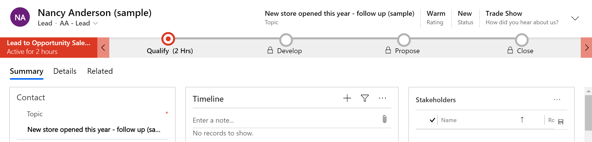
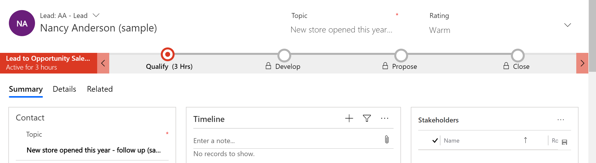
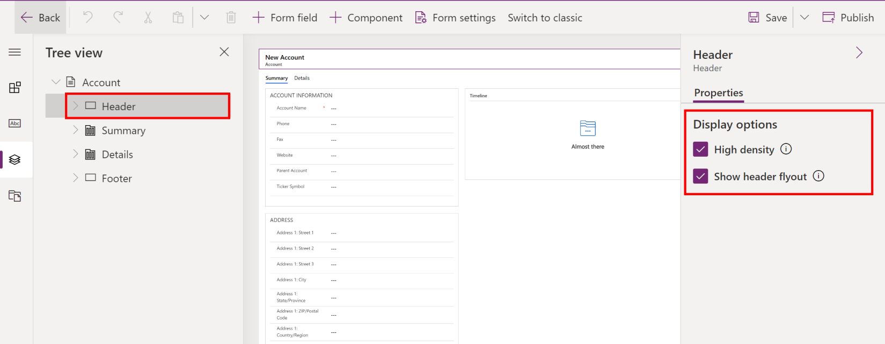
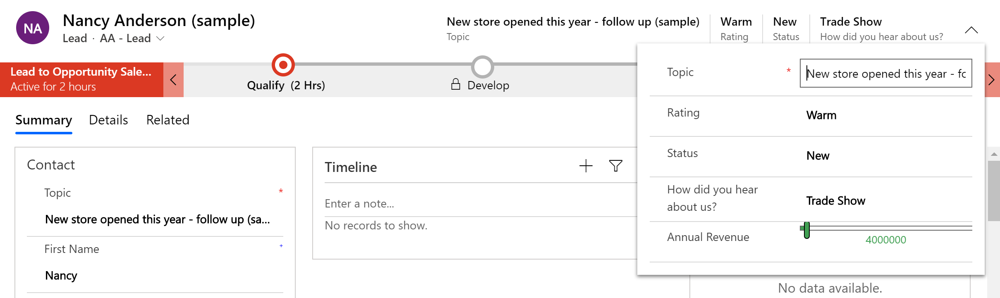
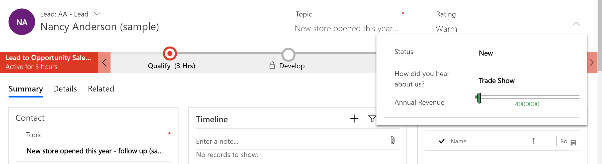

# Configure header properties in the form designer

Makers can control the density of model-driven app form headers to match the needs of anyone using the form.

## High-density header

High-density form header ensures that key information is always visible to users. Using high-density header, the row title never truncates. Even long row titles are displayed using multiple lines. Similarly, high-density header also ensures that up to four column values are directly visible in the header and never truncated or hidden.  

To ensure that key information is always visible, the framework displays read-only column values and users can't directly edit the column values in the header. Visualizations such as custom components or web resources also aren't allowed.

When a form does not specify header density or when a new form is created, the framework defaults to high-density header.

> [!div class="mx-imgBorder"] 
> 
    
## Low density header
> [!IMPORTANT]
> Low-density headers will be deprecated in 2021 Release Wave 2. At that time, existing low-density headers will render as high-density with flyout. We recommend that you set your forms to high-density with flyout and not low-density. 

Low density form header allows users to directly edit the column values in the header. It also allows visualizations such as custom components and web resources.  
  
However, often this comes at the cost of key information being truncated or not readily visible. Low-density header truncates the row title as well as column values displayed in the header. Often only one or two columns are directly visible in the header and the rest overflow and are displayed in a flyout requiring an extra click.

> [!div class="mx-imgBorder"] 
> 

### Configuring header density

Use the new form designer to configure the header density; the classic form designer does not provide the ability to configure the header density.

To configure the header density of a model-driven form, follow these steps:
1.	Open the form designer to [create or edit a form](create-and-edit-forms.md).
2.	Select the form header by selecting the header in the form preview or by using the [tree view](using-tree-view-on-form.md).
3.	In the property pane, select **High density** to use high-density form header or clear it to use low-density form header. Select **Show header flyout** to display a header flyout when users select the chevron in the form header. See the next section, **Header flyout** for more information.
    > [!div class="mx-imgBorder"] 
    > 
4.	In the command bar, select **Save** to save the form, or select **Publish** to save and make your changes visible to users.

## Header flyout
The header flyout is displayed when users select the chevron in the form header. It enables users to edit column values and also displays visualizations such as custom components or web resources that are a part of the form header.

The behavior of the header flyout changes depending on the header density configuration.

### High-density header flyout
With a high-density form header, the header flyout displays all header columns including the four columns that are directly displayed in the header. The framework defaults to show the header flyout when high-density header is being used. Makers can control the visibility of the header flyout with a high-density header.

> [!div class="mx-imgBorder"] 
> 

### Low-density header flyout
> [!IMPORTANT]
> Low-density headers will be deprecated in 2021 Release Wave 2. At that time, existing low-density headers will render as high-density with flyout. We recommend that you set your forms to high-density with flyout and not low-density.

With a low-density form header, the header flyout displays only overflow columns, such as  columns that the form is unable to display directly in the header based on the width of the form. The header flyout is also automatically displayed or hidden based on the number of columns in the header and the width of the form. Makers can't control the visibility of the header flyout when using a low-density header.

> [!div class="mx-imgBorder"] 
> 

### Show or hide the header flyout
To show or hide the header flyout for a model-driven form, follow these steps:

1.	Open the form designer to [create or edit a form](create-and-edit-forms.md).
2.	Select the form header in the form preview or use the [tree view](using-tree-view-on-form.md) to select it.
3.	In the property pane, select **High density** to use high-density form header. 
4.	In the property pane, select **Show header flyout** to make the header flyout visible or clear it to hide the header flyout.
5.	In the command bar, select **Save** to save the form, or select **Publish** to save and make your changes visible to users.

> [!NOTE]
> - Use the new form designer. The classic form designer does not provide the ability to show or hide the header flyout.   
> - The visibility of header flyout can only be controlled when using high-density form header. When using low-density header, the header flyout is automatically displayed or hidden based on the number of columns in the header and the width of the form.
> - An image for a table will be displayed in the header only if the **Primary Imagine** attribute is defined for the table and the form property **Show image in the form** is enabled. More information: [Image columns](../data-platform/types-of-fields.md#image-columns).  
    Developers can specify an image for a table by using the [EntityMetadata.PrimaryImageAttribute](/dotnet/api/microsoft.xrm.sdk.metadata.entitymetadata.primaryimageattribute?view=dynamics-general-ce-9) attribute.
> - When using a high-density header on a form, controls are limited in what is displayed that include a checkbox, datetime, decimal, duration, emailaddress, float, integer, languagepicker, lookup, money, phonenumber, picklist, radio, regarding, textbox, ticker and timezonepicklist.  Any other type of control, including custom Power Apps control framework controls, will not be displayed.  You'll need to switch to the high-density header with flyout to ensure your users can access controls in the header that aren't in the supported list. 

## Form designer messages related to form headers
When you edit forms using the new or classic form designer, you might see messages related to form headers. Below, you can find details on each message and why you are seeing it.

### We've upgraded your form to show a high density header that displays more data. You can edit this setting in the properties of the header. 
This message is displayed in the form designer when a maker creates a new main form (including via the Save-as action) or edits a main form that has not previously been configured for header density.  
  
The framework defaults to high-density header and this message helps makers become aware of that behavior. Makers can override the framework default at any time by manually configuring the form header density as outlined earlier.

### This form isn't using high density header, access the setting in the header properties. High density header helps display more data. 
This message is displayed in the form designer when a maker opens a main form for editing that is configured to use low-density header. 

The message helps increase awareness about the high-density header and its benefits.

### Column moved to header flyout: The header supports displaying up to four read-only column values. The column *[field display name]* will now only be available from the flyout.
This message is displayed in the form designer when a form is using high-density header with the header flyout visible.  
  
High-density header displays read-only values of the first four columns in the header. When makers add a column in the header in the top four positions, it causes an existing column that was directly displayed in the header to become extended and visible only in the header flyout.      

The message informs the maker of the change and confirms whether to proceed with the action.

### Header column limit exceeded: The header supports displaying up to four read-only column values. Remove unused columns to add more. 
This message is displayed in the form designer when a form is using high-density header with the header flyout hidden.  
  
High-density header displays read-only values of up to four columns in the header. Because the header flyout is hidden, users will be unable to see the additional columns.  

The message informs the maker that there are already four columns in the header and prevents adding additional columns in the header that users will not be able to see.

### Header does not display custom components: The header supports displaying up to four read-only column values. Remove the custom component from the column before adding it to the header.  
This message is displayed in the form designer when a form is using high-density header with the header flyout hidden.  
  
High-density header displays read-only values of columns in the header. Because the header flyout is hidden, users will be unable to see any custom components associated with the columns in the header.  

The message informs the maker that they are trying to add a column with an associated custom component to the header and they must remove the custom component before adding the column to the header. This is because users won't be able to see the custom component in the header.

### Header displays read-only column values: The header supports displaying up to four read-only column values. To provide editability to the user, add the column to a section in the form.  
This message is displayed in the form designer when a form is using high density header with the header flyout hidden.  
  
High-density header displays read-only values of columns in the header. Because the header flyout is hidden, users will be unable to edit column values.  
  
The message informs the maker that any columns added to the header will be read-only and that any columns they want users to edit should also be added to a section in the form.

### Header column values are not editable: Moving a column from the body to the header will display as a read-only value. To maintain editability, copy the column to the header.  
This message is displayed in the form designer only for forms using high-density header with the header flyout hidden.  
  
High-density header displays read-only values of columns in the header. Because the header flyout is hidden, users will be unable to edit column values.  

The message informs the maker that they are trying to move a column from the form body to the form header. Doing so will make it read-only. It gives the maker the choice of moving the column to the header or adding a copy of the column to the header. Moving the column to the header will make the column unavailable in the original location on the form body for users to edit. Adding a copy of the column to the header will leave the column in the original location as-is, ensuring that users can continue to edit it within the form body.

### Form headers now default to high density to display more data. Use the new form designer to edit header density.  
This message is displayed in the classic form designer when a maker opens a main form for editing and it is configured to use low density header.  
  
This message helps increase awareness about the high density header and its benefits and that makers should use the new form designer to configure header density.  

This message is displayed in the classic form designer when a maker opens a main form for editing and it is configured to use low density header. 

The message helps increase awareness about the high-density header and its benefits and that makers should use the new form designer to configure header density.  

### This form is using high density header. For the best authoring experience with this form, use the new form designer. 
This message is displayed in the classic form designer when a maker opens a main form for editing and it is configured to use high-density header.  
  
The classic form designer does not provide a WYSIWYG authoring experience. It also does not detect and prevent or warn makers about the implications of changes they make to the form header. For example, when you edit a form that is using high-density header with the header flyout hidden, the classic form designer will not prevent makers from adding more than four columns to the header even though these column will not be available to users.  
  
The message informs the maker that when editing a form that is using high-density header, they should use the new form designer. This helps ensure the maker is aware of the impact of their changes to the form header.

## See also
[Overview of the model-driven form designer](form-designer-overview.md)  
[Create, edit, or configure forms using the form designer](create-and-edit-forms.md)  
[Add, configure, move, or delete columns on a form](add-move-or-delete-fields-on-form.md)  
[Add, configure, move, or delete components on a form](add-move-configure-or-delete-components-on-form.md)  
[Add, configure, move, or delete sections on a form](add-move-or-delete-sections-on-form.md)  
[Add, configure, move, or delete tabs on a form](add-move-or-delete-tabs-on-form.md)  
[Add and configure a sub-grid component on a form](form-designer-add-configure-subgrid.md)  
[Add and configure a quick view component on a form](form-designer-add-configure-quickview.md)  
[Configure a lookup component on a form](form-designer-add-configure-lookup.md)  
[Using the tree view in the form designer](using-tree-view-on-form.md)  
[Create and edit columns](../data-platform/create-edit-field-portal.md)  

[!INCLUDE[footer-include](../../includes/footer-banner.md)]
