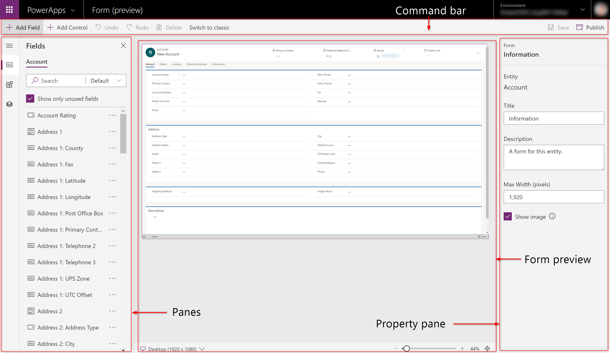

# Overview of the model-driven form designer
[!INCLUDE [cc-beta-prerelease-disclaimer](../../includes/cc-beta-prerelease-disclaimer.md)]

The new model-driven form designer provides a modern WYSIWYG authoring experience when you work with model-driven forms. It includes several improvements not available in the classic model-driven form designer. 

> [!NOTE]
> This feature is currently in preview.  
> [!INCLUDE [cc-preview-features-definition](../../includes/cc-preview-features-definition.md)]   

The designer shows a real-time WYSIWYG preview (Unified Interface only) while you author a form. Changes to the form are instantly reflected in the preview, enabling you to see exactly how the form will appear to users when published. 

Completing common tasks, such as setting properties, is simpler and faster with an always-available property pane. Also, 
**Save** and **Publish** are a single action, which streamlines the tasks.

The form designer interface has the following areas: 
- Command bar – Displays available actions such as **Save**, **Publish**, **Undo**, and **Redo**. 
- Panes – Displays panes with specific functions, such as a **Fields** pane that you use to add fields to a form. 
- Form preview – Displays a real-time preview of the form as it will appear to users when published. 
- Property pane – Displays properties of the selected element, and also allows you to make changes. More information: [Properties available in the form designer](form-designer-properties.md)

   

## See also
[Create and edit forms using the form designer](create-and-edit-forms.md)
