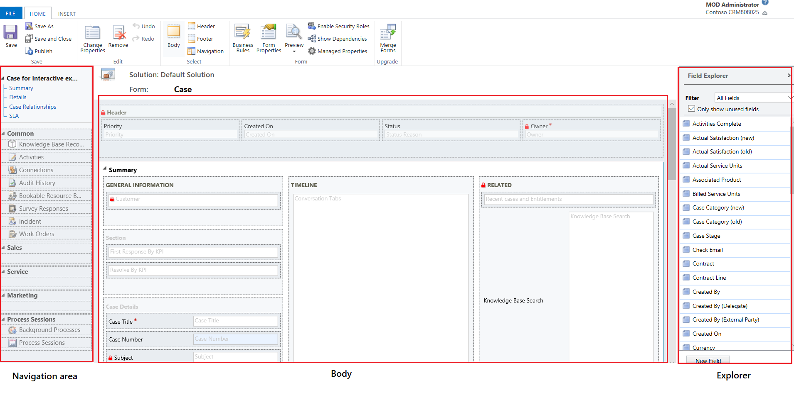
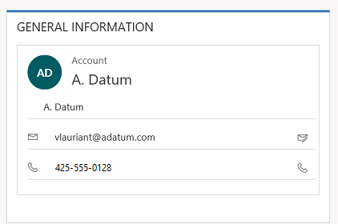
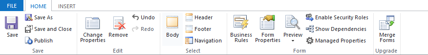
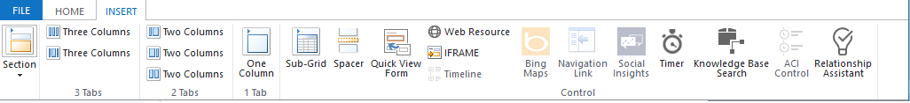

# Overview of the model-driven app form editor user interface

This article describes the classic form editor. We recommend that you use the modern form designer to create and edit your model-driven app forms. More information: [Overview of the model-driven form designer](form-designer-overview.md)

The form editor displays commands in three tabs: **File**, **Home**, and **Insert**.  

- [File tab](#file-tab)
- [Home tab](#home-tab)
- [Insert tab](#insert-tab)
  
The form editor is divided into three areas: **Navigation**, **Body**, and **Explorer**.  

> [!div class="mx-imgBorder"] 
> 
  
**Navigation**  
Located on the left side, use the navigation area to control access to related tables or to add links to URLs to be displayed in the main pane of the form. To edit navigation, you must first select the **Navigation** command in the **Select** group of the **Home** tab.

Main forms provide navigation options through the navigation bar, but use the same data in the navigation area to control what navigation options are available. More information: [Edit Navigation](use-the-form-editor-legacy.md)  

**Body**  
Located in the center, use the body area to control the layout of the form. You can select and drag form elements to position them. Double-clicking on an element will open the properties for the element. 

By default, for the Case, Contact, and Account Main forms, the first section under the **Summary** tab shows the account or contact card form of type **Quick View**. For custom tables, this section is not available by default. You can insert a new section and a quick view form in it. The card form shows a maximum of five columns. Other than columns, it isn’t possible to show other controls in the Blue tile even if the quick view form contains it. 
 
>[!NOTE] 
> To preserve the card format (as shown in the following image), we recommend that you do not move the quick view form to any other section on the form.

> [!div class="mx-imgBorder"] 
> 
   
More information: [Create and edit quick view forms](create-edit-quick-view-forms.md)  
 
-   To add a column, select it from the **Column Explorer** and drag it into a section.  
  
    -   To add an element that is not a column, select where you want to place it and use the appropriate command from the **Insert** tab add it.  
  
    -   To remove an element, select it and use the **Remove** command in the **Edit** group of the **Home** tab.  
  
    -   To edit the **Header** or **Footer** for the form you must first select the corresponding command in the **Select** group of the **Home** tab.  
  
**Explorer**  
Located on the right side, the content of the explorer area depends on the context.  
  
When you select **Body**, **Header**, or **Footer** in the **Select** group of the **Home** tab, you’ll see the **Column Explorer**. Use the **Column Explorer** to drag columns you want to display into a section in the form or within the header or footer. You can include the same column multiple times in a form. Use the **New Column** button as a shortcut to create a new column.  
  
When you select **Navigation** in the **Select** group of the **Home** tab you’ll see the **Relationship Explorer**. Drag any of the relationships into one of the groups within the navigation area. You cannot add the same relationship twice. Relationships are available based on how they are configured. If you configure a relationship to not display, it won’t display in the **Relationship Explorer**. For information about how to configure default display options for relationships, see [Navigation pane item for primary table](../data-platform/create-edit-1n-relationships-solution-explorer.md#navigation-pane-item-for-primary-table).
  
You can use the **New 1:N** and **New N:N buttons** as a shortcut to add new table relationships.  

## File tab

Select the **File** tab to add/view the following options:

- **New Activity** Add a new activity
- **New Row** Add a new row
- **Tools** Utilize options like Import data, Duplicate detection, and Bulk delete wizard
- **Options** Change the default display settings to personalize the default solution, and manage your email templates
    - General
    - Synchronization
    - Activities
    - Formats
    - Email Templates
    - Email Signatures
    - Email
    - Privacy
    - Languages
- Help
- Close

## Home tab  
 The **Home** tab displays the commands listed in the following table:

> [!div class="mx-imgBorder"] 
> 

|Group|Command|Description|
|-----------|-------------|-----------------| 
|**Save**|**Save**  **(Ctrl+S)**|Save the form.|
||**Save As**|Create a copy of this form with a different name.|
||**Save and Close**|Save the form and close the form editor.|
||**Publish**|Publish the form. More information: Publishing customizations|
|**Edit**|**Change properties**|Change properties of the selected item in the body.   See the following sections depending on the selected item:   -   [Tab Properties](tab-properties-legacy.md) -   [Section properties](section-properties-legacy.md) -   [Common Column properties](common-field-properties-legacy.md) -   [Special column properties](special-field-properties-legacy.md) -  [Sub-grid properties](sub-grid-properties-legacy.md) -   [Quick view control properties](quick-view-control-properties-legacy.md)|
||**Remove**|Remove the selected item.|
||**Undo** **(Ctrl+Z)**|Undo the previous action.|
||**Redo** **(Ctrl+Y)**|Redo the previous action.|
|**Select**|**Body**|Edit the main body of the form.|
||**Header**|Edit the form header.|
||**Footer**|Edit the form footer.|
||**Navigation**|Edit the form navigation.   More information: [Edit Navigation](use-the-form-editor-legacy.md)
|**Form**|**Business Rules**|View, edit, or create new business rules with the Business Rules explorer. **Note:**  For the interactive forms, only the “Entity” and “All Forms” scope is supported.   More information: [Create and edit business rules](create-business-rules-recommendations-apply-logic-form.md)|
||**Form Properties**| More information: [Form Properties](form-properties-legacy.md)|  
||**Preview**|Use this to see how form looks after it is published. You can also preview to test scripts associated with from events.|         
||**Enable Security Roles**|Use this to set which security roles will have access to the forms. More information:  [Control access to forms](control-access-forms.md) **Important:**  If you create a new form, only the System Administrator and System Customizer security roles will have access to the form. You must assign access to other security roles before people can use it.|  
||**Show Dependencies**|See which solution components depend on this form and which solution components are required by this form. |  
||**Managed Properties**|Managed properties command has two properties **Customizable** and **Can be Deleted**. Setting these properties to false means the form won’t be customizable and cannot be deleted after you included it in a solution, export that solution as a managed solution, and import that managed solution into a different environment. More information: [Managed properties](/power-platform/alm/managed-properties-alm)| 
|**Upgrade**|**Merge forms**|If applicable, this option lets you merge this form with a form from a previous version of Dynamics 365 form|
  

## Insert tab  
> [!div class="mx-imgBorder"] 
> 
 
The Insert tab displays the commands in the following table:

|Group|Command|Description|
|-----------|-------------|-----------------| 
||**Section**|Add a section to a selected tab. You can include a section with one to four columns.   You can also insert a Reference panel in the interactive forms. Reference panel is also added as a section to the Main - Interactive experience form. By default the Reference panel section is added to the Case, Account, Contact and custom table forms.   More information: [Section properties](section-properties-legacy.md)|  
|**3 Tabs**|**Three Columns**|Insert a three-column tab with equal widths.   More information: [Tab Properties](tab-properties-legacy.md)|  
||**Three Columns**|Insert a three-column tab with a wider middle column.|  
|**2 Tabs**|**Two Columns**|Insert a two-column tab with a wider right column.|  
||**Two Columns**|Insert a two-column tab with a wider left column.|  
||**Two Columns**|Insert a two-column tab with equal width columns.|  
|**1 Tab**|**One Column**|Insert a one-column tab.|  
|**Control**|**Sub-Grid**|Format a sub-grid and insert it into the form.   More information: [Sub-grid properties](sub-grid-properties-legacy.md)|  
||**Spacer**|Insert an empty space.|  
||**Quick View Form**|Insert a Quick View Form.   More information: [Quick view control properties](quick-view-control-properties-legacy.md)|  
||**Web Resource**|Insert a web resource to embed content from other locations in one page.   More information: [Web Resource properties](web-resource-properties-legacy.md)|  
||**IFRAME**|You can add an IFRAME to a form to integrate content from another website within a form.| 
||**Timeline**|Insert a timeline control in the form. This control shows the timeline of activities related to the table on a form.|  
||**Navigation Link**|Using this option, you can insert a link into a form navigation.|  
||**Timer**|Insert a timer control to a table form to track time against an SLA. More information: [Add a timer control](/dynamics365/customer-engagement/customer-service/add-timer-control-case-form-track-time-against-sla)|
||**Knowledge Base Search**|Insert a search control that users can use to search knowledge articles. More information:  [Knowledge Base Search control](/dynamics365/customer-engagement/customer-service/add-knowledge-base-search-control-forms)|  
||**Relationship Assistant**|Using this option, you can insert a relationship assistant control in the form.|

>[!Note] 
>The following components aren’t supported in the Main forms:  <ul> <li>Bing maps  <li>Yammer  <li>Activity Feeds   </li> </ul>

## Next steps

[Use the Main form and its components](use-main-form-and-components.md)  

[!INCLUDE[footer-include](../../includes/footer-banner.md)]