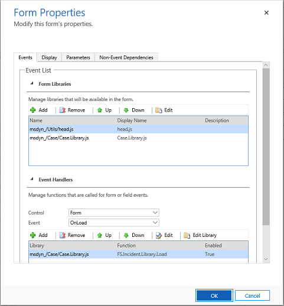

# Model-driven app form properties 

This article describes the classic solution explorer. We recommend that you use the modern form designer to edit properties for your model-driven app forms. More information: [Configure a form](create-and-edit-forms.md#configure-a-form) and [Configure model-driven app form event handlers](configure-event-handlers-legacy.md)

You can access **Form properties** in solution explorer. Under **Components**, expand **Tables**, expand the table you want, and then select **Forms**. In the list of forms, open the form of type **Main**. Then on the **Home** tab, select **Form Properties**.

The following table lists the form properties:  
  
|Tab|Property|Description|  
|---------|--------------|-----------------|  
|**Events**|**Form Libraries**|Manage which JavaScript web resources are available in the form and the order in which they will be loaded.|  
||**Event Handers**|Configure which JavaScript functions from the Form Libraries will run for the `OnLoad` and `OnSave` form events and the order in which they’ll be run.|  
|**Display**|**Form Name**|Enter a name that will be meaningful to people. This name will be shown to people when they use the form. If they can use multiple forms configured for the table they will use this name to differentiate between available forms.|  
||**Description**|Enter a description that explains how this form is different from other main forms. This description is only shown in the list of forms for a table in the solution explorer.|  
||**Form Assistant**|Select from the check box if you want to enable form assistant or view the form as expanded by default.|
||**Page Navigation**|You can choose not to show navigation items.   In forms for updated tables this means the primary name value for the row currently being viewed will not appear in the navigation bar to allow navigation to associated views.   In forms using the classic presentation, the navigation options to choose associated views on the left side of the form will not be shown.|  
||**Image**|When a table has an image column and the entities’ **Primary Image** option is set, this setting will enable showing the image column in the header of this form.   See [Enable or disable table options](../data-platform/edit-entities.md#enable-or-disable-table-options) for more information about table options.|  
||**Display**|**Set a Max Width (in pixels)** to limit the width of the form. The default value is 1900.|  
||**Display**|Enter in pixels the max width that you want for the form here.|
|**Parameters**|**Parameters**|Each form can be opened with code using a URL. The URL may also contain data that can be passed to the form using a query string that is appended to the URL. Query strings look like this example: `?p_firstName=Jim&p_lastName=Daly`   As a security measure, forms will not accept any unknown query string parameters. Use this parameters list to specify parameters this form should accept to support code that will pass data to the forms using a query string.   The name and type of data will be checked and the form won’t open if invalid query string parameters are passed to it.  **Note:** The name cannot start with an underscore (_) or crm\_. It must start with alphanumeric  characters followed by an underscore (\_). For example, parameter_1 or 1_parameter. The name cannot contain hyphens (-), colons (:), semicolons (;), commas (,) or periods (.).   |  
|**Non-Event Dependencies**|**Dependent Columns**|Each event handler has a similar **Dependent Columns** property so that any columns that are needed by the script can be registered. Anyone who tries to remove the dependent columns will not be able to.   Some scripts operate on the form but are not configured in an event handler. Scripts that are initiated from the command bar do not have a place where dependent columns can be registered. This form property provides a place for dependent columns for those scripts to be registered.|  

## Next steps

[Use the Main form and its components](use-main-form-and-components.md)

[!INCLUDE[footer-include](../../includes/footer-banner.md)]