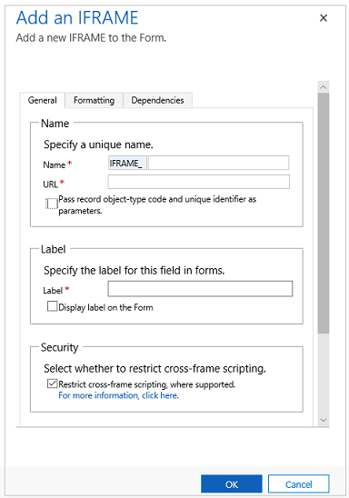

# iFrame properties for model-driven app main forms

[!INCLUDE [cc-data-platform-banner](../../includes/cc-data-platform-banner.md)]

You can add iFrames to a form to integrate content from another website within a form. 

To view IFrame properties, follow these steps.

1.  Sign in to [Power Apps](https://make.powerapps.com/?utm_source=padocs&utm_medium=linkinadoc&utm_campaign=referralsfromdoc).

2.  Expand **Data**, select **Tables**, select the table that you want, and then select the **Forms** tab. 

3. In the list of forms, open a form of type **Main**.

4.  Select **Switch to classic** to edit the form in the classic form designer.

4.  On the **Insert** tab, select IFRAME to view IFRAME properties.

      > [!div class="mx-imgBorder"] 
      > 

> [!NOTE]
> Forms are not designed to be displayed within an iFrame.  
  
|Tab|Property|Description|  
|---------|--------------|-----------------|  
|**General**|**Name**|**Required**: A unique name for the iFrame. The name can contain only alphanumeric characters and underscores.|  
||**URL**|**Required**: The URL for the page to display in the iFrame.|  
||**Pass row object-type code and unique identifiers as parameters**|Data about the organization, user, and the row can be passed to the iFrame. More information: [Pass parameters to iFrames](#pass-parameters-to-iframes) |  
||**Label**|**Required**: A label to display for the iFrame.|  
||**Display label on the Form**|Whether the label should be displayed.|  
||**Restrict cross-frame scripting, where supported**|It is considered a security risk to allow pages from a different web site to interact with the Dynamics 365 application using scripts. Use this option to restrict cross frame scripting for pages you do not have control over.  |  
||**Visible by default**|Showing the iFrame is optional and can be controlled using scripts. More information: [Visibility options](visibility-options-legacy.md)|
||**Enable for mobile**|Select the checkbox to enable the iFrame for mobile.|  
|**Formatting**|**Select the number of columns the control occupies**|When the section containing the iFrame has more than one column you can set the column to occupy up to the number of columns that the section has.|  
||**Select the number of rows the control occupies**|You can control the height of the iFrame by specifying a number of rows the control occupies.|  
||**Automatically expand to use available space**|Instead of setting the height by a number of rows, you can allow the iFrame height to expand to available space.|  
||**Select the scrolling type for the iFrame**|You have three options:   - **As Necessary**: Show scrollbars when the size of the iFrame is larger than the available space. - **Always**: Always show scrollbars. - **Never**:  Never show scrollbars.|  
||**Display border**|Display a border around the iFrame.|  
|**Dependencies**|**Dependent columns**|An iFrame may interact with columns in the form using script. If a column is removed from the form the script in the iFrame may break. Add any columns referenced by scripts in the iFrames to the **Dependent columns** so that they cannot be removed accidentally.|  
  
## Pass parameters to iFrames  
 Information about the row can be passed by enabling the **Pass row object-type code and unique identifiers as parameters** option. The values passed are:  
  
|Parameter|Description|  
|---------------|-----------------|  
|`orglcid`|The Organization default language LCID.|  
|`orgname`|The name of the organization.|  
|`userlcid`|The user's preferred language LCID|  
|`type`|The table type code. This value can be different for custom tables in different organizations. Use `typename` instead.|  
|`typename`|The table type name.|  
|`id`|The id value of the row. this parameter has no value until the table row is saved.|  

## Next steps

[Use the Main form and its components](use-main-form-and-components.md)

[!INCLUDE[footer-include](../../includes/footer-banner.md)]