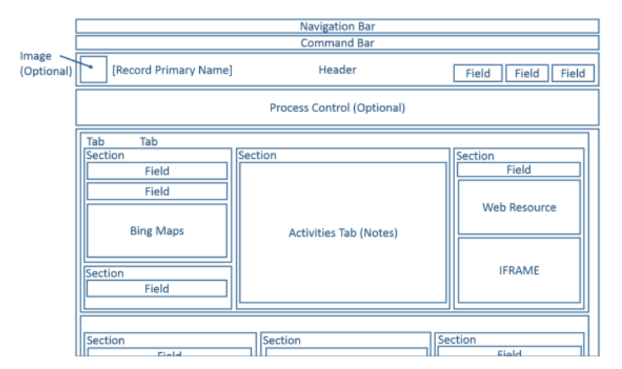
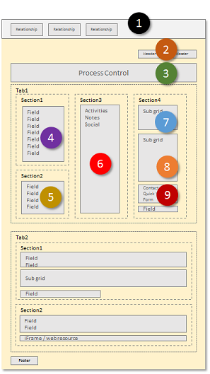
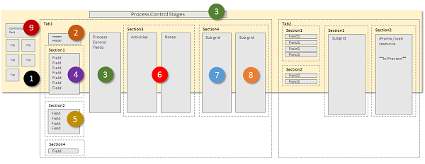
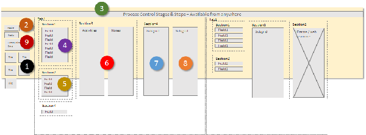
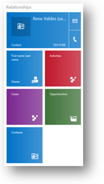
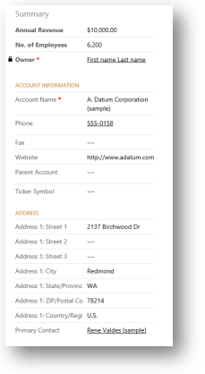
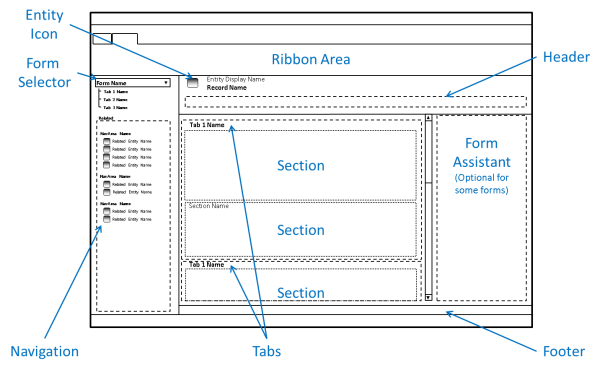

# How model-driven app main forms appear on different devices

There are 4 types of form.  Main, Quick View, Quick Create and Card.

The **main form** is a fundamental building block of any model-driven app and is used by all devices used to deliver them.

This form can be rendered using a web browser,  Dynamics 365 for phones, Dynamics 365 for tablets, or Dynamics 365 for Outlook and its design will adjust to accommodate the device used.  This responsive design is one of the most important features of any model-driven app.

Additionally, the main form is an intrinsic part of the table and it travels with the table as part of any solution.  This helps with the [application lifecycle management](model-driven-app-glossary.md#application-lifecycle-management)

[Learn more about all the form types](types-forms.md)

[Notes on Microsoft Dynamics 365](model-driven-app-glossary.md#Dynamics)
  

## Main form presentation options

 Any main forms that exist for a table may be displayed differently depending on the factors in the following table below. When designing a main form, consider how it works in each presentation tool.  
  
|Presentation|Description|  
|------------------|-----------------|  
|**Updated**|For the [Updated tables and classic tables](create-design-forms.md#updated-versus-classic-tables) and any custom tables in Dynamics 365 (online) and Dynamics 365 on-premises, the updated form provides a new user experience. These forms have the newer command bar design, and enable additional features such as auto-save and business process flows.|  
|**Dynamics 365 for tablets**| Dynamics 365 for tablets presents the content of the main form in a manner optimized for a tablet.|  
|**Dynamics 365 for phones**| Dynamics 365 for phones presents the content of the main form in a manner optimized for a phone.|  
|**Classic**|These forms are for the tables that haven't been updated. They use the ribbon rather than the command bar and the navigation pane on the left side of the form.   These forms have a two-column layout.|  
  

## Updated forms

 This diagram represents common components found in updated table forms.  
  
   
  
 For updated tables, the layout of the form works with a wide range of displays and window sizes. As the width of window decreases, tab columns move down so that you can scroll down to work with them instead of being compressed or requiring you to scroll to the right.

The image below illustrate the accounts table main form as it would be viewed through a web browser. 

 :::image type="content" source="media/create-and-edit-a-model-driven-form/main-form-accounts.png" alt-text="Sample model-driven app":::  
  
 The following table summarizes available components of the main form for updated tables.  
  
|Component|Summary|  
|---------------|-------------|  
|**Navigation bar**|Uses the data in the site map to provide the ability to move to different areas of the application.   The navigation pane used in classic forms isn’t included in the updated form. In the context of a row, the navigation bar provides access to views of related rows. Rather than navigating to related rows using the navigation pane or by using the navigation bar, adding [subgrids](model-driven-app-glossary.md#subgrid) configured to show useful related table rows provides a better experience for most people.|  
|**Command bar**|Uses the data defined for ribbons to provide commands relevant for the row.   The first five commands are displayed followed by an ellipsis () that provides a flyout menu to choose additional commands.|  
|**Image**|When a table has an image column and the table **Primary Image** option is set to **Default Image**, an image can be displayed in the header when the form is configured to show the image.|  
|**Header**|Columns placed in the header remain visible when people scroll down through the body of the form.   Up to four columns can be placed in the header. Multiple lines of text, web resources, or iFrames aren’t allowed in the header. The header and footer share some properties with sections.|  
|**Process Control**|When a table has active business process flows, the process control displays below the header. More information: [Business process flows](/flow/business-process-flows-overview)|  
|**Body**|The body is the scrollable part of the form that contains the tabs.|  
|**Tabs**|In the body of the form, tabs provide horizontal separation. Tabs have a label that can be displayed. If the label is displayed, tabs can be expanded or collapsed to show or hide their content by selecting the label.   Tabs contain up to three columns and the width of each column can be set to a percentage of the total width. When you create a new tab, each column is prepopulated with a section.|  
|**Sections**|A section occupies the space available in a tab column. Sections have a label that can be displayed and a line may be shown below the label.   Sections can have up to four columns and include options for displaying how labels for columns in the section are displayed.|  
|**Columns**|Columns display controls people use to view or edit data in a table row. Columns can be formatted to occupy up to four columns within a section.|  
|**Spacer**|A spacer allows for an empty space to be added to a section column.|  
|**Sub-grids**|Sub-grids allow for the display of a list within the form. The ability to display charts using a sub-grid isn’t available in forms for updated tables.|  
|**Quick View Form**|A quick view form displays data from a row referenced by a lookup column on the form. The table that is the target of the lookup must have a quick view form before one can be added to the form. More information: [Create and edit quick view forms](create-edit-quick-view-forms.md)|  
|**Web Resources**|HTML and Microsoft Silverlight web resources can be added to main forms but they won’t be displayed when using Dynamics 365 for phones and tablets.|  
|**iFrame**|An inline-frame that you configure to show a webpage from another website. **Important:**  <ul><li>When the page displayed in an iFrame is on another domain, browsers apply a higher level of security. This may complicate the requirements for the contents of an iFrame to interact with data in the form.</li><li>Displaying a table form within an iFrame embedded in another table form is not supported. 
|**Bing Maps**|When this control is present in a form for an updated table and the system setting **Enable Bing Maps** is enabled with a valid Bing Maps key, this control can be used one time in a form to show the location for one of the addresses in an updated table. More information: [Configuring Bing maps](configure-bing-maps-legacy.md)|  
|**Footer**|Any number of columns, web resources, or iFrames can be added to the footer. Columns are read-only when displayed in the footer. The header and footer share some properties with sections.|  
|**Status Bar**|The status bar displays the status column for the row, a notification area, and a save button.|  
  
   
## Dynamics 365 for phones and tablets forms  
 Most system tables and custom tables are available for Dynamics 365 for phones and tablets. The main form for these tables is transformed to a presentation optimized for phones or tablets.  
  
   
### Tables enabled for Dynamics 365 for phones and tablets  
 Only tables that are enabled for Dynamics 365 for phones and tablets use this presentation of the main form. More information: [Entities displayed in Dynamics 365 for phones and tablets](/dynamics365/customer-engagement/customize/customize-phones-tablets#BKMK_CustomEntity)  
  
### Form design  
 Dynamics 365 for phones and tablets takes many of the main form elements and presents them in a way optimized for phones or tablets. The following diagrams show the reflow from the web app to the tablet and phone apps.  
  
 **Web app**  
  
   
  
 **Tablet app**  
  
   
  
 **Phone app**  
  
   
  
 The form elements are transformed to a wide panorama layout in  Dynamics 365 for tablets, where users swipe the screen to change elements visible within a view port. In Dynamics 365 for phones, users swipe the screen to see a different column, or pane of elements, and the process control appears over every column.  
  
### View port element  
 The following items are always visible within the view port in the context of a form:  
  
 **Nav bar**  
 The nav bar is a presentation of the sitemap that is optimized for touch. More information: [Change navigation options](/dynamics365/customer-engagement/customize/customize-phones-tablets#BKMK_NavigationOptions)  
  
 **Home**  
 The home button takes users to the dashboard that is the starting page for Dynamics 365  for phones and tablets.  
  
 **Process Control**  
 If the table has a business process enabled, it will appear in the top right corner next to the search control in Dynamics 365 for tablets, and at the top of the screen in Dynamics 365 for phones.  
  
 **Search**  
 People can tap the search control to open the screen to search for rows.  
  
 **Command Bar**  
 By default, some of the commands that appear in the app running in a web browser do not appear in the Dynamics 365 for phones and tablets apps. Similar to the web application, the command bar is context-sensitive, so the available commands change depending on what is currently viewed or selected. More information [Change commands](/dynamics365/customer-engagement/customize/customize-phones-tablets#BKMK_ChangeCommands)  
  
### Form elements  
 The form elements displayed are taken from the main form and presented as a series of panels that users see through the view port.  
  
 In Dynamics 365 for tablets, the first panel displays contact information about relationships that exist for the row. In Dynamics 365 for phones, the first panel also displays header columns from the form above the relationship tiles.  
  
   
  
 For Contact and User forms, the top item displays a communication card for the row. The communication card provides buttons to initiate communication with the person. For other tables, a communication card is displayed if there is a Contact quick view form embedded in the main form.  
  
 You can show additional tiles based on table relationships, but you can’t customize the tiles for the following tables:  
  
|Entity|Tiles|  
|------------|-----------|  
|Account|Owner|  
|Contact|Company Name, Owner|  
|Lead|Owner|  
|Opportunity|Account, Owner|  
  
 You can customize the remaining tiles with the form editor. The order is fixed, but you can set which elements are visible in the relationship panel.  
  
 In Dynamics 365 for tablets, the second panel begins with the name of the first tab on the form. Any columns that are included within the header are included and then the contents of the first tab. In Dynamics 365 for phones, headers appear in the first column.  
  
   
  
 If there is a process flow active for the form, the third tab displays tasks for the current stage of the process in Dynamics 365 for tablets. In Dynamics 365 for phones, the process control floats above the panes, expands over the user’s current pane when it’s selected, and is always visible and actionable.  
  
 The remaining panels of the form contain the contents of the tabs in the form. Any subgrids found display as a separate panel.  
  
 The Dynamics 365 for phones and tablets form always displays the labels for tabs and sub-grids. The **Display Label on the Form** setting is not applied.  
  
> [!NOTE]
>  To optimize performance on mobile devices, the number of objects is limited to 5 tabs or 75 columns and 10 subgrids.  
  
 Forms for Dynamics 365 for phones and tablets don’t support the following:  
   
-   Bing maps  
  
-   Yammer
  
-   Activity feeds  
  
-   Theming  
  
 In addition, table images are visible in list views and contact cards, but not within the actual form.  
  
   
### Multiple forms  
 Dynamics 365 for phones and tablets supports multiple forms but doesn't provide a way for people to switch between forms if they can access more than one. People will see the first form in the form order that they have access to.  
  
 For example, if you have the following main forms for the opportunity table and have assigned the following security roles for each one, you’ll see the form order shown in the following table.  
  
|Form Order|Form Name|Security roles|  
|----------------|---------------|--------------------|  
|1|**Sales Form One**|Salesperson|  
|2|**Sales Form Two**|Salesperson and Sales Manager|  
|3|**Sales Form Three**|Sales Manager|  
|4|**Sales Form Four**|Vice President of Sales|  
  
-   People with the Salesperson role will always see **Sales Form One**.  
  
-   People with the Sales Manager role will always see **Sales Form Two**.  
  
-   People with the Vice President of Sales role will always see **Sales Form Four**.  
  
   

## Classic forms

 The following diagram shows the main form components used in the classic presentation.  
  
   
  
 The forms for updated tables have inherited many components from the classic forms, but there are significant differences.  
  
 Forms using the classic presentation don’t include the navigation bar and the ribbon is used instead of the command bar. These forms don’t support table images, the process control, quick view forms, auto-save, or Bing Maps. Columns in the header aren’t editable.  
  
 The form assistant is exposed for certain tables, such as `Article`.  
  
## Next steps

 [Create and design forms](create-design-forms.md)

[!INCLUDE[footer-include](../../includes/footer-banner.md)]