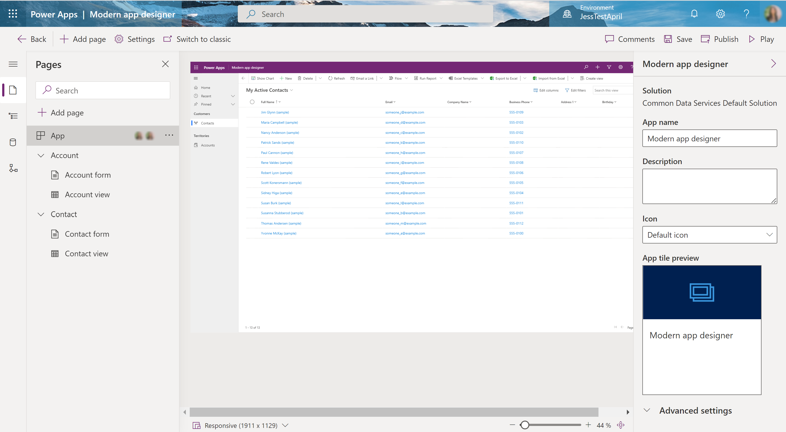

# Manage model-driven app properties in the app designer

App properties define important details about the app, like its title. You define app properties when you create an app. If you want to change those properties later, you can do that in the app designer.  
  
1. In the app designer, on the left side, select the **App** in the pages section. Or alternatively, select **Settings** in the command bar.

    > [!div class="mx-imgBorder"]
    >   
  
2. Change the information, as required:

    |Property|Description|  
    |--------------|-----------------|
    |**App name**|Enter a unique and meaningful name for the app.|  
    |**Description**|Type a short description of what the app is.|  

3. Save the app.  

## Known Limitations

The following app properties cannot be edited in the app designer:

- Icon
- Unique Name
- App Url Suffix
- Manage App
- Welcome page of the app
- Enable Mobile Offline
- Mobile Offline Profiles

> [!TIP]
> Select **Switch to classic** to use the [classic designer to change the app design properties](manage-app-properties.md) that aren't currently available in the designer.
  
## Next steps

[Create or edit an app](create-edit-app.md)

[!INCLUDE[footer-include](../../includes/footer-banner.md)]
