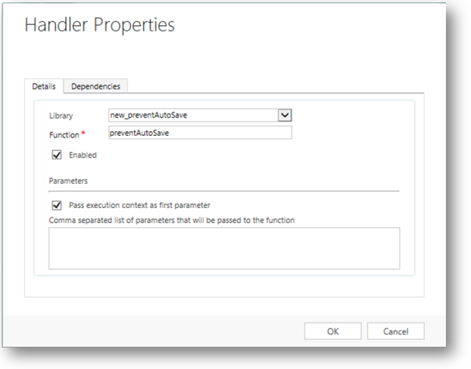

# Disable auto-save in a model-driven app

[!INCLUDE [cc-data-platform-banner](../../includes/cc-data-platform-banner.md)]

Auto-save helps app users focus on their work without having to manage saving data in the form. Most people will appreciate not having to explicitly save data each time they update a row, but some organizations may have customizations that were designed expecting an explicit save. For these organizations there are options to manage how auto-save is applied.  
  
<a name="BKMK_HowAutoSaveWorks"></a>   

## How auto-save works  
 By default all main forms for [Updated tables and classic tables](create-design-forms.md#updated-versus-classic-tables) will have auto-save enabled. After a row is created (initially saved), any changes made to a form will automatically be saved thirty seconds after the change is made. If no changes are made in the form, the automatic save won't occur while the form is open. After a change is made the 30-second period before an auto-save begins again. If someone else has updated the same row while you're editing it, those changes will be retrieved and displayed in the form when auto-save occurs.  
  
 With auto-save enabled, the save button only appears for the initial save of the row. After the row is created, the save button in the command bar isn't shown, but you can see a  button in the lower right corner that will show if there are any unsaved changes. This control is also displayed if auto-save is disabled.  
  
 You can select this button to save the row and refresh data in the form immediately. When  auto-save is enabled the row will be saved whenever you navigate away from a row or close a separate window displaying a row. There is no need for the **Save & Close** button that appears in forms for tables that aren't updated.  
  
<a name="BKMK_AutoSave"></a>   
## Should you disable auto-save?  
 If you have plug-ins, workflows, or form scripts that execute when a row is saved, they'll run each time auto-save occurs. This might lead to undesirable behaviors if these extensions weren't designed to work with auto-save. Whether auto-save is enabled or not, plug-ins, workflows, and form scripts should be designed to look for specific changes, and shouldn't execute indiscriminately for each save event.  
  
 If you have auditing configured for a table, each save is treated like a separate update. If someone lingers on a form with unsaved changes for more than thirty seconds, you'll see an additional entry only if they add more data after the auto-save is performed. If you have reports that depend on auditing data and treat each save as an individual "touch" of a row, you might see an increase in the frequency of touches. If you are using this approach, you should consider that individual user behaviors make it an unreliable metric with or without auto-save enabled.  
  
<a name="BKMK_DisableAutoSaveOrg"></a>   
## Disable auto-save for the organization  
 If you determine that auto-save will cause problems with any extensions you are using, you can disable it for your organization. There is no setting to disable auto-save for individual tables or forms.  
  
1. Go to **[Settings](advanced-navigation.md#settings)** > **Administration**.  
  
2.  Choose **System Settings**.  
  
3.  For the **Enable auto-save for all forms** option, select **No**.  
  
<a name="BKMK_DisalbleAutoSaveForm"></a>   
## Disable auto-save for a form  
 If you want to disable auto-save for specific table forms, you can add code to the `OnSave` event in an table.  
  
> [!NOTE]
>  Auto-save will be disabled for the form, but data will still be saved when you select the  button in the lower-right corner. If you attempt to navigate away from a form or close a form where data has been changed they will get prompt to save their changes before they are allowed to navigate away or close the form.  
  
1.  Sign in to [Power Apps](https://make.powerapps.com/?utm_source=padocs&utm_medium=linkinadoc&utm_campaign=referralsfromdoc).  

2.  Expand **Data**, select **Tables**, select the table that you want, and then select the **Forms** tab.  
  
3.  Open the form you want to edit.

4.  Select **Switch to classic** to edit the form in the classic form designer.
  
5.  Create a JavaScript web resource and add it to the form:  
  
    1.  In the form editor, in the **Form** group, choose **Form Properties**.  
  
    2.  On the **Events** tab, below **Form Libraries** choose **Add**.  
  
    3.  In the **Look Up Row** dialog box, choose **New**.  
  
    4.  Enter the following information in the web resource form:  
  
        |||  
        |-|-|  
        |**Name**|preventAutoSave|  
        |**Display Name**|Prevent Auto Save|  
        |**Type**|Script (JScript)|  
  
    5.  Next to the **Type** column, choose **Text Editor**.  
  
    6.  In the **Source** column, paste the following code:  
  
        ```javascript  
        function preventAutoSave(econtext) {  
            var eventArgs = econtext.getEventArgs();  
            if (eventArgs.getSaveMode() == 70 || eventArgs.getSaveMode() == 2) {  
                eventArgs.preventDefault();  
            }  
        }  
  
        ```  
  
    7.  Choose **OK** to close the text editor.  
  
    8.  Choose **Save** to save the web resource and then close the web resource window.  
  
    9. In the **Look Up Row** dialog the new web resource you created will be selected. Choose **Add** to close the dialog.  
  
6.  Configure the OnSave event:  
  
    1.  In the **Form Properties** window, in the **Event Handlers** section, set **Event** to **OnSave**.  
  
    2.  Select **Add**.  
  
    3.  In the **Handler Properties** window, set **Library** to the web resource you added in the previous step.  
  
    4.  Type '`preventAutoSave`' in the **Function** column. This is case sensitive. Do not include quotation marks.  
  
    5.  Make sure that **Enabled** is checked.  
  
    6.  Check **Pass execution context as first parameter**.  
  
        > [!IMPORTANT]
        >  If you do not do this the script will not work.  
  
         The **Handler Properties** dialog should look like this. The customization prefix: "new_" may vary based on the customization prefix set for the default publisher for your organization.  
  
           
  
    7.  Select **OK** to close the **Handler Properties** dialog.  
  
    8.  If there are any other event handlers for the `OnSave` event, use the green arrows to move this one to the top.  
  
7. Select **OK** to close the **Form Properties** dialog.  
  
8. Select **Save and Close** to close the form.  
  
9. In the solution explorer, select **Publish All Customizations**.  
  
 After you apply this script to the `OnSave` event, when people edit a row using this form the message **unsaved changes** will appear in the bottom right corner of the form just as it would if auto-save was not disabled. But this message will not go away until people select the  button next to it.  
  
## Next steps  
 [Create and design forms](create-design-forms.md)      

 


[!INCLUDE[footer-include](../../includes/footer-banner.md)]