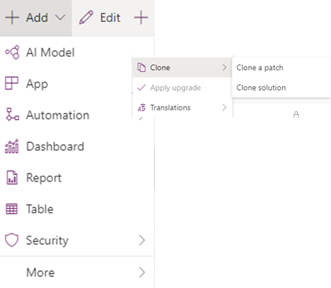

# Manage commands in solutions (preview)

[!INCLUDE [cc-beta-prerelease-disclaimer](../../includes/cc-beta-prerelease-disclaimer.md)]

Unlike classic commands, modern commands are treated the same as other solution components and support core solution behaviors.

> [!div class="mx-imgBorder"]
> 

Modern commanding provides these benefits when you work with solutions:
- Add solution components that depend on your command actions.
- Block commands from being customized by using managed properties.
- View dependencies related to your modern command components.
- Troubleshoot by viewing which solutions modified the component and when using solution layers.
- Remove any unmanaged customizations if in an unhealthy state.
- Add or remove command components from a solution.
- Segment solutions and build minor updates or patches that include your modern command components.
    > [!div class="mx-imgBorder"]
    > 
- Modern command components work with solution upgrade so you can delete components by importing a new version.
- Standardized localization via export/import translations.

### See also

[Modern commanding overview (preview)](command-designer-overview.md)
