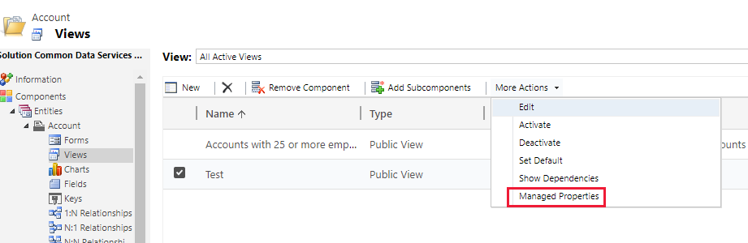
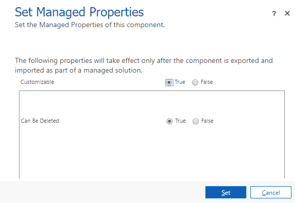

# Model-driven app managed properties for views

[!INCLUDE [cc-data-platform-banner](../../includes/cc-data-platform-banner.md)]

   
 
 If you create a custom public view in Power Apps that you want to include in a managed solution that you will distribute, you have the option to limit the ability of anyone who is installing your solution from customizing the view.  
  
 By default, most views have their **Customizable** managed property set to true so that people can customize them. Unless you have a very good reason to change this, we recommend you allow people to customize views in your app.  
  
## Set managed properties for a view  
  
1.  Open [solution explorer](advanced-navigation.md#solution-explorer), expand **Entities**, select the table that you want, and then select **Views**.  
  
2.  Select a custom public view.  
  
3.  On the menu bar, select **More Actions** > **Managed properties**.  

    > [!div class="mx-imgBorder"] 
    > 
  
4.  Set the **Customizable** or **Can Be Deleted** options to **True** or **False**.  

    > [!div class="mx-imgBorder"] 
    > 
  
> [!NOTE]
> The setting does not take effect until you export a solution that contains the view as a managed solution and install it in a different environment.  

## Next steps
[Understand views](create-edit-views.md)

[!INCLUDE[footer-include](../../includes/footer-banner.md)]