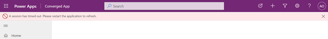

# Known issues with custom pages in a model-driven app (preview)

[!INCLUDE [cc-beta-prerelease-disclaimer](../../includes/cc-beta-prerelease-disclaimer.md)]

The custom page is a new page type within model-driven app, which brings in the power of canvas.  Below are the known issues to be aware of.

## Maker Related Issues

* When a custom page is modified (for example saved and published), the model-driven app is not aware of the change and will continue to use the last version of the custom page when the model-driven app was published.  A model-driven app publish through app designer or solution explorer will update all custom pages in the model-driven app. This also applies to **Publish all**.

* Deleting a model-driven app with a custom page from the make.powerapps.com Apps list fails with an error.  The work-around is to delete from the solution explorer list.

* Layout or control support for Right to Left (RTL) is coming before GA

* Ability to get the current users settings including Locale, Language is coming before GA

* Custom pages use a canvas hosting session that can time out after 8 hours where the Unified Interface session has a longer timeout.  When this timeout happens an error message bar will appear to prompt the user to refresh the browser

  > [!div class="mx-imgBorder"]
  > 

* Deleting a custom page that is referenced by a model-driven app will be blocked until the reference is removed from the model-driven app Pages and the sitemap. See more on [Managing dependencies](/power-platform/alm/removing-dependencies)

* When a custom page with code component is opened for editing, a security dialog is shown.  On this dialog, clicking on **Go back** button does not navigate back to parent context.  User can close the browser tab to leave the canvas designer.  

* Supports the most common canvas controls and custom pro-dev components. For more information on what is available, see [Design a custom page for your model-driven app](design-page-for-model-app.md)

* Makers need to share custom pages to allow another maker to make changes.  This is a different behavior than the typical model components.  If a custom page can not be shared from solution explorer, open the environment in Power Platform admin center and then open Resources > Power Apps > Page > Share. Similarly in order to reuse the canvas components inside the custom page, corresponding canvas component library also need to be shared with the custom page makers. 

* Maker experience for custom page does not has support for certain Power Apps component framework APIs like Navigation and Web APIs which is inline with the stand alone canvas apps. However these APIs are avaialable in the published app where the custom page is added to model apps, please see [add code components to a custom page for your model-driven app.](/powerapps/maker/model-driven-apps/page-code-components) 

## End User Related Issues

* When a user with no Power Apps user rights opens a custom page in the model-driven app, they will see an error mentioning no active entitlements to use PowerApps.  See more on [Licensing overview for Microsoft Power Platform](/power-platform/admin/pricing-billing-skus) and the associated licensing guide. 

* Custom pages require third-party cookie to be enabled which is required by the canvas runtime.

* When a user is prompted for consent with connectors and clicks "Don't allow", the custom page will render but without data.  The user does not get notified that data retrieval is skipped.

* After a model-driven app or custom page is changed and published, loading a custom page can take longer than normal and no page loading spinner is shown.

* When navigating back to a custom page from another page, the page state is not restored so the page is like a new navigation.  We are looking at enabling page state to be saved before navigating away and restored on reload.

* Native player support is available for iOS and Android in online-only mode. Offline support will be coming in 2022.  The preview Windows player current reports an error when the custom page is opened.

* When a user using model-driven apps in Teams opens a custom page, an error message will indicate not supported yet.

* When a user using Internet Explorer opens a custom page, an error message will appear indicating Internet Explorer is not supported.

## Related topics

[Model-driven app custom page overview](model-app-page-overview.md)
