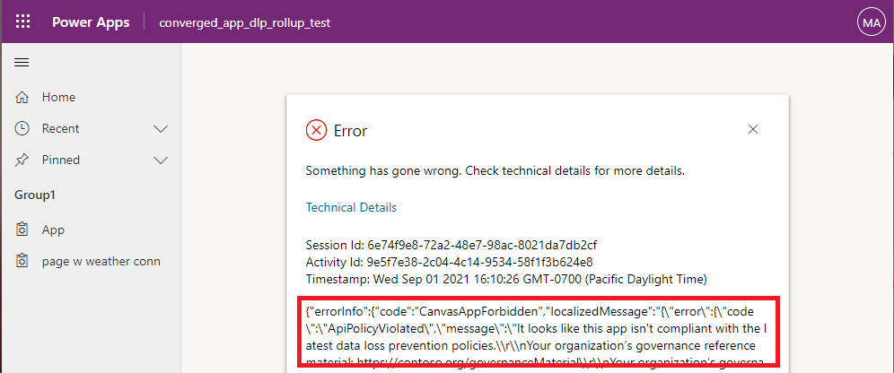

# Known issues with custom pages in a model-driven app (preview)

[!INCLUDE [cc-beta-prerelease-disclaimer](../../includes/cc-beta-prerelease-disclaimer.md)]

The custom page is a new page type within model-driven apps. Custom pages bring the power of canvas apps into model-driven apps. Below are the known issues to be aware of.

## Maker-related issues

* When a custom page is modified, such as saved and published, the model-driven app is not aware of the change and will continue to use the last version of the custom page when the model-driven app was published. A model-driven app publish through app designer or solution explorer will update all custom pages in the model-driven app. This also applies to **Publish all**.

* Deleting a model-driven app with a custom page from the make.powerapps.com **Apps** area fails with an error. The work-around is to delete from the solutions list in the **Solutions** area.

* Layout or control support for Right to Left (RTL) is currently unavailable.

* The ability to get the current users settings including locale and language is currently unavailable.

* Custom pages use a canvas app hosting session that can time out after 8 hours whereas the Unified Interface session has a longer timeout. When this timeout happens an error message bar appears that prompts the user to refresh the browser.

  > [!div class="mx-imgBorder"]
  > 

* Deleting a custom page that is referenced by a model-driven app will be blocked until the reference is removed from the model-driven app using the Pages tab and the site map in app designer. More information: [Managing dependencies](/power-platform/alm/removing-dependencies)

* When a custom page with code component is opened for editing, a security dialog is shown. On this dialog, selecting **Go back** doesn't navigate back to the parent context. The user can close the browser tab to leave the canvas app designer.

* Not all canvas app controls are available with custom pages. However, custom pages support the most common canvas app controls and custom pro-dev components. For more information about what is available, see [Design a custom page for your model-driven app](design-page-for-model-app.md)

* Makers need to share custom pages to allow another maker to make changes. This is a different behavior than the typical model-driven app components. If a custom page can't be shared from the **Solutions** area, open the environment in Power Platform admin center, and then open **Resources** > **Power Apps** > **Page** > **Share**. Similarly in order to reuse the canvas app components inside the custom page, the corresponding canvas app component library also needs to be shared with the custom page makers.

* The maker experience for the custom page doesn't have support for certain Power Apps component framework APIs like `Navigation` and Web APIs which is inline with the stand alone canvas apps. However, these APIs are available in the published app where the custom page is added to model-driven apps. More information: [add code components to a custom page for your model-driven app.](/powerapps/maker/model-driven-apps/page-code-components) 

## User-related issues

* When a user with no Power Apps user privileges opens a custom page in the model-driven app, they will see an error mentioning no active entitlements to use PowerApps.  More information: [Licensing overview for Microsoft Power Platform](/power-platform/admin/pricing-billing-skus) and the associated licensing guide.

* Custom pages require third-party cookies to be enabled, which is required by the canvas app runtime.

* When a user is prompted for consent with connectors and selects **Don't allow**, the custom page will render but without data.  The user does not get notified that data retrieval is skipped.

* After a model-driven app or custom page is changed and published, loading a custom page can take longer than normal and no page loading spinner is shown.

* When navigating back to a custom page from another page, the page state is not restored so the page appears like a new navigation.

* Native player support is available for iOS and Android in online-only mode. Offline support will come later. The preview Windows player currently reports an error when the custom page is opened.

* When a user running a model-driven app in Teams opens a custom page, an error message will indicate this action isn't supported yet.

* When a user running Internet Explorer opens a custom page, an error message will appear indicating Internet Explorer isn't supported.

* When a user runs an app that isn't compliant with their organization's [Data Loss Prevention (DLP) policies](https://docs.microsoft.com/power-platform/admin/wp-data-loss-prevention), they'll see an error dialog and the 'Technical details' reflects the app isn't DLP compliant. 

## See also

[Model-driven app custom page overview](model-app-page-overview.md)
