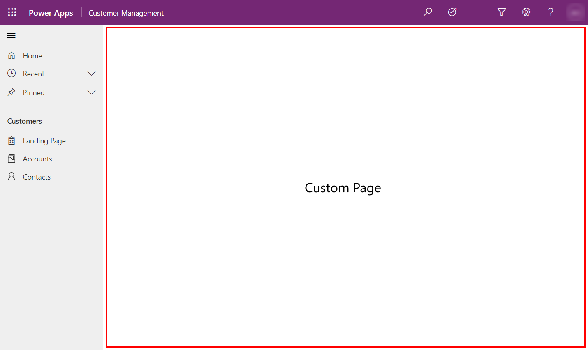
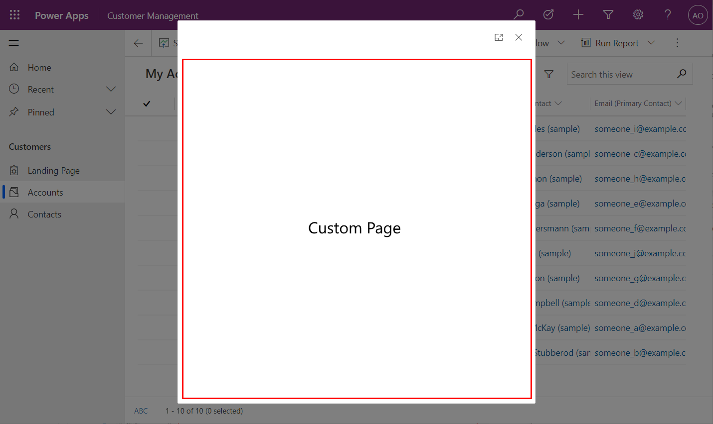
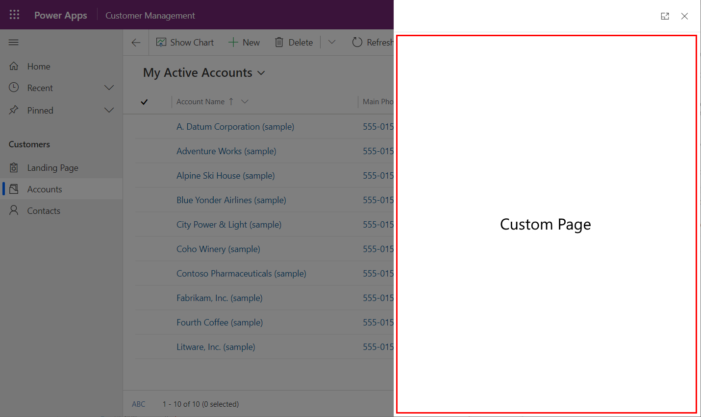

# Overview of canvas app custom pages for model-driven apps

[!INCLUDE [cc-beta-prerelease-disclaimer](../../includes/cc-beta-prerelease-disclaimer.md)]

The custom page is a new page type within a model-driven app, which brings in the power of canvas apps. Custom pages increase the convergence of model-driven and canvas apps. Custom pages can be used to add full pages, dialogs, or panes with the power of the canvas designer. It also includes a low code page authoring experience with expressions and custom PCF controls.  

This new page is more flexible than a modeled form, view, or dashboard page.  It allows including one or more tables.  Then the maker can define the data and component interactions.  The page is a separate solution element supporting co-authoring at a page level.  Like other model-driven app pages, the page state is either from the parameters passed or retrieved from persisted tables. 

Below shows the custom page inline within the model-driven app having the full-page space other than header and navigation.

Custom page as main page

  > [!div class="mx-imgBorder"]
  > 

Custom page as center dialog

  > [!div class="mx-imgBorder"]
  > 

Custom page as side dialog

  > [!div class="mx-imgBorder"]
  > 

Custom pages must be added through a soluion using either the modern app designer or solution explorer. See [Add a custom page to your model-driven app](add-page-to-model-app.md) for details.

  > [!IMPORTANT]
  > - This is a preview feature, and isn't available in all regions.
  > - [!INCLUDE[cc_preview_features_definition](../../includes/cc-preview-features-definition.md)]

## Custom pages are different than embedded canvas app

A custom page enables makers to create a new page experience using the canvas capabilities.  This provides a low code authoring experience with more flexible layouts, more control styling options, connector data, expressions, etc.  Page authoring happens in the canvas designer with increasing context of the model-driven app that the page runs in.  We are actively investing in custom page authoring as part of enabling a custom app.

Embedded canvas app also uses the canvas capabilities with a hosting approach that not as integrated as custom page. The simpler integration of an embedded canvas app means the current limitation on number of embedded canvas apps has not change.  The advanced integration of the custom page addresses those limits.  The embedded canvas app can only be placed with a model-driven form acting like a low code component. For more information, see [Embed a canvas app on a model-driven form](embed-canvas-app-in-form.md). 

Think of a custom page in your model-driven app like a table form or a dashboard page.  The page can consist of any set of controls that are supported on the page and can interact and navigate between other model-driven app page types and a canvas page.  What it is not is a canvas app that has multiple screens or pages inside of it.  It truly is a single page not a series or set of canvas pages like the embedded canvas app is today.

## Migrating standalone canvas app content to custom pages

Existing standalone canvas app is not supported for use as a custom page and the expected app structure is different.  A standalone canvas app often has many screens with global access to all controls and variables.  The custom page is expected to typically be a single screen with loose coupling to provide performance and co-dev capabilities.

To migrate an existing standalone canvas app, first start by identify a mapping of screens to separate custom pages.  For each separate custom page do the following steps:

1.	Create a blank custom page from app designer
1.	Add canvas Data Source for data used by the screen
1.	Copy the screen from canvas app in the original canvas designer
1.	Paste the screen into the new custom page in the canvas designer
1.	Change the Navigate calls to use the custom page name instead of the screen name
1.	Add custom page into the app designer sitemap

## Frequent questions

* What data can the custom page use?

  A custom page can use Dataverse (Common Data Service) and some of the most common connectors for Power Apps.  The list of verified connectors is tracked in [Add connectors into custom pages](page-data-connector.md).

* What interactions can the custom page have with the model-driven app?

  Custom pages can be added to the sitemap for direct navigation using [Add custom page to sitemap](add-page-to-model-app.md#add-existing-custom-page-into-model-driven-app-sitemap).  Model pages can open a custom page using the navigateTo Client API. Custom pages can navigate to other custom pages or to a model page like form, view, or dashboard with PowerFx navigate function. For more information, see [Navigating to and from a custom page in your model-driven app](navigate-page-examples.md)

* How is the custom page made responsive?

  The recently released responsive container controls enables building a responsive without formulas. For more information, see [Building responsive pages](../canvas-apps/build-responsive-apps.md).  More custom page design guidance can also be found in [Design a custom page for your model-driven app](design-page-for-model-app.md).

* How is the custom page managed in a solution?

  Each custom page is a separate component in the solution which allows one maker to edit a custom page at a time.  Most custom pages will have a single screen.  Instead of multiple screens, they will use the custom page's navigation functions to move to another custom page or model page.  When a custom page has multiple screens, it is still a single solution component so only one maker can be working on the contained set of screens.

* What licenses are allowed to use a custom page and does a custom page impact app counts?

  The custom page uses a special canvas type which allows us to manage it differently.  The custom page is considered part of the model-driven app infrastructure and can only be used within a model-driven app.  So it follows the license for the model-driven app.  Also custom pages do not count toward the app limits because we treat them as a page instead of an app.

* Do custom pages need to be shared like standalone canvas apps?

  The custom page is aligned with the model page sharing which relies on the model-driven app sharing without sharing individual pages for end users.  Makers may need to share the custom page to allow editing.

## Known limitations
As a public preview feature, custom pages some known limitations.  Below are the most common and the full list is in [Custom Page Known Issues](model-app-page-issues.md).

* Supports the most common canvas controls and custom pro-dev components. For more information on what is available, see [Design a custom page for your model-driven app](design-page-for-model-app.md)

* Canvas component library or canvas component control support is coming soon

* Native player support (for example, iOS, Android) is coming soon for online-only. Offline support will be coming in 2022

* Custom pages require third-party cookie to be enabled which is required by the canvas runtime

Custom pages will not work on premise since it requires the online service for canvas apps. Custom pages also will notwork with IE 11 because it depends on capabilities not available in that browser.

## Related topics

[Add a custom page to your model-driven app](add-page-to-model-app.md)

[Design a custom page for your model-driven app](design-page-for-model-app.md)

[Navigating to and from a custom page in your model-driven app](navigate-page-examples.md)

[Using PowerFx in custom page](page-powerfx-in-model-app.md)

[Add connectors into custom pages](page-data-connector.md)

[Use Monitor to troubleshoot custom page](monitor-page-checker.md)

[Model-driven app custom page known issues](model-app-page-issues.md)