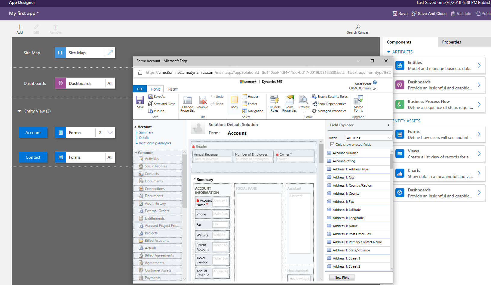
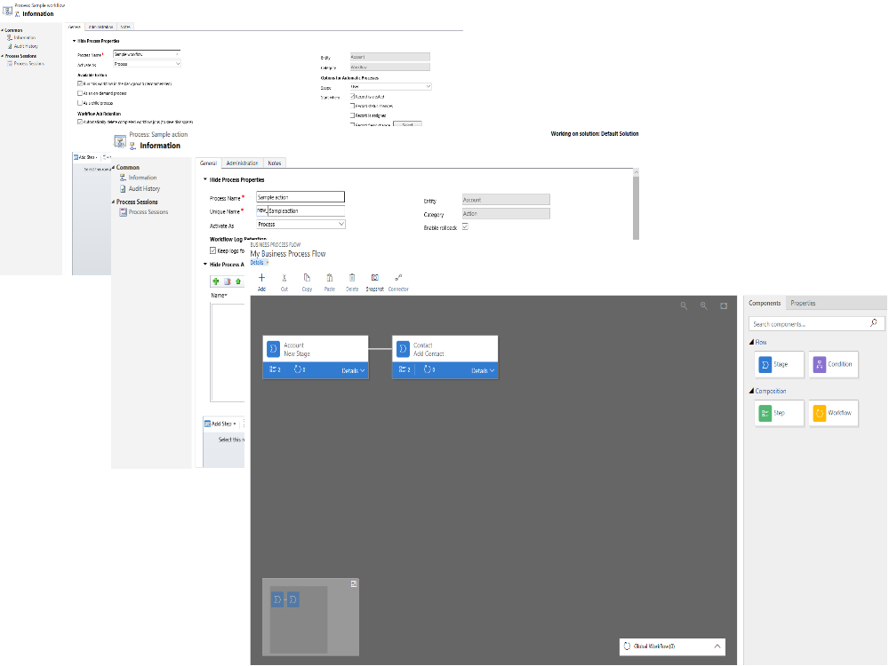
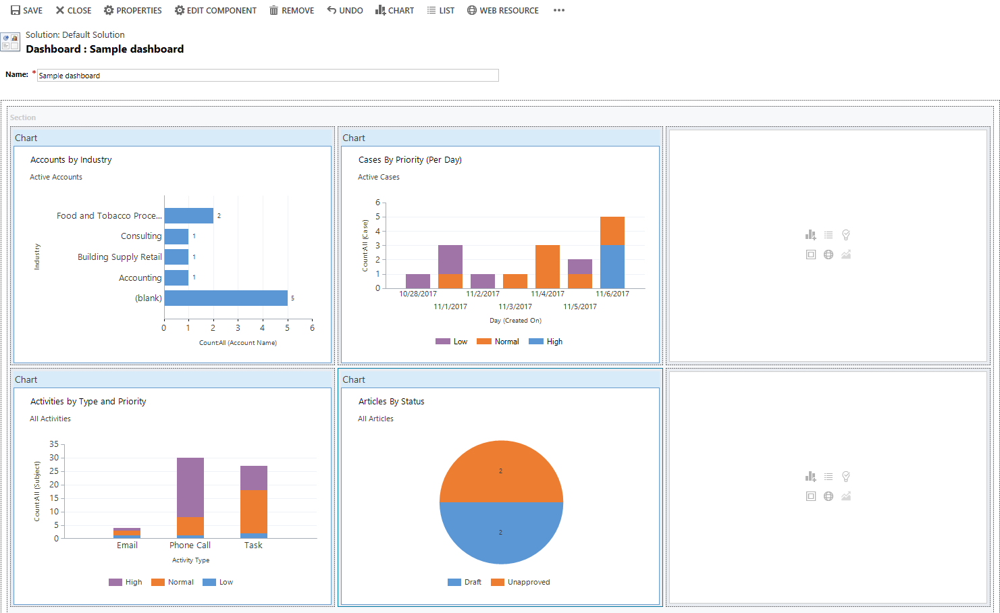
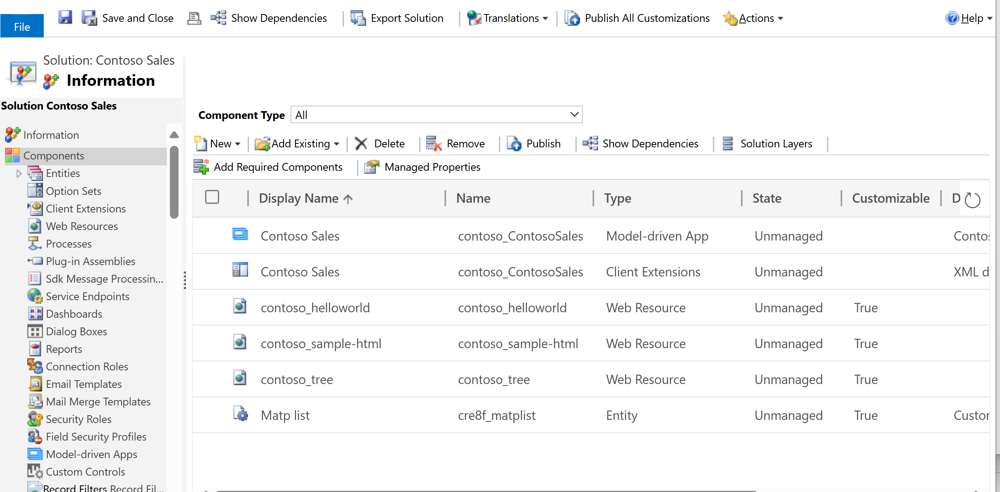
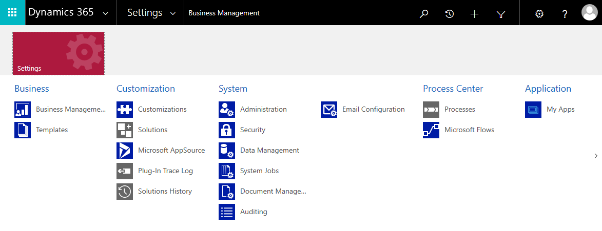

# Understand model-driven app components
A well designed model-driven app consists of several components you select using the designer to build the appearance and functionality of the finished app. The components and component properties that designers use to make up an app become the metadata. 

To understand how each of these components relates to app design, they're separated here into *data*, *UI*, *logic*, and *visualization* categories. 

## Data
These components determine what data the app will be based upon and what designer is used to create or edit the component.

|Component  |Description  |Designer  |
|---------|---------|---------|
|Table     |An item with properties that you track, such as a contact or account. Many standard tables are available. You can customize a non-system standard table (production table) or create a custom table from scratch.     | Power Apps table designer        |
|Relationship     | Table relationships define how tables can be related to each other. There are 1:N (one-to-many), N:1 (many-to-one), and N:N (many-to-many) types of relationships. For example, adding a lookup column to a table creates a new 1:N relationship between the two tables and lets you put that lookup column on a form.   | Power Apps table designer        |
|Column     | A property that is associated with an table. A column is defined by a data type, which determines the type of data that can be entered or selected. Examples include text, number, date and time, currency, or lookup (creates a relationship with another table). Columns typically are used with forms, views, and searches.        | Power Apps table designer   |
|Choice column     | This is a special type of column, which provides the user a set of predetermined options. Each option has a number value and label. When added to a form, this column displays a control for the user to select an option.  There are two kinds of choices; choices, where the user can only select one option, and multi-select choices, which allow more than one selection.  | Power Apps option set designer     |

More information: [Define data for your model-driven app](define-data-model-driven-app.md) 

## UI
These components determine how users interact with the app. 

|Component  |Description  |Designer  |
|---------|---------|---------|
|App     | Determines the application fundamentals such as components, properties, client type, and URL for your app.      | App designer   |
|Site map     | Specifies the navigation for your app.        | Site map designer        |
|Form     | A set of data-entry columns for a given table that matches the items that your organization tracks for the table. For example, a set of data-entry columns that where user's input relevant information to track a customer's previous orders along with specific requested reorder dates.        | Form designer        |
|View     | Views define how a list of rows for a specific table is displayed in your application. A view defines the columns to display, width of each column, sort behavior, and the default filters.   |  View designer       |

> [!div class="mx-imgBorder"] 
> 

## Logic
Determines the business processes, rules, and automation the app will have. Power Apps makers use a designer that is specific to the type of process or rule. 

|Type of logic  |Description  |Designer  |
|---------|---------|---------|
|Business process flow     | An online process that walks users through a standard business process. For example, use a business process flow if you want everyone to handle customer service requests the same way, or to require staff to gain approval for an invoice before submitting an order.        | Business process flow designer        |
|Workflow     |  Workflows automate business processes without a user interface. Designers use workflows to initiate automation that doesn't require any user interaction.       | Workflow designer        |
|Actions    |  Actions are a type of process that let you manually invoke actions, including custom actions, directly from a workflow.       |  Process designer       |
|Business rule     | Used to apply rule or recommendation logic to a form, such as to set column requirements, hide columns, or validate data. App designers use a simple interface to implement and maintain fast-changing and commonly used rules.         |  Business rule designer       |
|Flow     | Power Automate is a cloud-based service that lets you create automated flows between apps and services to get notifications, synchronize files, collect data, and more.        | Power Automate        |

> [!div class="mx-imgBorder"]
> 

More information: [Apply business logic in your model-driven app](guide-staff-through-common-tasks-processes.md) 

### Additional options for adding custom business logic
[Use plug-ins to extend business processes](../../developer/data-platform/plug-ins.md)  
[Workflow extensions](../../developer/data-platform/workflow/workflow-extensions.md)

## Visualizations
Determines what type of data visualizations and reporting the app will have available.

|Component  |Description  |Designer  |
|---------|---------|---------|
|Chart     | A single graphic visualization  that can be displayed within a view, on a form, or be added to a dashboard.        | Chart designer        |
|Dashboard     | Functions as a palate for one or more graphic visualizations that provide an overview of actionable business data.        | Dashboard designer        |
|Embedded Power BI     | Add embedded Power BI tiles and dashboards to your app. Power BI is a cloud-based service that provides business intelligence insight.        |  Combination of chart designer, dashboard designer, and Power BI       |

> [!div class="mx-imgBorder"] 
> 

## Advanced model-driven app making
The solution explorer is a comprehensive tool used for advanced model-driven app building. Within the solution explorer you can navigate through a hierarchy that consists of all app components using the navigation pane on the left side of the tool.

> [!div class="mx-imgBorder"] 
> 

To open solution explorer, 

1. On the [!INCLUDE [powerapps](../../includes/powerapps.md)] Home page, select **Settings**, and then select **Advanced Settings**.

2. On the Dynamics 365 Business Management page, select **Settings**, select **Customizations**, and then select **Customize the System**.

  > [!div class="mx-imgBorder"] 
  > 

More information: [Advanced app making and customization](advanced-navigation.md)

## Related topics

[Validate and publish your model-driven app](validate-app.md)

[Share your model-driven app](share-model-driven-app.md)

[!INCLUDE[footer-include](../../includes/footer-banner.md)]
