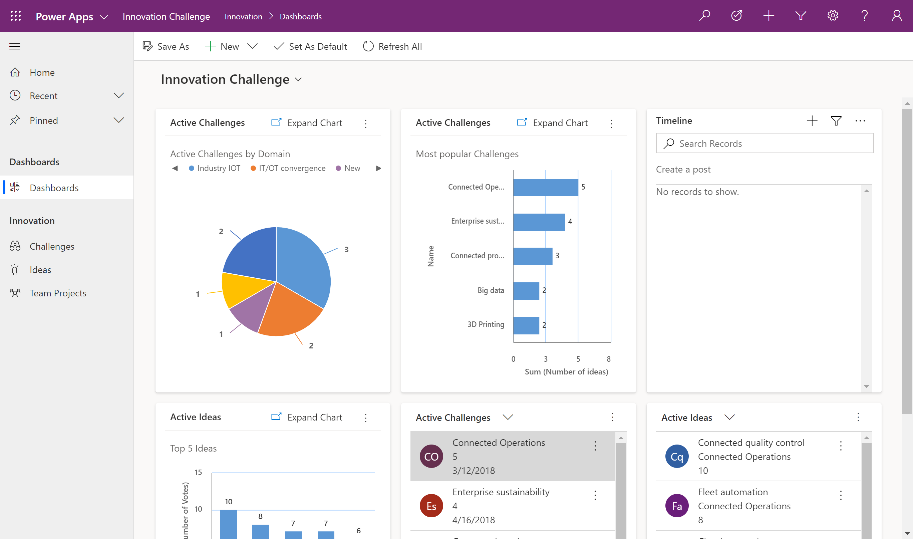
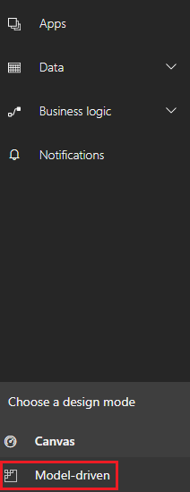

# Overview of building a model-driven app

Model-driven app design is a no-code or low-code component-focused approach to app development. Unlike canvas app development where the designer has complete control over app layout, with model-driven apps much of the layout is determined for you and largely designated by the components you add to the app. 

> [!IMPORTANT]
> [!INCLUDE [cc-preview-features-definition](../../includes/cc-preview-features-definition.md)]

Model-driven app design provides the following benefits:
- Rich component-focused no-code design environments 
- Create complex responsive apps with a similar UI across a variety of devices from desktop to mobile
- Design capability similar to what’s is available in the Dynamics 365 customer engagement platform 
- Your app can be distributed as a solution
 
## The approach to model-driven app making
At a fundamental level, model-driven app making consists of three key focus areas.

- Modeling business data 
- Defining business processes 
- Composing the app

### Modeling business data
To model business data you determine what data your app will need and how that data will relate to other data. Model-driven design uses a metadata-driven architecture so that designers can customize the application without writing code. Metadata means “data about data” and it defines the structure of the data stored in the system.

### Defining business processes
Defining and enforcing consistent business processes is a key aspect of model-driven app design. Consistent processes help make sure your app users focus on their work and not on remembering to perform a set of manual steps. Processes can be simple or complex and often change over time. To create a process, in [solution explorer](#advanced-model-driven-app-making) on the left navigation pane select **Processes**, and then select **New**. More information: [Working with business logic](#working-with-business-logic)  

### Composing the app
After modeling data and defining processes, you build your app by selecting and configuring the components you need using the app designer.

## Model-driven app components and designers
A well designed model-driven app consists of a several components the designer selects to build the appearance and functionality of the finished app. The components and component properties that designers use to make up an app become the metadata. 
To understand how each of these components relates to app design, they’re separated here into *data*, *UI*, *logic*, and *visualization* categories. 

### Data
These components determine what data the app will be based upon.

|Component  |Description  |Designer  |
|---------|---------|---------|
|Entity     |An item with properties that you track, such as a contact or account. Many standard entities are available. You can customize a non-system standard entity (production entity) or create a custom entity from scratch.     | [!INCLUDE [powerapps](../../includes/powerapps.md)] entity designer        |
|Field     | A property that is associated with an entity. A field is defined by a data type, which determines the type of data that can be entered or selected. Examples include text, number, date and time, currency, or lookup (creates a relationship with another entity). Fields typically are used with forms, views, and searches.        | [!INCLUDE [powerapps](../../includes/powerapps.md)] entity designer   |
|Relationship     | Entity relationships define how entities can be related to each other. There are 1:N (one-to-many), N:1 (many-to-one), and N:N (many-to-many) types of relationships . For example, adding a lookup field to an entity creates a new 1:N relationship between the two entities and lets you put that lookup field on a form.   | [!INCLUDE [powerapps](../../includes/powerapps.md)] entity designer        |
|Option set field     | This is a special type of field, which provides the user a set of predetermined options. Each option has a number value and label. When added to a form, this field displays a control for the user to select an option.  There are two kinds of option sets; option sets, where the user can only select one option, and multi-select options sets, which allow more than one selection.  | [!INCLUDE [powerapps](../../includes/powerapps.md)] option set designer     |

### UI
These components determine how users interact with the app. 

|Component  |Description  |Designer  |
|---------|---------|---------|
|App     | Determines the application fundamentals such as components, properties, client type, and URL for your app.      | App designer   |
|Site map     | Specifies the navigation for your app.        | Site map designer        |
|Form     | A set of data-entry fields for a given entity that matches the items that your organization tracks for the entity. For example, a set of data-entry fields that where user’s input relevant information to track a customer’s previous orders along with specific requested reorder dates.        | Form designer        |
|View     | Views define how a list of records for a specific entity is displayed in your application. A view defines the columns to display, width of each column, sort behavior, and the default filters.   |  View designer       |

### Logic
Determines the business processes, rules, and automation the app will have. [!INCLUDE [powerapps](../../includes/powerapps.md)] makers use a designer that is specific to the type of process or rule. 

|Type of logic  |Description  |Designer  |
|---------|---------|---------|
|Business process flow     | An online process that walks users through a standard business process. For example, use a business process flow if you want everyone to handle customer service requests the same way, or to require staff to gain approval for an invoice before submitting an order.        | Business process flow designer        |
|Workflow     |  Workflows automate business processes without a user interface. Designers use workflows to initiate automation that doesn’t require any user interaction.       | Workflow designer        |
|Actions    |  Actions are a type of process that let you manually invoke actions, including custom actions, directly from a workflow.       |  Process designer       |
|Business rule     | Used to apply rule or recommendation logic to a form, such as to set field requirements, hide fields, or validate data. App designers use a simple interface to implement and maintain fast-changing and commonly used rules.         |  Business rule designer       |
|Flow     | Flow is a cloud-based service that lets you create automated workflows between apps and services to get notifications, synchronize files, collect data, and more.        | Microsoft Flow        |

### Visualizations
Determines what type of data visualizations and reporting the app will have available.

|Component  |Description  |Designer  |
|---------|---------|---------|
|Chart     | A single graphic visualization  that can be displayed within a view, on a form, or be added to a dashboard.        | Chart designer        |
|Dashboard     | Functions as a palate for one or more graphic visualizations that provide an overview of actionable business data.        | Dashboard designer        |
|Embedded Power BI     | Add embedded Power BI tiles and dashboards to your app. Power BI is a cloud-based service that provides business intelligence insight.        |  Combination of chart designer, dashboard designer, and Power BI       |

### Advanced model-driven app making
The solution explorer is a comprehensive tool used for advanced model-driven app building. Within the solution explorer you can navigate through a hierarchy that consists of all app components using the navigation pane on the left side of the tool.

To open solution explorer, select **Model-driven** on the left pane of [!INCLUDE [powerapps](../../includes/powerapps.md)].

  

Then select the **Advanced** tab. 

## Model-driven app development resources
For more information about model-driven app development, see these topics.
### Modeling and composing your app
- [Design custom business apps by using the app designer](https://docs.microsoft.com/dynamics365/customer-engagement/customize/design-custom-business-apps-using-app-designer)
- [Create or edit entities](https://docs.microsoft.com/dynamics365/customer-engagement/customize/create-edit-entities)
- [Create and design forms](https://docs.microsoft.com/dynamics365/customer-engagement/customize/create-design-forms)
- [Create and edit fields](https://docs.microsoft.com/dynamics365/customer-engagement/customize/create-edit-fields)
- [Create and edit global option sets](https://docs.microsoft.com/dynamics365/customer-engagement/customize/create-edit-global-option-sets)
- [Create or edit views](https://docs.microsoft.com/dynamics365/customer-engagement/customize/create-edit-views)  
- [Create and edit relationships](https://docs.microsoft.com/dynamics365/customer-engagement/customize/create-edit-entity-relationships) 

### Working with business logic
- [Business process flows overview](https://docs.microsoft.com/dynamics365/customer-engagement/customize/business-process-flows-overview)
- [Use Workflow processes to automate processes](https://docs.microsoft.com/dynamics365/customer-engagement/customize/workflow-processes)
- [Actions overview](https://docs.microsoft.com/dynamics365/customer-engagement/customize/actions)
- [Create business rules and recommendations to apply logic](https://docs.microsoft.com/dynamics365/customer-engagement/customize/create-business-rules-recommendations-apply-logic-form)

### Using visualizations in your app
- [Create or edit a system chart](https://docs.microsoft.com/dynamics365/customer-engagement/customize/create-edit-system-chart)
- [Create or edit dashboards](https://docs.microsoft.com/dynamics365/customer-engagement/customize/create-edit-dashboards)

### Distributing your app
[Create a solution](https://docs.microsoft.com/dynamics365/customer-engagement/customize/create-solution)

## Next steps
[Create a custom entity in PowerApps](../common-data-service/create-custom-entity.md)

