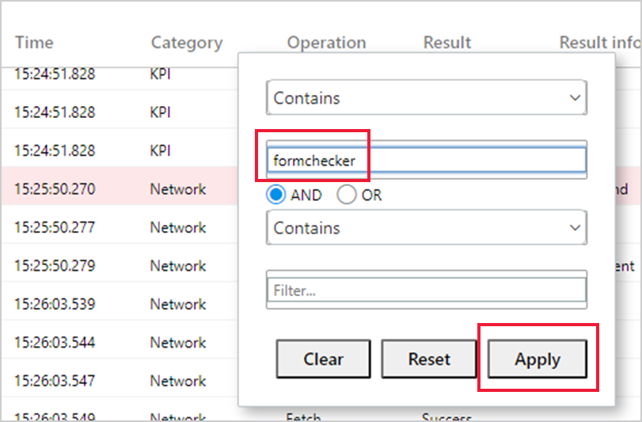
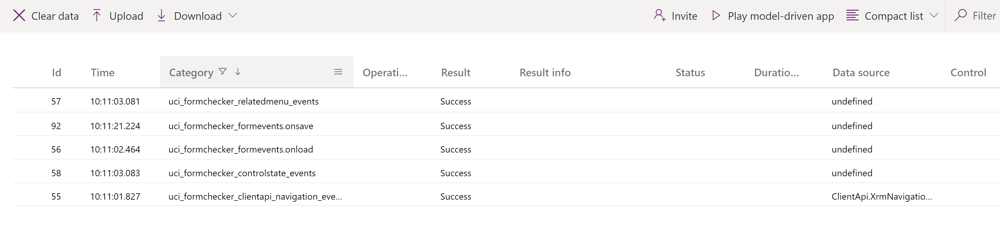

# Use Monitor to troubleshoot model-driven app form behavior

Monitor can help you debug and diagnose problems, which helps you build faster, more reliable apps. Monitor provides a deep view into how an app runs by providing a log of all activities in your app as it runs.

When you filter on model-driven app form-related events in Monitor, you can get information about related tables, tables, controls, and components on a form in Monitor as your app runs.  

There are many situations that you might encounter where access to the information provided by Monitor will help you better understand why a form behaves a certain way. Many form issues are based on business rules, JavaScript, form events, or client API that admins and makers have set. Monitor can also help identify whether the issue you experience is designed out-of-the-box or is due to a customization. It provides details that can help you answer the following questions:

- [Why aren't rows showing in the related menu of a table?](../../developer/model-driven-apps/troubleshoot-forms.md#related-menurelated-tab)
- [Why a control is disabled/enabled or visible/hidden](../../developer/model-driven-apps/troubleshoot-forms.md#why-a-control-is-disabledenabled-or-visiblehidden)
- Why is a row in a read-only state?

## Filter Monitor for form-related issues

1. Sign in to [Power Apps](https://make.powerapps.com/), select **Apps**, select the app you want, and then select **Monitor** on the command bar. Follow the instructions on your screen to run the app and join the monitoring session.

   You can also start a Monitor session from a model-driven app. To do this, append *&monitor=true* to the end of the URL in the browser. This displays the **Monitor** command on the model-driven app global command bar. Select **Monitor** to open a monitoring session in a new tab.
   

2. On the browser window running Monitor, select the three horizontal lines on the **Category** column to open the filter options.

   > [!div class="mx-imgBorder"] 
   > 

3. Enter *formchecker* in the topmost **Filter** box. Don't make any other changes. Select **Apply**. 

    

4. Select anywhere outside the filter dialog to close the dialog and refresh the list in Monitor. You can expand the **Operation** column to see the full name of the events that are tracked by selecting and holding the right side of the column and dragging to the right. As you use the app and open and use a form, Monitor updates the list of events.

   > [!div class="mx-imgBorder"] 
   >

## Use Monitor to understand form behavior

For each row, you can open and view detailed information about the form event. For example, imagine you have a question about the options in the related menu tab of a form. You go to that form in the app and select the appropriate form component. In this example, the **RelatedMenu** row in the **Operation** column is selected. Next, the **Details** tab, and then **…** are selected to display additional information.

> [!div class="mx-imgBorder"] 
> 

To see the full details, select **+** next to the line that displays the word **data** in the title, which is line **5** in the previous screenshot. The expanded details display all items in the related menu with information that can help you understand why a table is, or isn't, included in the related menu options. There are many types of events that are monitored, including the standard form events like `onload`, `onsave`, and `onclose`.

As you continue to use the app that's being monitored, Monitor updates the information in the list of events. For forms, there are many different scenarios that you can troubleshoot and find additional information on the form, control, or table you're working with. 

## Supported form checking areas and events

Supported areas for form monitoring include the following.

|App area  |Description  |
|---------|---------|
|Control state   | Details about the state of the visible, enabled, and label source of a control when the form is loaded.     |
|Related menu   | Details about the state of related menu items. Examples:    Why is a menu item not being displayed?   Where does the menu item come from?     |
|Tab / section / control state change   | Details on who (via the callstack) has caused a form component&mdash;such as a tab, section, or control&mdash;to change the component's visibility and enabled state.        |
|Navigation     | Details about what's causing navigation or unexpected dialogs by tracing the callstack of these `Xrm.Navigation` client API methods: `openAlertDialog(), openConfirmDialog(), openDialog(), openErrorDialog(), navigateTo(), openForm(), openTaskFlow(), openUrl(), openWebResource()`         |
|Unsupported customizations    |  Details about unsupported client API access before the form is ready. Examples:   Accessing `parent.Xrm.Page` in iFrame before the form is fully loaded.   Accessing Xrm.Page in a form web resource outside of form handler contexts using `window.setTimeout()` to periodically call the form client API.   Accessing `Xrm.Page` in `updateView()` method of the Power Apps control framework control code.  |

Examples of the supported form-related events in Monitor include:

- FormEvents.onsave
- XrmNavigation
- FormEvents.onload
- FormControls
- TabStateChange.visible
- RelatedMenu
- ControlStateChange.disabled
- ControlStateChange.visible
- SectionStateChange.visible
- UnsupportedClientApi

For more information about how to troubleshoot issues with forms in a model-driven app, see [Troubleshoot form issues in model-driven apps](../../developer/model-driven-apps/troubleshoot-forms.md).

[!INCLUDE[footer-include](../../includes/footer-banner.md)]