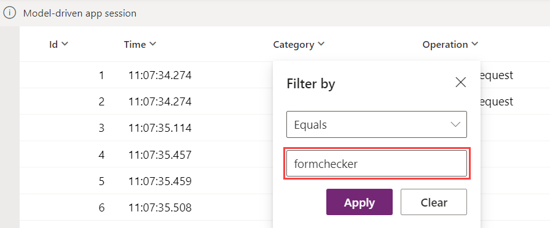

# Use Live monitor to troubleshoot model-driven app behavior

Live monitor is a tool that can help app makers debug and diagnose problems, which help them build faster, more reliable apps. Live monitor provides a deep view into how an app runs by providing a log of all activities in the app as it runs.

To help you isolate certain model-driven app features, you can filter on specific categories, such as forms or the Copilot control.

## Create a Live monitor session

Sign in to [Power Apps](https://make.powerapps.com/), select **Solutions** on the left navigation pane, open the solution that contains the app you want to monitor, select the app, and then select **Live monitor** on the command bar.

On the Live monitor page, select **Play model-driven** app on the command bar. For more information about creating a Live monitor session, go to [Use Live monitor to troubleshoot page behavior in model-driven apps](monitor-page-checker.md).

## Filter Live monitor for form-related issues

Filtering on model-driven app form-related events in Live monitor can provide information about related tables, tables, controls, and components on a form in Live monitor as your app runs.  

There are many situations where Live monitor can help makers understand why a form behaves a certain way. Many form issues are based on business rules, JavaScript, form events, or client API that admins and makers set. Live monitor can also help identify whether the issue experienced is designed out-of-the-box or is due to a customization. It provides details that can help answer the following questions:

- [Why aren't rows showing in the related menu of a table?](../../developer/model-driven-apps/troubleshoot-forms.md#related-menu-item-doesnt-appear-in-related-tab)
- [Why a control is disabled/enabled or visible/hidden](../../developer/model-driven-apps/troubleshoot-forms.md#why-a-control-is-disabledenabled-or-visiblehidden)
- Why is a row in a read-only state?

1. On the browser window running Live monitor, select the **Category** column, and then select **Filter by**.

   > [!div class="mx-imgBorder"]
   > 

1. Select **Equals** or **Contains** from the dropdown list, and then enter `formchecker` in the box. Select **Apply**.

     

1. The categories are now filtered.  The **Operation** column can be expanded to see the full name of the events that are tracked by selecting and holding the right side of the column and dragging to the right. As you use the app and open and use a form, Live monitor updates the list of events.

   > [!div class="mx-imgBorder"] 
   >
1. While the app is running in the monitored session, perform actions within the model-driven app consistent with normal use of the app. For example, open and change data using a table form.

### Use Live monitor to understand form behavior

For each row with Live monitor, detailed information about the form event can be reviewed. For example, imagine you have a question about an error taking place within the form. You go to that form in the app and select the appropriate form component. Then return to the browser with Live monitor enabled and review the results either with or without filtering. In this case, there's an error on the composite control. By expanding areas of the **Details**, you can learn more about the event itself.

> [!div class="mx-imgBorder"] 
> 

There are many types of events that are monitored, including the standard form events like `onload`, `onsave`, and `onclose`.

As you continue to use the app that's being monitored, Live monitor updates the information in the list of events. For forms, there are many different scenarios that you can troubleshoot and find additional information on the form, control, or table currently being worked on.

### Form-checking areas and events

Areas for form monitoring include the following.

|App area  |Description  |
|---------|---------|
|Control state   | Details about the state of the visible, enabled, and label source of a control when the form is loaded.     |
|Related menu   | Details about the state of related menu items. Examples:    Why is a menu item not being displayed?   Where does the menu item come from?     |
|Tab / section / control state change   | Details on who (via the callstack) has caused a form component&mdash;such as a tab, section, or control&mdash;to change the component's visibility and enabled state.        |
|Navigation     | Details about what's causing navigation or unexpected dialogs by tracing the callstack of these `Xrm.Navigation` client API methods: `openAlertDialog(), openConfirmDialog(), openDialog(), openErrorDialog(), navigateTo(), openForm(), openTaskFlow(), openUrl(), openWebResource()`         |
|Unsupported customizations    |  Details about unsupported client API access before the form is ready. Examples:   Accessing `parent.Xrm.Page` in iFrame before the form is fully loaded.   Accessing `Xrm.Page` in a form web resource outside of form handler contexts using `window.setTimeout()` to periodically call the form client API.   Accessing `Xrm.Page` in `updateView()` method of the Power Apps control framework control code.  |

Examples of the supported form-related events in Live monitor include:

- FormEvents.onsave
- XrmNavigation
- FormEvents.onload
- FormControls
- TabStateChange.visible
- RelatedMenu
- ControlStateChange.disabled
- ControlStateChange.visible
- SectionStateChange.visible
- UnsupportedClientApi

## Filter Live monitor for Copilot control-related issues

1. On the browser window running Live monitor, select the **Category** column, and then select **Filter by**.
1. Select **Equals** or **Contains** from the dropdown list, and then enter `CopilotEvent` in the box. Select **Apply**.

### Copilot control events

Events for Copilot control monitoring include the following.

|Event name| Description|
|----------|------------|
|AdaptiveCardActionData|Data sent to submit action for adaptive card|
|adaptiveCardContent|Content of adaptiveCard |
|AISummarize|This message is logged in case the summarize feature is off and logs the fcb status|
|AutoTriggerSummarizeHandler.isAutoTriggeredSummaryEnabled|	Tells if auto trigger is enabled |
|ClientActionCalled| Logs the name of the client action and payload passed ot it |
|CopilotResponse|Response from the copilot|
|DVCopilotAction|isDVChatEnabled: if dv chat is enabled for the org or not |
|DynamicContextSentToBot|Dynamics context sent to bot|
|EnvironmentHostedBotSchemaName|	Logs the environment bot schema name|
|ExecutingAction|Adaptive card action is getting executed|
|isSummaryEnabledForEntity|Tells if summarize is enabled for the entity|
|queryStructuredDataRequest|Request sent to query structure data|
|queryStructuredDataResponse|Response from query structure data |
|SessionContextSentToBot|Session context sent to bot|
|SummarizeResponse|Logs the response for the summarize |
|UserPrompt|Prompt entered by the User|

## Close a monitoring session

To close the monitoring session, close the browser tab where the monitored model-driven app is playing.

## Next steps

For more information about how to troubleshoot issues with forms in a model-driven app, see [Troubleshoot form issues in model-driven apps](../../developer/model-driven-apps/troubleshoot-forms.md).

[Learn about Live monitor as a Power Apps tool](../../maker/monitor-overview.md)

[!INCLUDE[footer-include](../../includes/footer-banner.md)]
