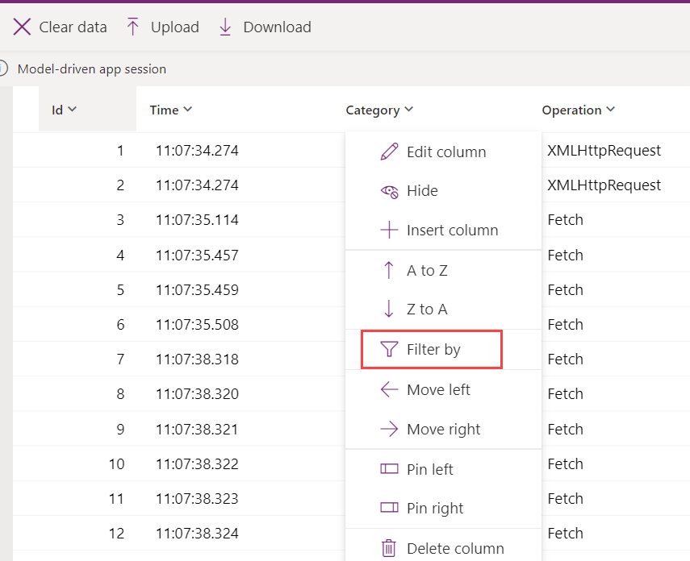
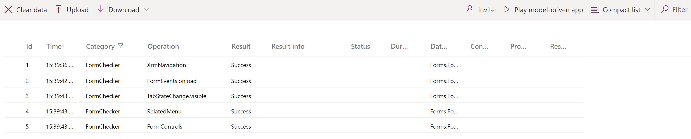
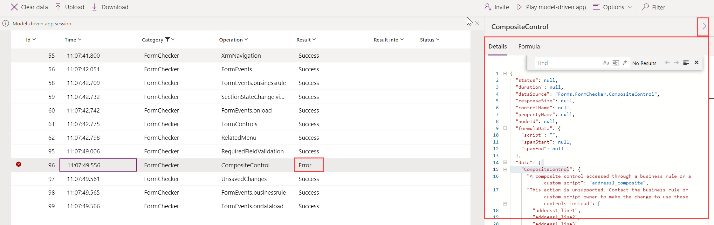

# Use Monitor to troubleshoot model-driven app form behavior

## Introduction

**Monitor** is a tool that can help app developers to debug and diagnose problems, which helps them to build faster, more reliable apps. Monitor provides a deep view into how an app runs by providing a log of all activities in your app as it runs.

When filtering on model-driven app form-related events in Monitor, this can provide information about related tables, tables, controls, and components on a form in Monitor as your app runs.  

There are many situations that Monitor will help developers to better understand why a form behaves a certain way. Many form issues are based on business rules, JavaScript, form events, or client API that admins and makers have set. Monitor can also help identify whether the issue experienced is designed out-of-the-box or is due to a customization. It provides details that can help answer the following questions:

- [Why aren't rows showing in the related menu of a table?](../../developer/model-driven-apps/troubleshoot-forms.md#related-menurelated-tab)
- [Why a control is disabled/enabled or visible/hidden](../../developer/model-driven-apps/troubleshoot-forms.md#why-a-control-is-disabledenabled-or-visiblehidden)
- Why is a row in a read-only state?

## Filter Monitor for form-related issues

Follow the instructions below to understand the performance of your model-driven app forms.

1. Sign in to [Power Apps](https://make.powerapps.com/), select **Apps**.
2. The model-driven app required.
3. In order to create a monitoring session select the three dots next to the model-driven app or the three dots in the global command bar.
4. From the options available select Monitor

:::image type="content" source="media/create-monitor-session.png" alt-text="Sample model-driven app":::

5. Follow the instructions on your screen to run the app and join the monitoring session.

6. Once in the monitor select **Play model-driven app** from the menu in the command rail.  This will open the app in addition to beginning monitoring.
7. Perform actions within the model-driven app consistent will normal use of the app.  In this case ensure that the table form is used.
8. On the browser window running Monitor, select the three horizontal lines on the **Category** column to open the filter options.

   > [!div class="mx-imgBorder"]
   > 

9.  Select **Equals** or **Contains** from the dropdown and enter *formchecker* in the box available. Don't make any other changes. Select **Apply**.

    

10. The categories are now filtered.  The **Operation** column can be expanded to see the full name of the events that are tracked by selecting and holding the right side of the column and dragging to the right. As you use the app and open and use a form, Monitor updates the list of events.

   > [!div class="mx-imgBorder"] 
   >

## Use Monitor to understand form behavior

For each row with Monitor, detailed information about the form event can be reviewed. For example, imagine you have a question about an error taking place within the form. You go to that form in the app and select the appropriate form component. Then return to the browser with Monitor enabled and review the results either with or without filtering.  In this case there is an error on the composite control.  By expanding the **Properties** we can learn more about the event itself.

> [!div class="mx-imgBorder"] 
> 

There are many types of events that are monitored, including the standard form events like `onload`, `onsave`, and `onclose`.

As you continue to use the app that's being monitored, Monitor updates the information in the list of events. For forms, there are many different scenarios that you can troubleshoot and find additional information on the form, control, or table currently being worked on.

## Supported form checking areas and events

Supported areas for form monitoring include the following.

|App area  |Description  |
|---------|---------|
|Control state   | Details about the state of the visible, enabled, and label source of a control when the form is loaded.     |
|Related menu   | Details about the state of related menu items. Examples:    Why is a menu item not being displayed?   Where does the menu item come from?     |
|Tab / section / control state change   | Details on who (via the callstack) has caused a form component&mdash;such as a tab, section, or control&mdash;to change the component's visibility and enabled state.        |
|Navigation     | Details about what's causing navigation or unexpected dialogs by tracing the callstack of these `Xrm.Navigation` client API methods: `openAlertDialog(), openConfirmDialog(), openDialog(), openErrorDialog(), navigateTo(), openForm(), openTaskFlow(), openUrl(), openWebResource()`         |
|Unsupported customizations    |  Details about unsupported client API access before the form is ready. Examples:   Accessing `parent.Xrm.Page` in iFrame before the form is fully loaded.   Accessing Xrm.Page in a form web resource outside of form handler contexts using `window.setTimeout()` to periodically call the form client API.   Accessing `Xrm.Page` in `updateView()` method of the Power Apps control framework control code.  |

Examples of the supported form-related events in Monitor include:

- FormEvents.onsave
- XrmNavigation
- FormEvents.onload
- FormControls
- TabStateChange.visible
- RelatedMenu
- ControlStateChange.disabled
- ControlStateChange.visible
- SectionStateChange.visible
- UnsupportedClientApi

## Next Steps
For more information about how to troubleshoot issues with forms in a model-driven app, see [Troubleshoot form issues in model-driven apps](../../developer/model-driven-apps/troubleshoot-forms.md).

[Learn about Monitor as a Power Apps tool](../../maker/monitor-overview.md)

[!INCLUDE[footer-include](../../includes/footer-banner.md)]